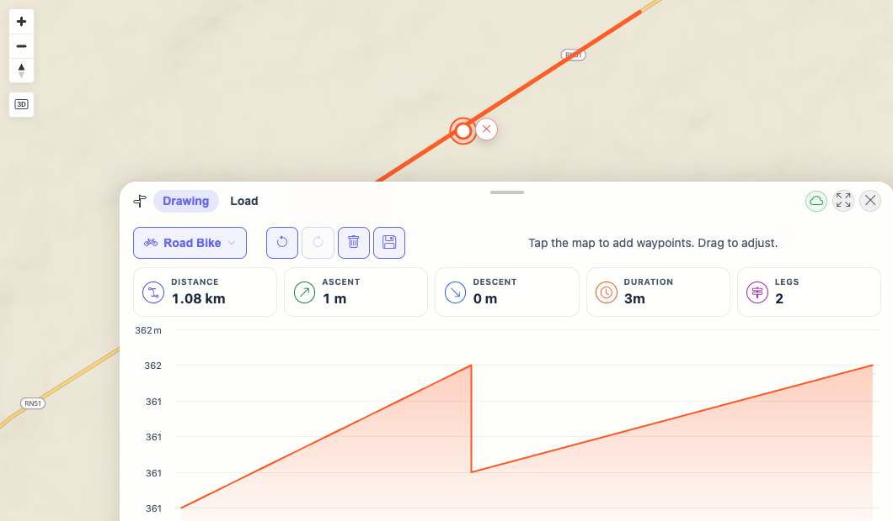
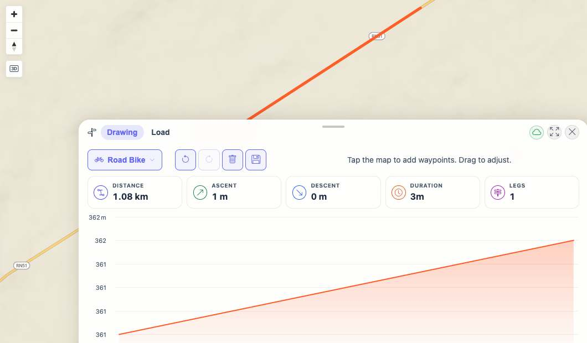
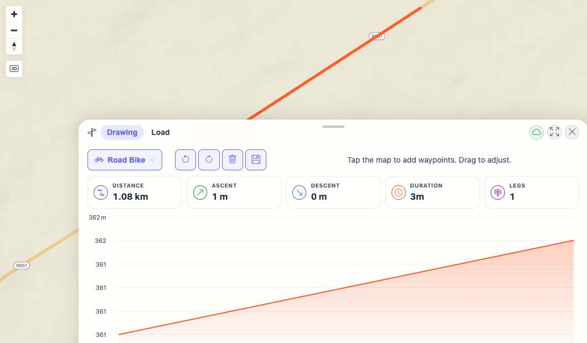

# Packet: PLN_04

## Scope

- Coverage source: `documentation/testing/frontend-regression-test-plan.md`
- Coverage ID or run packet: PLN_04
- In scope: Move and delete waypoints; verify clear, undo, and redo behavior.
- Out of scope: Saving, downloading, and mobile touch dragging.

## Prerequisites

- Required previous coverage IDs or run packets: PLN_01, PLN_02, PLN_03
- Required app/data state: Planner open with Road Bike profile and the two-leg route left by PLN_03.
- Required browser context: Desktop isolated Playwright browser at `http://188.245.169.80:18080/mtl/plan`.

## Allowed Mutations

- Allowed: Move/delete planner waypoints and use clear/undo/redo.
- Not allowed: Save or delete persisted planned routes.

## Actions And Results

| Coverage ID | Action | Expected result | Actual result | Status | Evidence |
|---|---|---|---|---|---|
| PLN_04 | Dragged the selected waypoint, undid/redid the move, clicked the selected-waypoint delete marker, undid/redid the delete, cleared the route, then undid/redid the clear. | Waypoint move is reflected on the map; delete reduces the route; clear empties the planner; undo and redo restore/reapply each mutation. | Delete marker moved from `(680,172)` to `(640,140)` after dragging the waypoint; delete changed `Legs 2` to `Legs 1`; clear changed `Legs 1` to `Legs 0`; undo/redo restored and reapplied move, delete, and clear states. | PASS | [assets/PLN_04-edit-history-results.txt](../assets/PLN_04-edit-history-results.txt); [assets/PLN_04-waypoint-moved.jpg](../assets/PLN_04-waypoint-moved.jpg); [assets/PLN_04-waypoint-deleted.jpg](../assets/PLN_04-waypoint-deleted.jpg); [assets/PLN_04-route-cleared.jpg](../assets/PLN_04-route-cleared.jpg); [assets/PLN_04-undo-clear-restored.jpg](../assets/PLN_04-undo-clear-restored.jpg) |

## Issues

| ID | Severity | Summary | Reproduction | Expected | Actual | Evidence | Release impact |
|---|---|---|---|---|---|---|---|

## Evidence Files

| File | Purpose |
|---|---|
| [assets/PLN_04-edit-history-results.txt](../assets/PLN_04-edit-history-results.txt) | Step-by-step stats, history-button states, and waypoint marker positions. |
| [assets/PLN_04-start-two-leg-route.jpg](../assets/PLN_04-start-two-leg-route.jpg) | Starting two-leg route with selected inserted waypoint. |
| [assets/PLN_04-waypoint-moved.jpg](../assets/PLN_04-waypoint-moved.jpg) | Waypoint after drag move. |
| [assets/PLN_04-waypoint-deleted.jpg](../assets/PLN_04-waypoint-deleted.jpg) | Route after deleting the selected waypoint. |
| [assets/PLN_04-route-cleared.jpg](../assets/PLN_04-route-cleared.jpg) | Empty planner after clear route. |
| [assets/PLN_04-undo-clear-restored.jpg](../assets/PLN_04-undo-clear-restored.jpg) | Route restored after undoing clear. |

## Screenshot Evidence

## Timings

| Step | Timing |
|---|---:|
| Move/delete/clear with undo-redo checks | ~25 s |

## Handoff Notes

- Completed: Move, delete, clear, undo, and redo were all verified through the UI.
- Remaining unfinished coverage: PLN_05 onward.
- Blocked or not applicable: None.
- State left for the next packet: Planner is open in Drawing mode with Road Bike profile and an empty route after redo clear.
