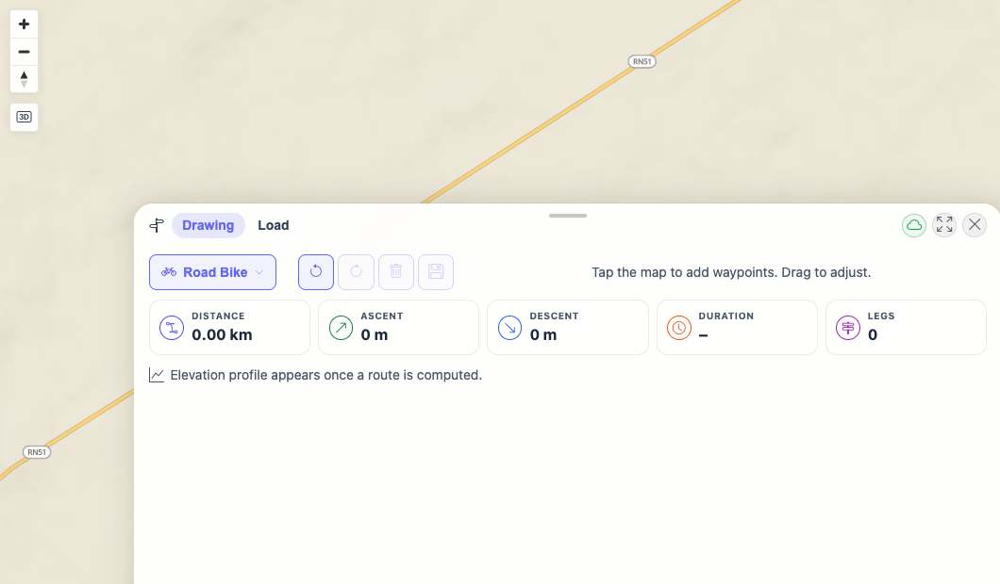
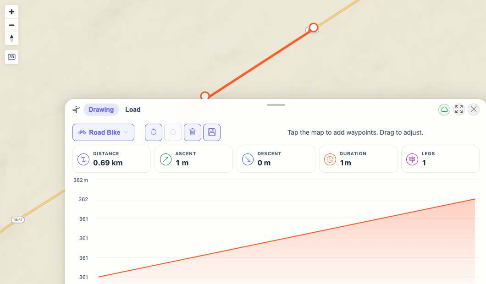
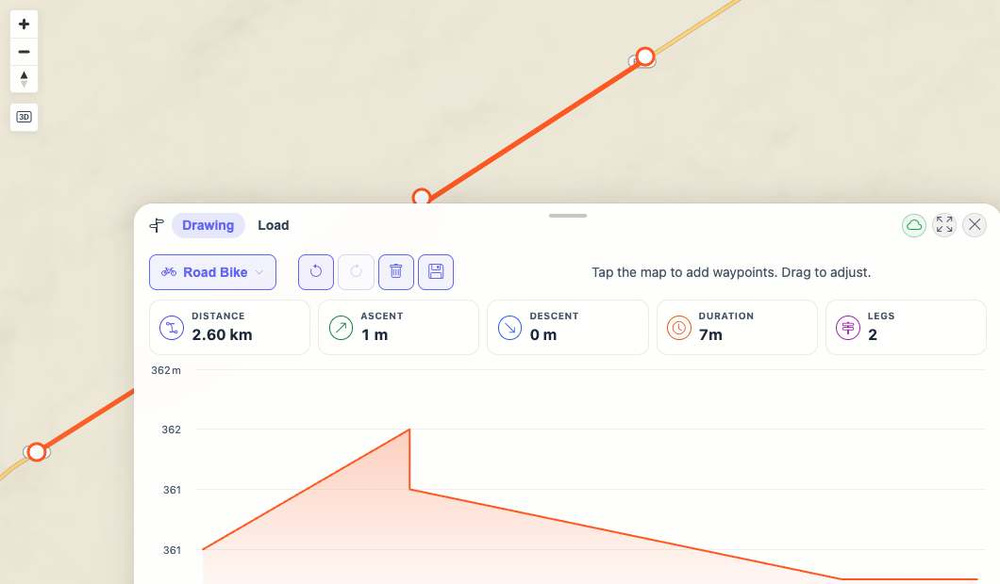

# Packet: PLN_05

## Scope

- Coverage source: `documentation/testing/frontend-regression-test-plan.md`
- Coverage ID or run packet: PLN_05
- In scope: Live stats bar distance, ascent, duration, and legs updates while editing a planner route.
- Out of scope: Elevation profile hover behavior and plan persistence.

## Prerequisites

- Required previous coverage IDs or run packets: PLN_01 through PLN_04
- Required app/data state: Planner open in Drawing mode with Road Bike profile and empty route after PLN_04.
- Required browser context: Desktop isolated Playwright browser at `http://188.245.169.80:18080/mtl/plan`.

## Allowed Mutations

- Allowed: Add waypoints to compute and extend a route.
- Not allowed: Save or delete persisted planned routes.

## Actions And Results

| Coverage ID | Action | Expected result | Actual result | Status | Evidence |
|---|---|---|---|---|---|
| PLN_05 | Recorded live stats at empty route, after one waypoint, after a two-waypoint computed route, and after adding a third waypoint to extend the route. | Live stats bar updates distance, ascent, time, and leg count as route edits happen. | Empty route showed `0.00 km`, `0 m`, `–`, `0 legs`; one-leg route updated to `0.69 km`, `1 m`, `1m`, `1 leg`; extended route updated to `2.60 km`, `1 m`, `7m`, `2 legs`. | PASS | [assets/PLN_05-live-stats-results.txt](../assets/PLN_05-live-stats-results.txt); [assets/PLN_05-empty-stats.jpg](../assets/PLN_05-empty-stats.jpg); [assets/PLN_05-one-leg-stats.jpg](../assets/PLN_05-one-leg-stats.jpg); [assets/PLN_05-extended-route-stats.jpg](../assets/PLN_05-extended-route-stats.jpg) |

## Issues

| ID | Severity | Summary | Reproduction | Expected | Actual | Evidence | Release impact |
|---|---|---|---|---|---|---|---|

## Evidence Files

| File | Purpose |
|---|---|
| [assets/PLN_05-live-stats-results.txt](../assets/PLN_05-live-stats-results.txt) | Live stats values after each route edit. |
| [assets/PLN_05-empty-stats.jpg](../assets/PLN_05-empty-stats.jpg) | Empty live stats baseline. |
| [assets/PLN_05-one-leg-stats.jpg](../assets/PLN_05-one-leg-stats.jpg) | Live stats after two-waypoint route computation. |
| [assets/PLN_05-extended-route-stats.jpg](../assets/PLN_05-extended-route-stats.jpg) | Live stats after adding a third waypoint. |

## Screenshot Evidence

## Timings

| Step | Timing |
|---|---:|
| Add first waypoint | ~1 s |
| Compute two-waypoint route | ~4 s |
| Extend route with third waypoint | ~5 s |

## Handoff Notes

- Completed: Live stats bar updates were verified through route creation and extension.
- Remaining unfinished coverage: PLN_06 onward.
- Blocked or not applicable: None.
- State left for the next packet: Planner is open with a computed Road Bike route, `2.60 km`, `7m`, and `2 legs`.
