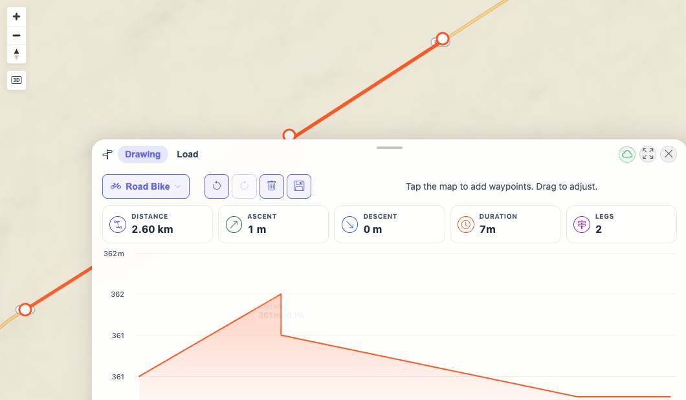
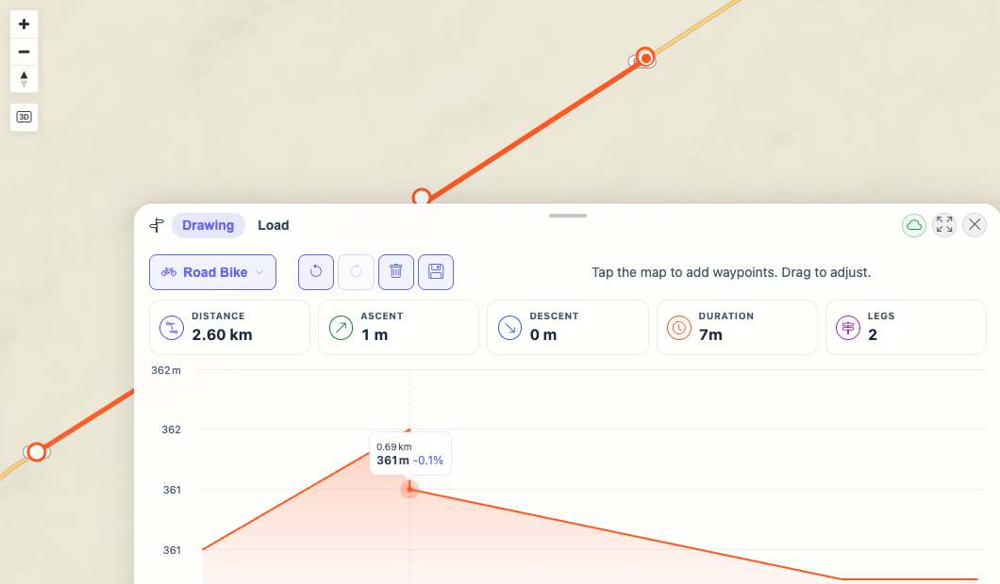

# Packet: PLN_06

## Scope

- Coverage source: `documentation/testing/frontend-regression-test-plan.md`
- Coverage ID or run packet: PLN_06
- In scope: Elevation profile rendering and hover highlight on the map.
- Out of scope: Saved-plan persistence and GPX export.

## Prerequisites

- Required previous coverage IDs or run packets: PLN_01 through PLN_05
- Required app/data state: Planner open with the computed two-leg route left by PLN_05.
- Required browser context: Desktop isolated Playwright browser at `http://188.245.169.80:18080/mtl/plan`.

## Allowed Mutations

- Allowed: Hover the elevation profile.
- Not allowed: Change or save the current route.

## Actions And Results

| Coverage ID | Action | Expected result | Actual result | Status | Evidence |
|---|---|---|---|---|---|
| PLN_06 | Confirmed the elevation profile rendered, hovered Highcharts point index 1, then moved the pointer away. | Elevation profile is visible and hovering a profile point highlights the matching map point. | Profile rendered with Highcharts SVG and 5 data points. Before hover no planner hover marker existed; during hover a `.planner-hover-marker` appeared at map point `(761,62)` with size `14x14`; after pointer exit the marker was removed. | PASS | [assets/PLN_06-elevation-hover-results.txt](../assets/PLN_06-elevation-hover-results.txt); [assets/PLN_06-profile-rendered.jpg](../assets/PLN_06-profile-rendered.jpg); [assets/PLN_06-profile-hover-highlight.jpg](../assets/PLN_06-profile-hover-highlight.jpg) |

## Issues

| ID | Severity | Summary | Reproduction | Expected | Actual | Evidence | Release impact |
|---|---|---|---|---|---|---|---|

## Evidence Files

| File | Purpose |
|---|---|
| [assets/PLN_06-elevation-hover-results.txt](../assets/PLN_06-elevation-hover-results.txt) | Profile render and hover-marker DOM observations. |
| [assets/PLN_06-profile-rendered.jpg](../assets/PLN_06-profile-rendered.jpg) | Elevation profile rendered before hover. |
| [assets/PLN_06-profile-hover-highlight.jpg](../assets/PLN_06-profile-hover-highlight.jpg) | Hover marker visible on the map while hovering the profile. |

## Screenshot Evidence

## Timings

| Step | Timing |
|---|---:|
| Hover profile point and capture marker | ~2 s |

## Handoff Notes

- Completed: Elevation profile render and hover-to-map highlight were verified.
- Remaining unfinished coverage: PLN_07 onward.
- Blocked or not applicable: None.
- State left for the next packet: Planner is open with the same computed Road Bike route from PLN_05.
