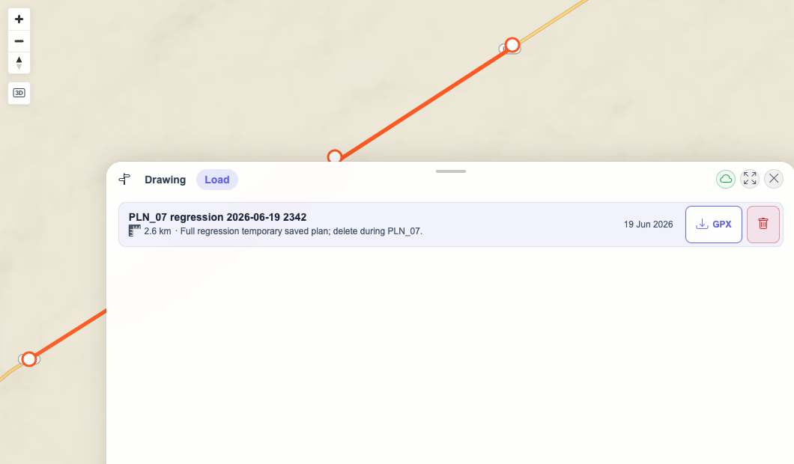
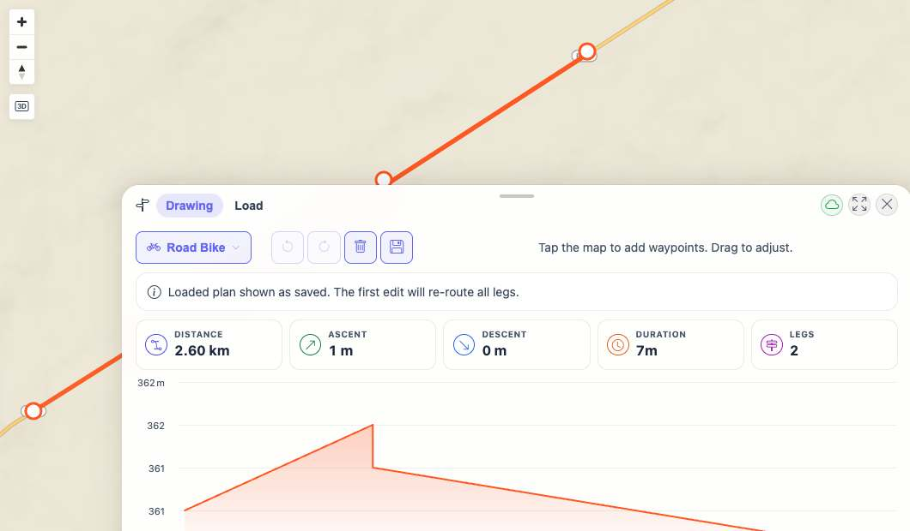

# Packet: PLN_07

## Scope

- Coverage source: `documentation/testing/frontend-regression-test-plan.md`
- Coverage ID or run packet: PLN_07
- In scope: Save plan, list saved plans, load saved plan, delete saved plan.
- Out of scope: GPX download validation.

## Prerequisites

- Required previous coverage IDs or run packets: PLN_01 through PLN_06
- Required app/data state: Planner open with computed Road Bike route from PLN_05.
- Required browser context: Desktop isolated Playwright browser at `http://188.245.169.80:18080/mtl/plan`.

## Allowed Mutations

- Allowed: Create one temporary saved plan and delete it during the packet.
- Not allowed: Leave temporary saved plans behind.

## Actions And Results

| Coverage ID | Action | Expected result | Actual result | Status | Evidence |
|---|---|---|---|---|---|
| PLN_07 | Saved the current route as `PLN_07 regression 2026-06-19 2342`, opened the Load tab, loaded the saved plan, reopened Load, and deleted the saved plan. | Saved route appears in list, can be loaded back into the editor, and can be deleted cleanly. | API created plan id `100024`; Load tab listed the plan; loading returned to Drawing with `2.60 km`, `7m`, `2 legs`; delete dialog opened for the plan; after deletion the list and API had no matching plan. | PASS | [assets/PLN_07-save-load-delete-results.txt](../assets/PLN_07-save-load-delete-results.txt); [assets/PLN_07-save-dialog.jpg](../assets/PLN_07-save-dialog.jpg); [assets/PLN_07-saved-list.jpg](../assets/PLN_07-saved-list.jpg); [assets/PLN_07-loaded-plan.jpg](../assets/PLN_07-loaded-plan.jpg); [assets/PLN_07-delete-dialog.jpg](../assets/PLN_07-delete-dialog.jpg); [assets/PLN_07-deleted-list.jpg](../assets/PLN_07-deleted-list.jpg) |

## Issues

| ID | Severity | Summary | Reproduction | Expected | Actual | Evidence | Release impact |
|---|---|---|---|---|---|---|---|

## Evidence Files

| File | Purpose |
|---|---|
| [assets/PLN_07-save-load-delete-results.txt](../assets/PLN_07-save-load-delete-results.txt) | UI/API observations for save, list, load, delete, and cleanup. |
| [assets/PLN_07-save-dialog.jpg](../assets/PLN_07-save-dialog.jpg) | Save dialog populated with temporary plan. |
| [assets/PLN_07-saved-list.jpg](../assets/PLN_07-saved-list.jpg) | Load tab listing the saved plan. |
| [assets/PLN_07-loaded-plan.jpg](../assets/PLN_07-loaded-plan.jpg) | Saved plan loaded back into Drawing. |
| [assets/PLN_07-delete-dialog.jpg](../assets/PLN_07-delete-dialog.jpg) | Delete confirmation for the temporary plan. |
| [assets/PLN_07-deleted-list.jpg](../assets/PLN_07-deleted-list.jpg) | Load tab after deleting the temporary plan. |

## Screenshot Evidence

## Timings

| Step | Timing |
|---|---:|
| Save/list/load/delete workflow | ~12 s |

## Handoff Notes

- Completed: Save, list, load, and delete were verified; temporary plan id `100024` was deleted.
- Remaining unfinished coverage: PLN_08 onward.
- Blocked or not applicable: None.
- State left for the next packet: Planner is on the Load tab with no saved `PLN_07 regression 2026-06-19 2342` plan; the route remains available in Drawing after being loaded.
