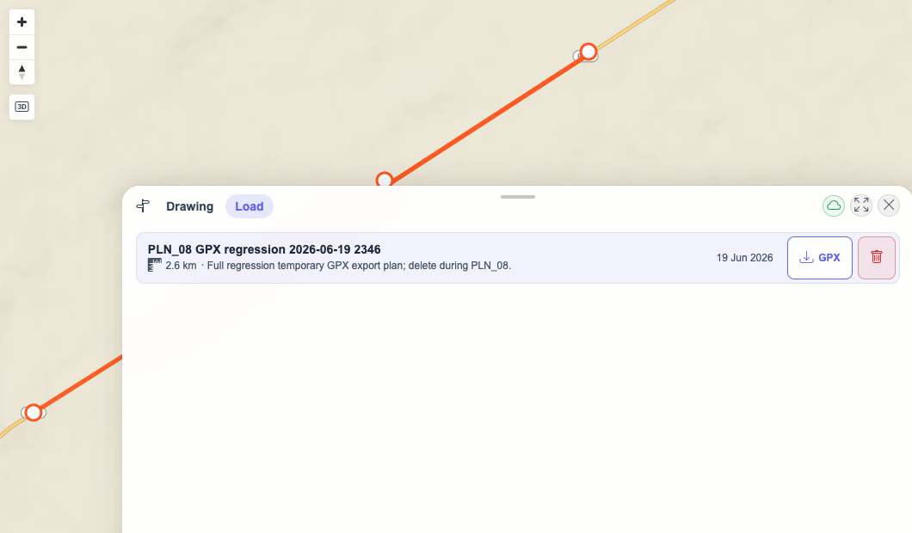
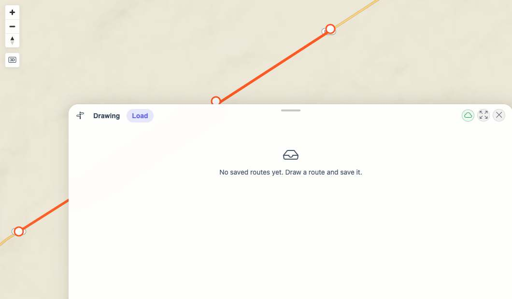

# Packet: PLN_08

## Scope

- Coverage source: `documentation/testing/frontend-regression-test-plan.md`
- Coverage ID or run packet: PLN_08
- In scope: Download a saved plan as GPX and validate it against the planned route.
- Out of scope: General save/load/delete behavior already covered by PLN_07.

## Prerequisites

- Required previous coverage IDs or run packets: PLN_01 through PLN_07
- Required app/data state: Planner has the computed Road Bike route from PLN_05 loaded in Drawing.
- Required browser context: Desktop isolated Playwright browser at `http://188.245.169.80:18080/mtl/plan` with downloads enabled.

## Allowed Mutations

- Allowed: Create one temporary saved plan, download it as GPX, then delete it.
- Not allowed: Leave temporary saved plans behind.

## Actions And Results

| Coverage ID | Action | Expected result | Actual result | Status | Evidence |
|---|---|---|---|---|---|
| PLN_08 | Saved a temporary plan as `PLN_08 GPX regression 2026-06-19 2346`, opened Load, clicked its GPX export action, parsed the downloaded file, compared GPX points with `/api/planner/plans/100025`, then deleted the plan. | Downloaded GPX is valid and matches the planned route geometry. | Browser download produced `PLN_08 GPX regression 2026-06-19 2346.gpx`; XML parsed as `<gpx>` with 5 `trkpt` points; saved detail also had 5 coordinates; max lat/lon delta was `0`; temporary plan id `100025` was deleted. | PASS | [assets/PLN_08-gpx-download-results.txt](../assets/PLN_08-gpx-download-results.txt); [assets/PLN_08-downloaded-plan.gpx](../assets/PLN_08-downloaded-plan.gpx); [assets/PLN_08-export-list.jpg](../assets/PLN_08-export-list.jpg); [assets/PLN_08-deleted-list.jpg](../assets/PLN_08-deleted-list.jpg) |

## Issues

| ID | Severity | Summary | Reproduction | Expected | Actual | Evidence | Release impact |
|---|---|---|---|---|---|---|---|

## Evidence Files

| File | Purpose |
|---|---|
| [assets/PLN_08-gpx-download-results.txt](../assets/PLN_08-gpx-download-results.txt) | Save/export/delete steps and GPX validation summary. |
| [assets/PLN_08-downloaded-plan.gpx](../assets/PLN_08-downloaded-plan.gpx) | Downloaded GPX file from the saved plan. |
| [assets/PLN_08-save-dialog.jpg](../assets/PLN_08-save-dialog.jpg) | Temporary plan save dialog. |
| [assets/PLN_08-export-list.jpg](../assets/PLN_08-export-list.jpg) | Saved plan in Load tab with GPX export action available. |
| [assets/PLN_08-deleted-list.jpg](../assets/PLN_08-deleted-list.jpg) | Load tab after cleanup deletion. |

## Screenshot Evidence

## Timings

| Step | Timing |
|---|---:|
| Save, export, parse, compare, and delete | ~8 s |

## Handoff Notes

- Completed: GPX download parsed and matched the saved route geometry; temporary plan id `100025` was deleted.
- Remaining unfinished coverage: PLN_09 onward.
- Blocked or not applicable: None.
- State left for the next packet: Planner is on the Load tab with no saved `PLN_08 GPX regression 2026-06-19 2346` plan.
