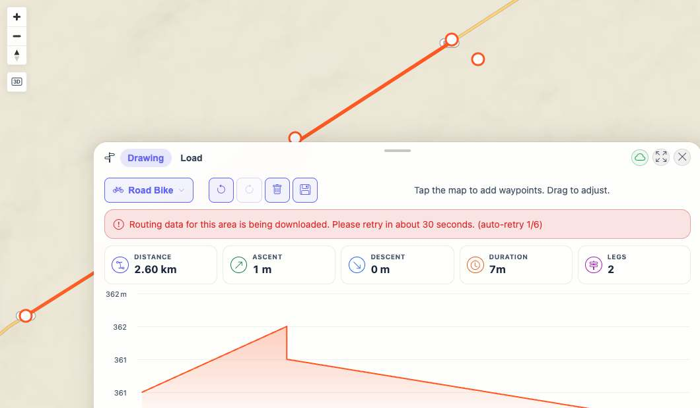
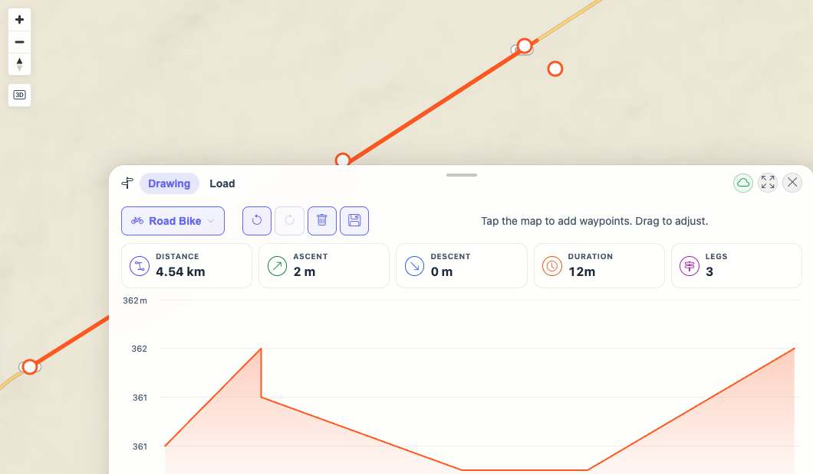

# Packet: PLN_09

## Scope

- Coverage source: `documentation/testing/frontend-regression-test-plan.md`
- Coverage ID or run packet: PLN_09
- In scope: Planner UI behavior when the route endpoint reports BRouter segment download/missing-data state.
- Out of scope: Verifying actual BRouter tile availability for a remote geography.

## Prerequisites

- Required previous coverage IDs or run packets: PLN_01 through PLN_08
- Required app/data state: Planner open in Drawing mode with a computed route.
- Required browser context: Desktop isolated Playwright browser at `http://188.245.169.80:18080/mtl/plan`.

## Allowed Mutations

- Allowed: Simulate one `/api/planner/route` missing-data response, then allow the normal auto-retry to recover.
- Not allowed: Leave route request interception active after the packet.

## Actions And Results

| Coverage ID | Action | Expected result | Actual result | Status | Evidence |
|---|---|---|---|---|---|
| PLN_09 | Installed a one-shot browser route handler returning `503 {"error":"segment-downloading"}` for the next planner route request, added a waypoint through the UI, captured the notice, removed the mock, and waited for auto-retry. | UI shows clear segment-downloading/unavailable state instead of an unhandled error; route retry can recover. | UI displayed `Routing data for this area is being downloaded. Please retry in about 30 seconds. (auto-retry 1/6)`; exactly one route request was intercepted; after the mock was removed the auto-retry cleared the notice and recomputed route stats to `4.54 km`, `12m`, `3 legs`. | PASS | [assets/PLN_09-segment-downloading-results.txt](../assets/PLN_09-segment-downloading-results.txt); [assets/PLN_09-segment-downloading-notice.jpg](../assets/PLN_09-segment-downloading-notice.jpg); [assets/PLN_09-after-auto-retry.jpg](../assets/PLN_09-after-auto-retry.jpg) |

## Issues

| ID | Severity | Summary | Reproduction | Expected | Actual | Evidence | Release impact |
|---|---|---|---|---|---|---|---|

## Evidence Files

| File | Purpose |
|---|---|
| [assets/PLN_09-segment-downloading-results.txt](../assets/PLN_09-segment-downloading-results.txt) | One-shot simulated response, UI notice, and auto-retry recovery. |
| [assets/PLN_09-before-simulated-missing-data.jpg](../assets/PLN_09-before-simulated-missing-data.jpg) | Planner before simulated missing-data edit. |
| [assets/PLN_09-segment-downloading-notice.jpg](../assets/PLN_09-segment-downloading-notice.jpg) | User-facing segment-downloading notice. |
| [assets/PLN_09-after-auto-retry.jpg](../assets/PLN_09-after-auto-retry.jpg) | Planner after normal route auto-retry recovered. |

## Screenshot Evidence

## Timings

| Step | Timing |
|---|---:|
| Simulated missing-data edit and notice capture | ~2 s |
| Built-in auto-retry recovery wait | ~9.5 s |

## Handoff Notes

- Completed: Client-facing BRouter missing-data notice and recovery were verified with a one-shot simulated route response.
- Remaining unfinished coverage: PLN_10 onward.
- Blocked or not applicable: Actual remote BRouter missing-tile geography was not controllable through exposed UI state in this run.
- State left for the next packet: Planner is in Drawing mode with recovered route stats `4.54 km`, `12m`, and `3 legs`; no route interception remains active.
