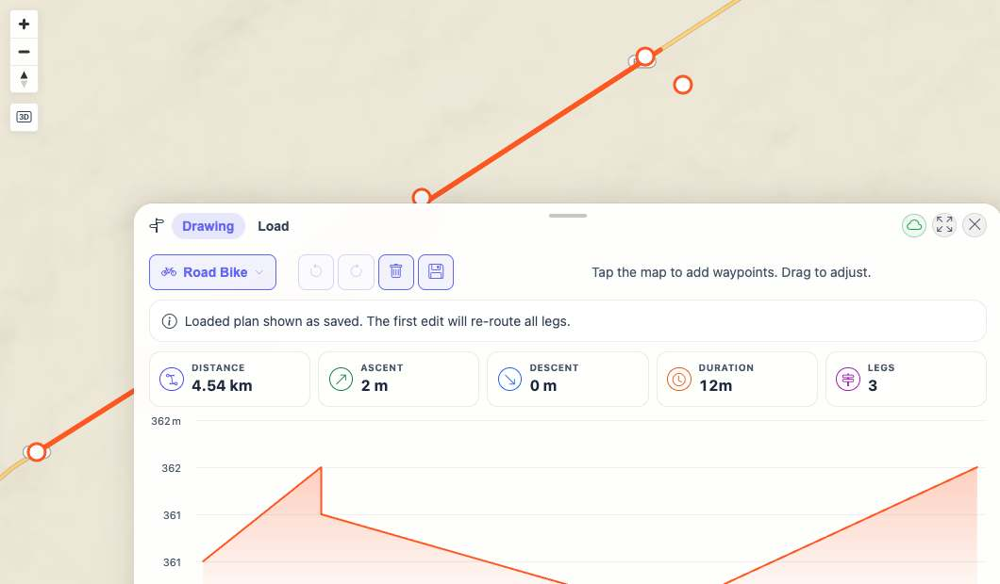
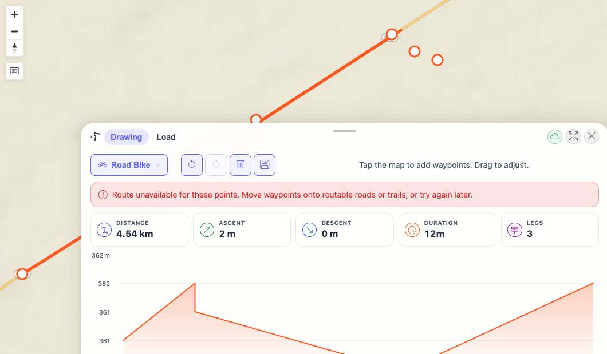
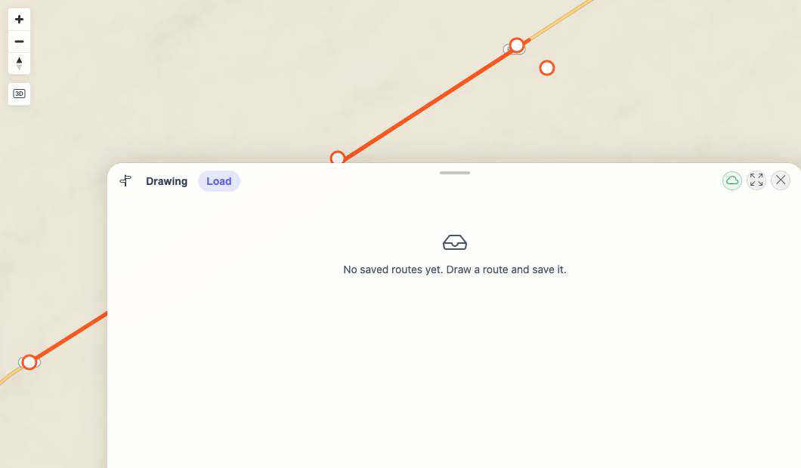

# Packet: PLN_10

## Scope

- Coverage source: `documentation/testing/frontend-regression-test-plan.md`
- Coverage ID or run packet: PLN_10
- In scope: Existing saved planned route display while new route computation fails.
- Out of scope: Real BRouter tile outage discovery; PLN_09 covered missing-data notice handling.

## Prerequisites

- Required previous coverage IDs or run packets: PLN_01 through PLN_09
- Required app/data state: Planner has a computed route available to save.
- Required browser context: Desktop isolated Playwright browser at `http://188.245.169.80:18080/mtl/plan`.

## Allowed Mutations

- Allowed: Create one temporary saved plan, simulate route computation failure, reload the saved plan, then delete it.
- Not allowed: Leave route request interception or temporary saved plans behind.

## Actions And Results

| Coverage ID | Action | Expected result | Actual result | Status | Evidence |
|---|---|---|---|---|---|
| PLN_10 | Saved route `PLN_10 existing route regression 2026-06-19 2350`, mocked `/api/planner/route` to return routing-unavailable, loaded the saved plan, then made an edit to trigger the mocked failure. | Existing saved route still displays even when fetching new route data fails. | Loading the saved plan made `0` route requests and displayed saved stats `4.54 km`, `12m`, `3 legs` with the saved-plan notice. After an edit, one mocked route request produced the user-facing unavailable notice while the same saved geometry/stats remained visible. Mock was removed and plan id `100026` was deleted. | PASS | [assets/PLN_10-existing-route-failure-results.txt](../assets/PLN_10-existing-route-failure-results.txt); [assets/PLN_10-loaded-existing-under-route-failure.jpg](../assets/PLN_10-loaded-existing-under-route-failure.jpg); [assets/PLN_10-new-data-failure-existing-route-visible.jpg](../assets/PLN_10-new-data-failure-existing-route-visible.jpg); [assets/PLN_10-deleted-list.jpg](../assets/PLN_10-deleted-list.jpg) |

## Issues

| ID | Severity | Summary | Reproduction | Expected | Actual | Evidence | Release impact |
|---|---|---|---|---|---|---|---|

## Evidence Files

| File | Purpose |
|---|---|
| [assets/PLN_10-existing-route-failure-results.txt](../assets/PLN_10-existing-route-failure-results.txt) | Save/load/failure/delete observations and route request interception count. |
| [assets/PLN_10-saved-list.jpg](../assets/PLN_10-saved-list.jpg) | Saved temporary route in Load tab. |
| [assets/PLN_10-loaded-existing-under-route-failure.jpg](../assets/PLN_10-loaded-existing-under-route-failure.jpg) | Existing route displayed while route endpoint mock was active. |
| [assets/PLN_10-new-data-failure-existing-route-visible.jpg](../assets/PLN_10-new-data-failure-existing-route-visible.jpg) | Route unavailable notice while existing route stats/geometry remained visible. |
| [assets/PLN_10-deleted-list.jpg](../assets/PLN_10-deleted-list.jpg) | Temporary plan deleted. |

## Screenshot Evidence

## Timings

| Step | Timing |
|---|---:|
| Save, mock failure, load/edit, cleanup | ~17 s |

## Handoff Notes

- Completed: Existing saved route display was verified under a simulated new-route fetch failure; temporary plan id `100026` was deleted.
- Remaining unfinished coverage: PLN_11 onward.
- Blocked or not applicable: Actual remote BRouter outage geography was not controlled in this quick-install run.
- State left for the next packet: Planner is on the Load tab; the saved route remains loaded in Drawing without an error notice, and no `PLN_10 existing route regression 2026-06-19 2350` plan remains.
