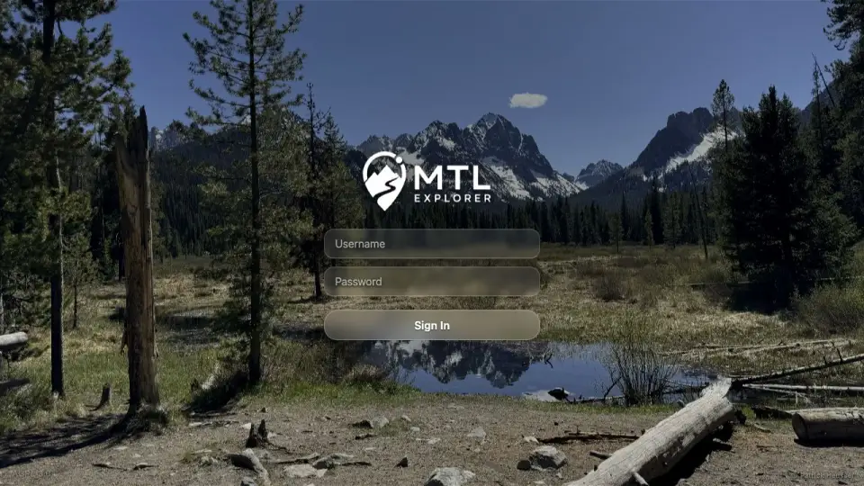

# Packet: RUN_SETUP

## Scope

- Coverage source: `documentation/testing/full-regression/retest-instructions.md` and README quick start.
- Coverage ID or run packet: RUN_SETUP
- In scope: disposable target setup, Docker prerequisite installation if missing, README quick install, beta app image override, app URL/login reachability, run-state initialization.
- Out of scope: product source changes, source builds/tests, non-README app credentials.

## Prerequisites

- Required previous coverage IDs or run packets: none.
- Required app/data state: fresh disposable target directory.
- Required browser context: normal desktop browser tab.

## Allowed Mutations

- Allowed: rotate expired temporary SSH password for the run; install missing Docker/Compose packages; create disposable install directory; download README compose file; set requested beta app image override; start the stack.
- Not allowed: store real SSH credentials in repo artifacts; alter product source; use non-README app credentials.

## Actions And Results

| Coverage ID | Action | Expected result | Actual result | Status | Evidence |
|---|---|---|---|---|---|
| RUN_SETUP | Connected to `188.245.169.80` as root, rotated the expired temporary SSH password, installed missing Docker/Compose prerequisites, created `/root/mtl-full-regression-2026-06-19_1952-beta-188-full-regression`, downloaded GitHub `main` `docker-compose.yml`, set `MTL_APP_IMAGE=wauwau0977/mytraillog:beta`, ran `docker compose up -d`, checked server-local and remote URLs, and opened the login screen in a browser. | Quick-install stack runs from README compose with beta app image; app is reachable at the documented URL derived for the remote server; login screen is visible with README credentials expected. | Docker 29.1.3 and Compose 2.40.3 were installed as missing prerequisites; app/db/brouter/location-search containers are up; app image is `wauwau0977/mytraillog:beta`; server-local and remote `/mtl/` both returned HTTP 200; browser redirected to `/mtl/login` with MTL Explorer title and username/password fields. | PASS | [assets/RUN_SETUP-server.txt](../assets/RUN_SETUP-server.txt); [assets/RUN_SETUP-login.webp](../assets/RUN_SETUP-login.webp) |

## Issues

| ID | Severity | Summary | Reproduction | Expected | Actual | Evidence | Release impact |
|---|---|---|---|---|---|---|---|

## Evidence Files

| File | Purpose |
|---|---|
| [assets/RUN_SETUP-server.txt](../assets/RUN_SETUP-server.txt) | Host, Docker/Compose, image override, container state, local/remote HTTP checks. |
| [assets/RUN_SETUP-login.webp](../assets/RUN_SETUP-login.webp) | Browser screenshot of the reachable login screen. |

## Screenshot Evidence

## Timings

| Step | Timing |
|---|---:|
| SSH preflight and forced password rotation | <1 min |
| Docker package installation | ~1 min |
| Compose download, image pull, and stack start | ~2 min |
| App startup after container start | 29 s |
| Remote URL/browser verification | <1 min |

## Handoff Notes

- Completed: RUN_SETUP.
- Remaining unfinished coverage: ACC_01 onward, then RUN_CLEANUP after the finalization gate passes.
- Blocked or not applicable: none for setup.
- State left for the next packet: beta quick-install stack running at `http://188.245.169.80:18080/mtl/`; import folder is `/root/mtl-full-regression-2026-06-19_1952-beta-188-full-regression/data/gpx`; app login should use README credentials `mtl` / `change-me`.
