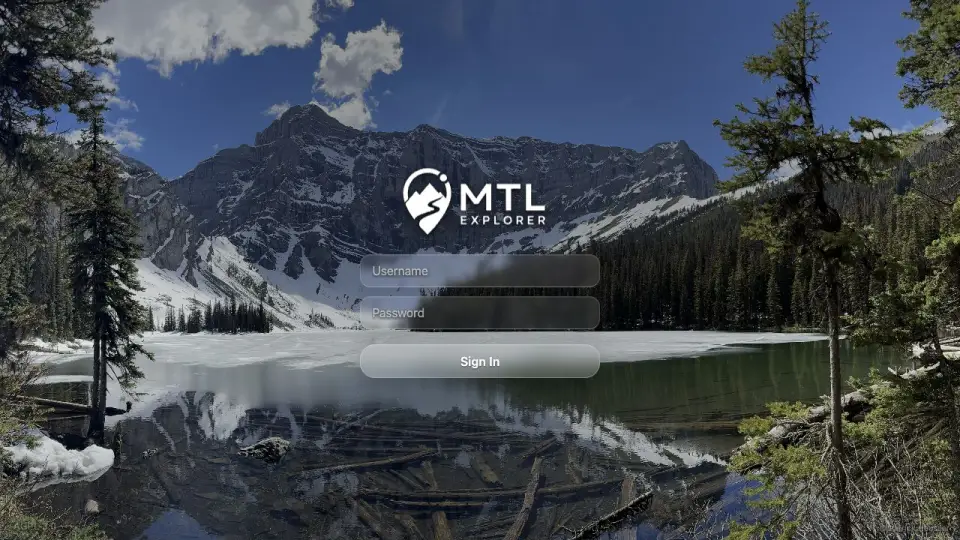

# Packet: SGN_01

## Scope

- Coverage source: `documentation/testing/frontend-regression-test-plan.md`
- Coverage ID or run packet: SGN_01
- In scope: Open the app while signed out and verify redirect to login.
- Out of scope: Valid and invalid login behavior.

## Prerequisites

- Required previous coverage IDs or run packets: FMT_02.
- Required app/data state: app running with imported dataset; browser session may be signed in initially.
- Required browser context: desktop browser.

## Allowed Mutations

- Allowed: Use visible session Logout to create signed-out state.
- Not allowed: Wipe all app data.

## Actions And Results

| Coverage ID | Action | Expected result | Actual result | Status | Evidence |
|---|---|---|---|---|---|
| SGN_01 | Used Admin > Session > Logout, then opened `/mtl/` while signed out. | Signed-out user is redirected to the login screen. | Browser landed on `/mtl/login`; login screen showed MTL Explorer branding plus Username, Password, and Sign In controls. | PASS | [assets/SGN_01-login-redirect.webp](../assets/SGN_01-login-redirect.webp) |

## Issues

| ID | Severity | Summary | Reproduction | Expected | Actual | Evidence | Release impact |
|---|---|---|---|---|---|---|---|

## Evidence Files

| File | Purpose |
|---|---|
| [assets/SGN_01-login-redirect.webp](../assets/SGN_01-login-redirect.webp) | Signed-out app root redirect to login screen. |

## Screenshot Evidence

## Timings

| Step | Timing |
|---|---:|
| Logout and open root | <1 min |

## Handoff Notes

- Completed: SGN_01.
- Remaining unfinished coverage: SGN_02 onward.
- Blocked or not applicable: none.
- State left for the next packet: Browser is signed out at `/mtl/login`.
