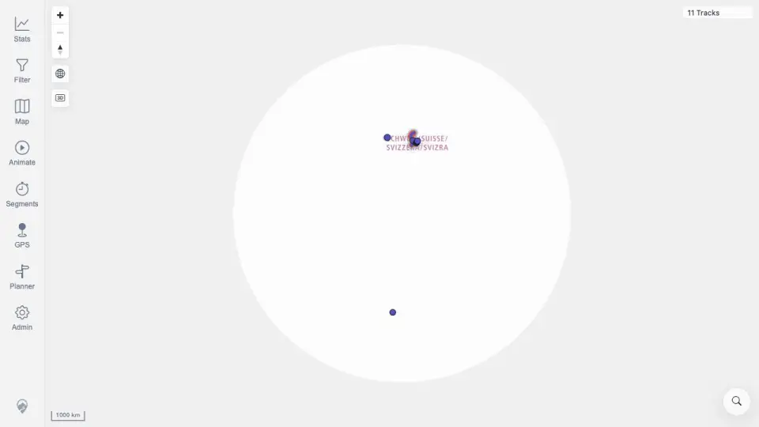

# Packet: SGN_02

## Scope

- Coverage source: `documentation/testing/frontend-regression-test-plan.md`
- Coverage ID or run packet: SGN_02
- In scope: Sign in with valid README quick-start credentials and verify the map is reached.
- Out of scope: Invalid credentials and logout behavior.

## Prerequisites

- Required previous coverage IDs or run packets: SGN_01.
- Required app/data state: browser is signed out at login.
- Required browser context: desktop browser.

## Allowed Mutations

- Allowed: Sign in with README-documented local credentials.
- Not allowed: Change app data.

## Actions And Results

| Coverage ID | Action | Expected result | Actual result | Status | Evidence |
|---|---|---|---|---|---|
| SGN_02 | Entered username `mtl` and the README quick-start password, then clicked Sign In. | Valid credentials reach the map. | Browser returned to `/mtl/`; map rendered with navigation controls and `11 Tracks`. | PASS | [assets/SGN_02-valid-login-map.webp](../assets/SGN_02-valid-login-map.webp) |

## Issues

| ID | Severity | Summary | Reproduction | Expected | Actual | Evidence | Release impact |
|---|---|---|---|---|---|---|---|

## Evidence Files

| File | Purpose |
|---|---|
| [assets/SGN_02-valid-login-map.webp](../assets/SGN_02-valid-login-map.webp) | Valid login reached map with imported tracks. |

## Screenshot Evidence

## Timings

| Step | Timing |
|---|---:|
| Login and map load | <1 min |

## Handoff Notes

- Completed: SGN_02.
- Remaining unfinished coverage: SGN_03 onward.
- Blocked or not applicable: none.
- State left for the next packet: Browser is signed in at the map.
