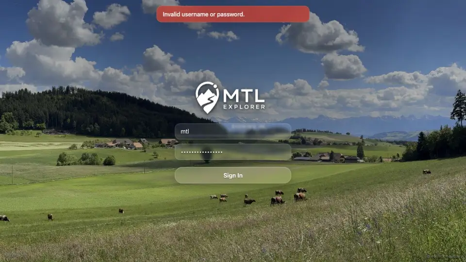

# Packet: SGN_03

## Scope

- Coverage source: `documentation/testing/frontend-regression-test-plan.md`
- Coverage ID or run packet: SGN_03
- In scope: Sign in with wrong credentials and verify a clear error while staying on login.
- Out of scope: Valid login behavior.

## Prerequisites

- Required previous coverage IDs or run packets: SGN_02.
- Required app/data state: app running; browser can be signed out as test setup.
- Required browser context: desktop browser.

## Allowed Mutations

- Allowed: Use visible logout as setup and attempt invalid login.
- Not allowed: Lock accounts or change credentials.

## Actions And Results

| Coverage ID | Action | Expected result | Actual result | Status | Evidence |
|---|---|---|---|---|---|
| SGN_03 | Signed out, entered username `mtl` with password `definitely-wrong`, and clicked Sign In. | Clear error appears and user stays on login. | Browser stayed on `/mtl/login`; alert displayed `Invalid username or password.` with login fields still present. | PASS | [assets/SGN_03-invalid-login.webp](../assets/SGN_03-invalid-login.webp) |

## Issues

| ID | Severity | Summary | Reproduction | Expected | Actual | Evidence | Release impact |
|---|---|---|---|---|---|---|---|

## Evidence Files

| File | Purpose |
|---|---|
| [assets/SGN_03-invalid-login.webp](../assets/SGN_03-invalid-login.webp) | Invalid credentials error on login screen. |

## Screenshot Evidence

## Timings

| Step | Timing |
|---|---:|
| Sign out and invalid login attempt | <1 min |

## Handoff Notes

- Completed: SGN_03.
- Remaining unfinished coverage: SGN_04 onward.
- Blocked or not applicable: none.
- State left for the next packet: Browser is signed out at `/mtl/login` with invalid-credential error visible.
