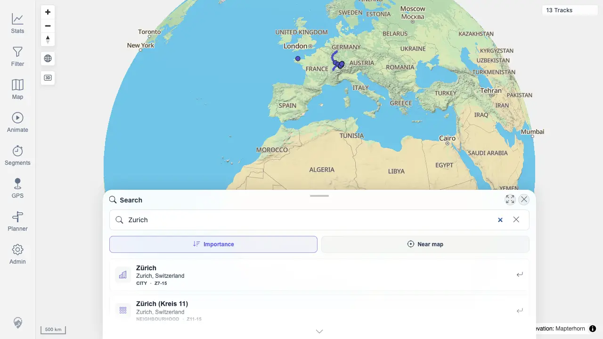

# Packet: SRC_01

## Scope

- Coverage source: `documentation/testing/frontend-regression-test-plan.md`
- Coverage ID or run packet: SRC_01
- In scope: Open location search, type a place name, and verify visible results.
- Out of scope: Selecting a result, marker cleanup, and no-result messaging.

## Prerequisites

- Required previous coverage IDs or run packets: GPS_05
- Required app/data state: Authenticated map view with 13 tracks.
- Required browser context: Fresh desktop Chrome context against the remote target.

## Allowed Mutations

- Allowed: Open location search and type a query.
- Not allowed: Change server data or persistent map settings.

## Actions And Results

| Coverage ID | Action | Expected result | Actual result | Status | Evidence |
|---|---|---|---|---|---|
| SRC_01 | Clicked `Search location`, typed `Zurich`, waited for the debounced search to settle. | Search results appear for the place query. | The search sheet opened, the query remained `Zurich`, 20 results appeared, and the map stayed usable with 13 tracks visible. | PASS | [assets/SRC_01-location-results.webp](../assets/SRC_01-location-results.webp); [assets/SRC-location-search-results.txt](../assets/SRC-location-search-results.txt) |

## Issues

| ID | Severity | Summary | Reproduction | Expected | Actual | Evidence | Release impact |
|---|---|---|---|---|---|---|---|

## Evidence Files

| File | Purpose |
|---|---|
| [assets/SRC_01-location-results.webp](../assets/SRC_01-location-results.webp) | Location search sheet showing Zurich results. |
| [assets/SRC-location-search-results.txt](../assets/SRC-location-search-results.txt) | Captured query, result count, and result text summary. |

## Screenshot Evidence

## Timings

| Step | Timing |
|---|---:|
| Open search, type query, capture results | 2026-06-20T00:58 CEST |

## Handoff Notes

- Completed: SRC_01 passed.
- Remaining unfinished coverage: SRC_02.
- Blocked or not applicable: None.
- State left for the next packet: Shared SRC evidence captured; queue advances to result selection.
