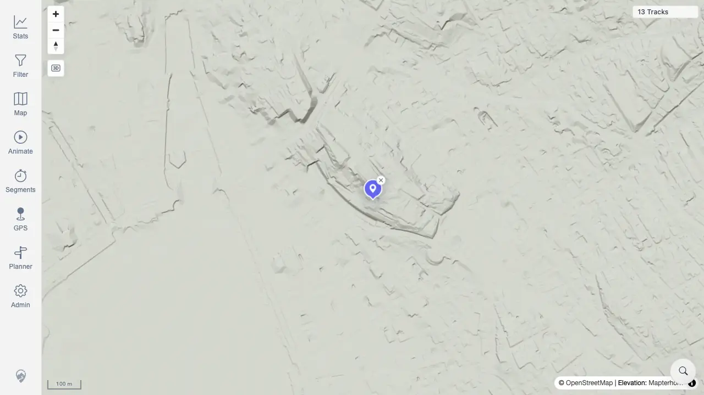

# Packet: SRC_02

## Scope

- Coverage source: `documentation/testing/frontend-regression-test-plan.md`
- Coverage ID or run packet: SRC_02
- In scope: Select a location-search result and verify map fly-to plus marker placement.
- Out of scope: Clearing the marker and no-result query messaging.

## Prerequisites

- Required previous coverage IDs or run packets: SRC_01
- Required app/data state: Location search sheet has results for `Zurich`.
- Required browser context: Desktop Chrome context against the remote target.

## Allowed Mutations

- Allowed: Select a search result, allowing the map to fly to it and place a marker.
- Not allowed: Change server data.

## Actions And Results

| Coverage ID | Action | Expected result | Actual result | Status | Evidence |
|---|---|---|---|---|---|
| SRC_02 | Clicked the first Zurich location result and waited for the marker to appear. | The map flies to the selected location and places a marker. | The map zoomed to Zurich, one `.mtl-location-search-marker` appeared with one clear button, and the marker was rendered near the map center. | PASS | [assets/SRC_02-location-marker.webp](../assets/SRC_02-location-marker.webp); [assets/SRC-location-search-results.txt](../assets/SRC-location-search-results.txt) |

## Issues

| ID | Severity | Summary | Reproduction | Expected | Actual | Evidence | Release impact |
|---|---|---|---|---|---|---|---|

## Evidence Files

| File | Purpose |
|---|---|
| [assets/SRC_02-location-marker.webp](../assets/SRC_02-location-marker.webp) | Map after selecting the first search result, showing the location marker. |
| [assets/SRC-location-search-results.txt](../assets/SRC-location-search-results.txt) | Marker count, clear-button count, and marker bounding box evidence. |

## Screenshot Evidence

## Timings

| Step | Timing |
|---|---:|
| Select first result and capture marker | 2026-06-20T00:58 CEST |

## Handoff Notes

- Completed: SRC_02 passed.
- Remaining unfinished coverage: SRC_03.
- Blocked or not applicable: None.
- State left for the next packet: Marker cleanup evidence captured.
