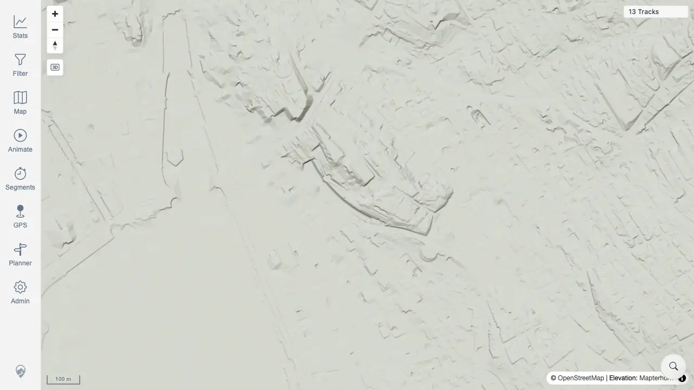

# Packet: SRC_03

## Scope

- Coverage source: `documentation/testing/frontend-regression-test-plan.md`
- Coverage ID or run packet: SRC_03
- In scope: Clear the location search marker cleanly.
- Out of scope: Search result loading and no-result state.

## Prerequisites

- Required previous coverage IDs or run packets: SRC_02
- Required app/data state: One location search marker is visible on the map.
- Required browser context: Desktop Chrome context against the remote target.

## Allowed Mutations

- Allowed: Use the marker clear control.
- Not allowed: Change server data or track filters.

## Actions And Results

| Coverage ID | Action | Expected result | Actual result | Status | Evidence |
|---|---|---|---|---|---|
| SRC_03 | Clicked the location marker clear button after selecting a Zurich result. | The search marker is removed cleanly. | Marker count changed from 1 to 0, the clear button disappeared, and the map remained usable with 13 tracks visible. | PASS | [assets/SRC_03-location-marker-cleared.webp](../assets/SRC_03-location-marker-cleared.webp); [assets/SRC-location-search-results.txt](../assets/SRC-location-search-results.txt) |

## Issues

| ID | Severity | Summary | Reproduction | Expected | Actual | Evidence | Release impact |
|---|---|---|---|---|---|---|---|

## Evidence Files

| File | Purpose |
|---|---|
| [assets/SRC_03-location-marker-cleared.webp](../assets/SRC_03-location-marker-cleared.webp) | Map after clearing the location search marker. |
| [assets/SRC-location-search-results.txt](../assets/SRC-location-search-results.txt) | Before/after marker counts for the search marker cleanup. |

## Screenshot Evidence

## Timings

| Step | Timing |
|---|---:|
| Clear marker and capture map | 2026-06-20T00:58 CEST |

## Handoff Notes

- Completed: SRC_03 passed.
- Remaining unfinished coverage: SRC_04.
- Blocked or not applicable: None.
- State left for the next packet: No-result evidence captured.
