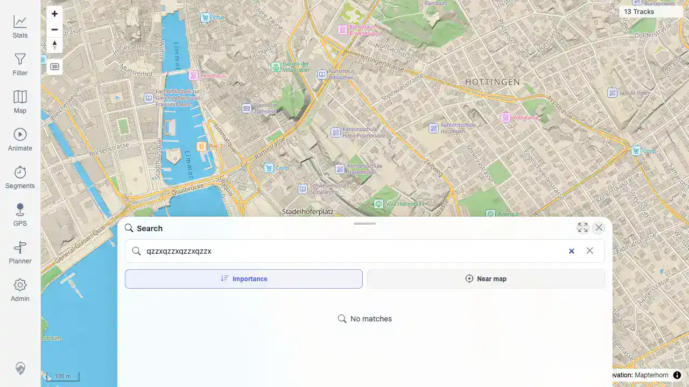

# Packet: SRC_04

## Scope

- Coverage source: `documentation/testing/frontend-regression-test-plan.md`
- Coverage ID or run packet: SRC_04
- In scope: Verify empty or no-result location-search query messaging.
- Out of scope: Search result selection and marker placement.

## Prerequisites

- Required previous coverage IDs or run packets: SRC_03
- Required app/data state: Authenticated map view; location marker cleared.
- Required browser context: Desktop Chrome context against the remote target.

## Allowed Mutations

- Allowed: Open location search and type a query expected to have no matches.
- Not allowed: Change server data.

## Actions And Results

| Coverage ID | Action | Expected result | Actual result | Status | Evidence |
|---|---|---|---|---|---|
| SRC_04 | Opened location search, cleared the previous query, and typed `qzzxqzzxqzzxqzzx`. | Empty or no-result queries show a clear message. | The search sheet showed zero result rows and the state message `No matches`; no location marker was present. | PASS | [assets/SRC_04-location-no-results.webp](../assets/SRC_04-location-no-results.webp); [assets/SRC-location-search-results.txt](../assets/SRC-location-search-results.txt) |

## Issues

| ID | Severity | Summary | Reproduction | Expected | Actual | Evidence | Release impact |
|---|---|---|---|---|---|---|---|

## Evidence Files

| File | Purpose |
|---|---|
| [assets/SRC_04-location-no-results.webp](../assets/SRC_04-location-no-results.webp) | Search sheet showing the `No matches` message for a nonsense query. |
| [assets/SRC-location-search-results.txt](../assets/SRC-location-search-results.txt) | Captured no-result query, zero result count, and no-marker state. |

## Screenshot Evidence

## Timings

| Step | Timing |
|---|---:|
| Enter no-result query and capture state | 2026-06-20T00:58 CEST |

## Handoff Notes

- Completed: SRC_04 passed; location search section complete.
- Remaining unfinished coverage: GLB_01.
- Blocked or not applicable: None.
- State left for the next packet: Queue advances to globe mode.
