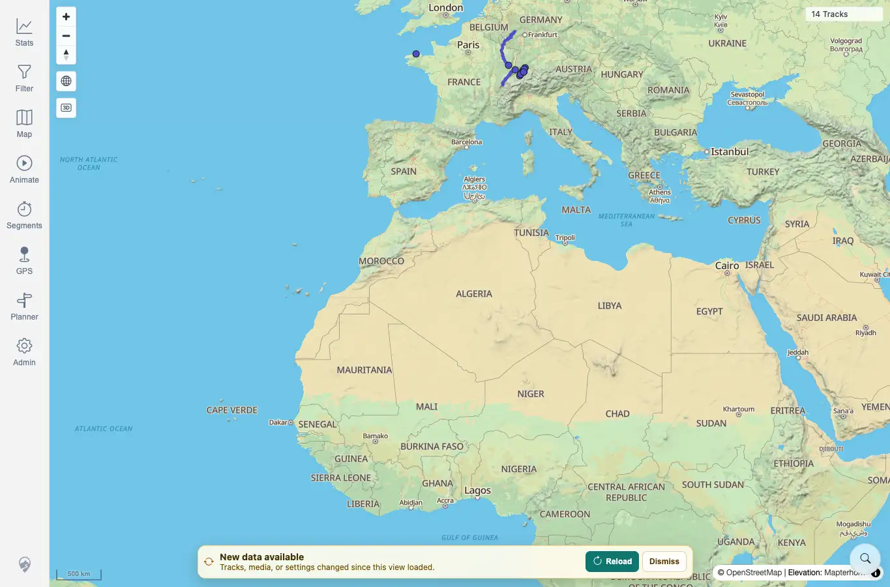

# Packet: SYN_01

## Scope

- Coverage source: `documentation/testing/frontend-regression-test-plan.md`
- Coverage ID or run packet: SYN_01
- In scope: Verify a data-freshness banner appears after a server-side data change.
- Out of scope: Reload, dismissal, logout/login behavior.

## Prerequisites

- Required previous coverage IDs or run packets: ADM_11.
- Required app/data state: Authenticated desktop map loaded with the then-current freshness token applied.
- Required browser context: Desktop Chrome context against the remote target.

## Allowed Mutations

- Allowed: Upload a fully synthetic GPX through the authenticated upload endpoint to create a server-side track change.
- Not allowed: Use private GPX data or SSH-side file changes.

## Actions And Results

| Coverage ID | Action | Expected result | Actual result | Status | Evidence |
|---|---|---|---|---|---|
| SYN_01 | Loaded the map, cleared any freshness dismissal, recorded the current applied token, uploaded `syn-cache-refresh-20260619232459.gpx`, and waited for the client freshness poll. | A visible data-freshness banner appears after the server token changes. | The map still showed the stale `14 Tracks` client state and displayed `New data available` with `Reload` and `Dismiss` actions after the upload changed the server token. | PASS | [assets/SYN_01-freshness-banner.webp](../assets/SYN_01-freshness-banner.webp); [assets/SYN-live-results.txt](../assets/SYN-live-results.txt) |

## Issues

| ID | Severity | Summary | Reproduction | Expected | Actual | Evidence | Release impact |
|---|---|---|---|---|---|---|---|

## Evidence Files

| File | Purpose |
|---|---|
| [assets/SYN_01-freshness-banner.webp](../assets/SYN_01-freshness-banner.webp) | Freshness banner over stale 14-track map after synthetic upload. |
| [assets/SYN-live-results.txt](../assets/SYN-live-results.txt) | Upload, token-change, and banner state summary. |

## Screenshot Evidence

## Timings

| Step | Timing |
|---|---:|
| Synthetic upload, freshness polling, and banner capture | ~2 min |

## Handoff Notes

- Completed: SYN_01 passed.
- Remaining unfinished coverage: SYN_02 onward.
- Blocked or not applicable: None.
- State left for the next packet: `syn-cache-refresh-20260619232459.gpx` had been uploaded; the browser still needed the banner reload for cache refresh.
