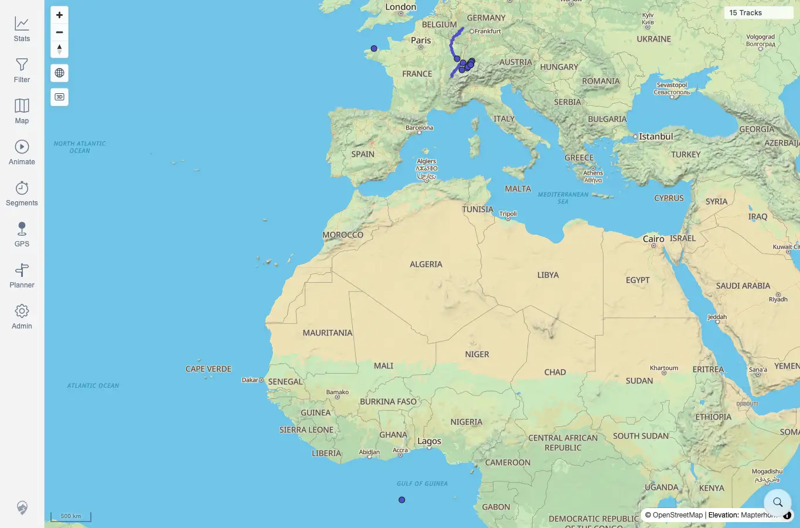
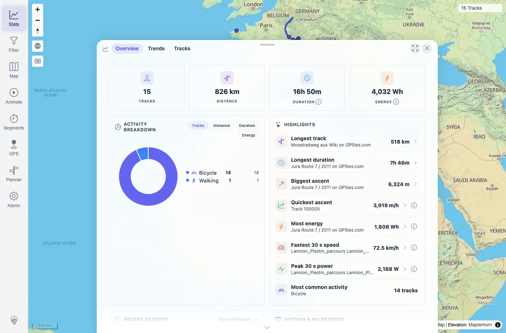
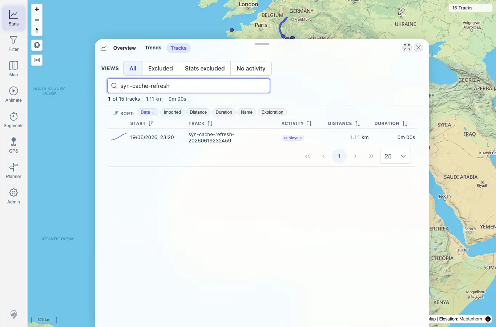

# Packet: SYN_02

## Scope

- Coverage source: `documentation/testing/frontend-regression-test-plan.md`
- Coverage ID or run packet: SYN_02
- In scope: Verify the freshness banner reload refreshes cached tracks and statistics.
- Out of scope: Banner dismissal and login-loop behavior.

## Prerequisites

- Required previous coverage IDs or run packets: SYN_01.
- Required app/data state: Freshness banner visible after `syn-cache-refresh-20260619232459.gpx` upload.
- Required browser context: Desktop Chrome context against the remote target.

## Allowed Mutations

- Allowed: Click the banner Reload action and navigate map/stats/browser surfaces.
- Not allowed: Add or delete additional files during this packet.

## Actions And Results

| Coverage ID | Action | Expected result | Actual result | Status | Evidence |
|---|---|---|---|---|---|
| SYN_02 | Clicked `Reload` in the freshness banner, waited for the banner to disappear, then checked map, Stats overview, and Stats > Tracks search for the synthetic filename. | Cached tracks and stats refresh to the new server source of truth. | After reload, the map count changed from 14 to `15 Tracks`; Stats overview showed `15` tracks with updated totals; the Tracks tab search for `syn-cache-refresh` returned the new synthetic track as 1 of 15. | PASS | [assets/SYN_02-after-banner-reload-map.webp](../assets/SYN_02-after-banner-reload-map.webp); [assets/SYN_02-stats-after-reload.webp](../assets/SYN_02-stats-after-reload.webp); [assets/SYN_02-browser-after-reload.webp](../assets/SYN_02-browser-after-reload.webp); [assets/SYN-live-results.txt](../assets/SYN-live-results.txt) |

## Issues

| ID | Severity | Summary | Reproduction | Expected | Actual | Evidence | Release impact |
|---|---|---|---|---|---|---|---|

## Evidence Files

| File | Purpose |
|---|---|
| [assets/SYN_02-after-banner-reload-map.webp](../assets/SYN_02-after-banner-reload-map.webp) | Map after banner reload, showing 15 tracks. |
| [assets/SYN_02-stats-after-reload.webp](../assets/SYN_02-stats-after-reload.webp) | Stats overview after cache refresh. |
| [assets/SYN_02-browser-after-reload.webp](../assets/SYN_02-browser-after-reload.webp) | Track browser search finding the synthetic track. |
| [assets/SYN-live-results.txt](../assets/SYN-live-results.txt) | Token, count, and surface summary. |

## Screenshot Evidence

## Timings

| Step | Timing |
|---|---:|
| Banner reload and surface checks | ~3 min |

## Handoff Notes

- Completed: SYN_02 passed.
- Remaining unfinished coverage: SYN_03 onward.
- Blocked or not applicable: None.
- State left for the next packet: Client cache was refreshed to include `syn-cache-refresh-20260619232459`; later SYN_07 added one more synthetic track.
