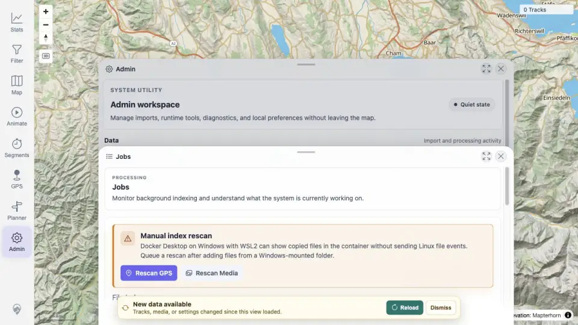
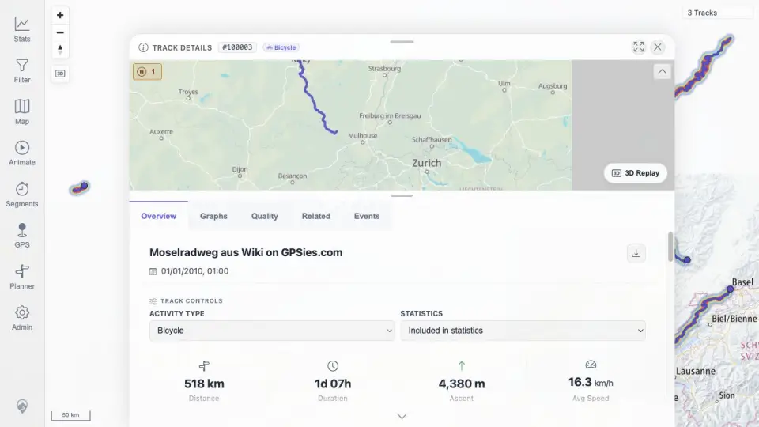

# Packet: SYN_03

## Scope

- Coverage source: `documentation/testing/frontend-regression-test-plan.md`
- Coverage ID or run packet: SYN_03
- In scope: Verify the required five-GPX import and delete-two-track flow reflected the source of truth across indexer, freshness, map, browser, stats, filters, heatmap, and details.
- Out of scope: Repeating the destructive import/delete flow after it already completed in the ordered queue.

## Prerequisites

- Required previous coverage IDs or run packets: IMP_01 through IMP_09, DEL_01 through DEL_05.
- Required app/data state: Five public GPX import was executed, then two imported source files were deleted.
- Required browser context: Completed desktop evidence from the import/delete packets.

## Allowed Mutations

- Allowed: Review completed packet evidence for the already-executed flow.
- Not allowed: Re-import or re-delete files just to duplicate evidence.

## Actions And Results

| Coverage ID | Action | Expected result | Actual result | Status | Evidence |
|---|---|---|---|---|---|
| SYN_03 | Cross-checked the completed IMP and DEL packets for the required five-GPX import and delete-two-track flow. | Indexer state, freshness banner, map, browser, stats, filters, heatmap, and details all reflect the new source-of-truth files before and after deletion. | IMP_03/IMP_04 recorded 5/5 GPX files indexed and freshness changed; IMP_05 banner reload updated map/browser/stats/filter to five tracks; IMP_09 verified stats and heatmap; DEL_02/DEL_03 showed deletion processing and map/browser/filter/heatmap/stats removal; DEL_04 confirmed remaining details still opened. | PASS | [assets/IMP_04-freshness-out-of-sync.webp](../assets/IMP_04-freshness-out-of-sync.webp); [assets/IMP_05-refresh-surfaces.txt](../assets/IMP_05-refresh-surfaces.txt); [assets/IMP_09-post-import-totals.txt](../assets/IMP_09-post-import-totals.txt); [assets/DEL_03-deletion-surfaces.txt](../assets/DEL_03-deletion-surfaces.txt); [assets/DEL_04-remaining-detail-open.webp](../assets/DEL_04-remaining-detail-open.webp) |

## Issues

| ID | Severity | Summary | Reproduction | Expected | Actual | Evidence | Release impact |
|---|---|---|---|---|---|---|---|

## Evidence Files

| File | Purpose |
|---|---|
| [assets/IMP_04-freshness-out-of-sync.webp](../assets/IMP_04-freshness-out-of-sync.webp) | Freshness changed after five-GPX import. |
| [assets/IMP_05-refresh-surfaces.txt](../assets/IMP_05-refresh-surfaces.txt) | Post-import map/browser/filter/stats count summary. |
| [assets/IMP_09-post-import-totals.txt](../assets/IMP_09-post-import-totals.txt) | Post-import heatmap/stats totals. |
| [assets/DEL_03-deletion-surfaces.txt](../assets/DEL_03-deletion-surfaces.txt) | Post-delete absence and surface summary. |
| [assets/DEL_04-remaining-detail-open.webp](../assets/DEL_04-remaining-detail-open.webp) | Remaining track detail still opens after deletion. |

## Screenshot Evidence

## Timings

| Step | Timing |
|---|---:|
| Evidence cross-check | ~10 min |

## Handoff Notes

- Completed: SYN_03 passed using the direct import/delete packets already executed in queue order.
- Remaining unfinished coverage: SYN_04 onward.
- Blocked or not applicable: None.
- State left for the next packet: No new mutation in this packet.
