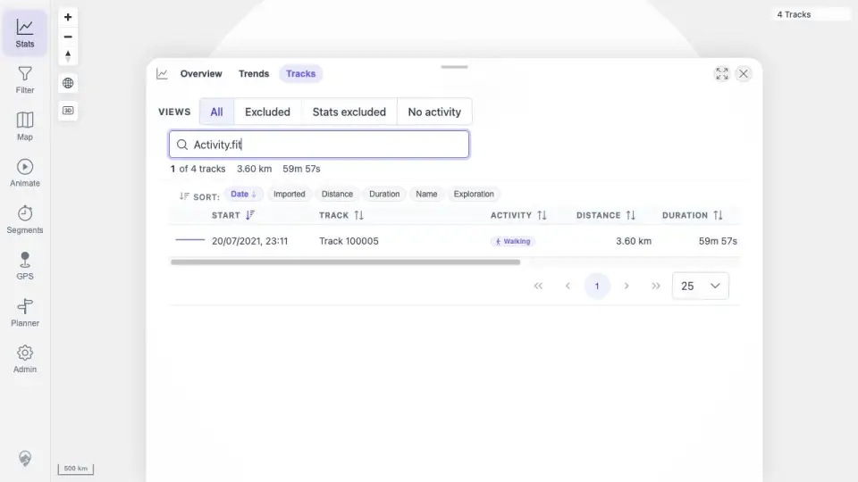

# Packet: SYN_04

## Scope

- Coverage source: `documentation/testing/frontend-regression-test-plan.md`
- Coverage ID or run packet: SYN_04
- In scope: Verify FIT conversion import changes freshness and cache state like native GPX import.
- Out of scope: Re-importing the same FIT file after FIT coverage already completed.

## Prerequisites

- Required previous coverage IDs or run packets: FIT_01 through FIT_05.
- Required app/data state: Public `Activity.fit` was imported and indexed as a converted GPS track.
- Required browser context: Completed desktop evidence from the FIT packets.

## Allowed Mutations

- Allowed: Review completed FIT evidence for the already-executed conversion import.
- Not allowed: Add duplicate FIT files.

## Actions And Results

| Coverage ID | Action | Expected result | Actual result | Status | Evidence |
|---|---|---|---|---|---|
| SYN_04 | Cross-checked FIT import monitor, search/stats UI, details, and source/GPX download packets. | FIT conversion changes freshness/cache state the same way native GPX import does. | `Activity.fit` imported as track `100005`; the monitor recorded freshness tokens during FIT processing, jobs settled, the refreshed UI showed `4 Tracks`, Stats/Tracks search found `Activity.fit`, detail tabs opened, and source plus GPX download paths worked. | PASS | [assets/FIT_02-import-monitor.txt](../assets/FIT_02-import-monitor.txt); [assets/FIT_02-search-stats.webp](../assets/FIT_02-search-stats.webp); [assets/FIT_03-overview.webp](../assets/FIT_03-overview.webp); [assets/FIT_04-source-download.txt](../assets/FIT_04-source-download.txt); [assets/FIT_05-gpx-export.txt](../assets/FIT_05-gpx-export.txt) |

## Issues

| ID | Severity | Summary | Reproduction | Expected | Actual | Evidence | Release impact |
|---|---|---|---|---|---|---|---|

## Evidence Files

| File | Purpose |
|---|---|
| [assets/FIT_02-import-monitor.txt](../assets/FIT_02-import-monitor.txt) | FIT index/freshness polling summary. |
| [assets/FIT_02-search-stats.webp](../assets/FIT_02-search-stats.webp) | FIT track visible in refreshed UI and stats. |
| [assets/FIT_03-overview.webp](../assets/FIT_03-overview.webp) | FIT-backed detail view. |
| [assets/FIT_04-source-download.txt](../assets/FIT_04-source-download.txt) | Original FIT source download verification. |
| [assets/FIT_05-gpx-export.txt](../assets/FIT_05-gpx-export.txt) | Converted GPX export verification. |

## Screenshot Evidence

## Timings

| Step | Timing |
|---|---:|
| Evidence cross-check | ~5 min |

## Handoff Notes

- Completed: SYN_04 passed using the direct FIT packets already executed in queue order.
- Remaining unfinished coverage: SYN_05 onward.
- Blocked or not applicable: None.
- State left for the next packet: No new mutation in this packet.
