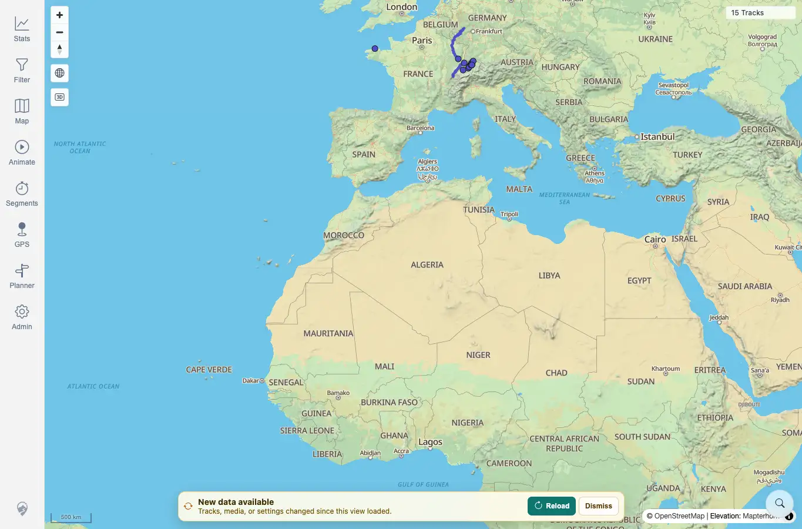
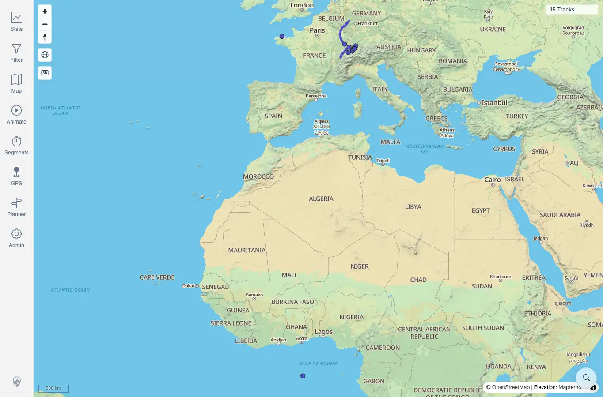

# Packet: SYN_05

## Scope

- Coverage source: `documentation/testing/frontend-regression-test-plan.md`
- Coverage ID or run packet: SYN_05
- In scope: Verify dismissing the freshness banner snoozes it for five minutes and hides it through the next polling cycle even when the server token changes again.
- Out of scope: Waiting the full five minutes for reappearance after snooze expiry.

## Prerequisites

- Required previous coverage IDs or run packets: SYN_04.
- Required app/data state: Authenticated map with current freshness token known.
- Required browser context: Desktop Chrome context against the remote target.

## Allowed Mutations

- Allowed: Trigger safe manual GPS rescans to change the freshness token without changing track files.
- Not allowed: Add or delete tracks in this packet.

## Actions And Results

| Coverage ID | Action | Expected result | Actual result | Status | Evidence |
|---|---|---|---|---|---|
| SYN_05 | Set the applied token to the current server token, triggered a GPS rescan, waited for the banner, clicked `Dismiss`, triggered another GPS rescan, and waited beyond one 30-second freshness polling cycle. | Dismissal stores a five-minute snooze and keeps the banner hidden through the next polling cycle even if the server token changes again. | The first rescan showed `New data available`; after clicking `Dismiss`, local storage had a dismissed token with a future expiry. A second rescan changed the token again, and after 36 seconds the banner remained hidden with the dismissal still active. | PASS | [assets/SYN_05-before-dismiss.webp](../assets/SYN_05-before-dismiss.webp); [assets/SYN_05-dismissed-after-poll.webp](../assets/SYN_05-dismissed-after-poll.webp); [assets/SYN-live-results.txt](../assets/SYN-live-results.txt) |

## Issues

| ID | Severity | Summary | Reproduction | Expected | Actual | Evidence | Release impact |
|---|---|---|---|---|---|---|---|

## Evidence Files

| File | Purpose |
|---|---|
| [assets/SYN_05-before-dismiss.webp](../assets/SYN_05-before-dismiss.webp) | Banner visible before dismissal. |
| [assets/SYN_05-dismissed-after-poll.webp](../assets/SYN_05-dismissed-after-poll.webp) | Banner hidden after second token change and polling interval. |
| [assets/SYN-live-results.txt](../assets/SYN-live-results.txt) | Dismissed token, expiry, rescan, and poll summary. |

## Screenshot Evidence

## Timings

| Step | Timing |
|---|---:|
| Rescan, dismiss, second rescan, and post-poll capture | ~3 min |

## Handoff Notes

- Completed: SYN_05 passed.
- Remaining unfinished coverage: SYN_06 onward.
- Blocked or not applicable: None.
- State left for the next packet: No file mutation; client dismissal was local to the closed browser context.
