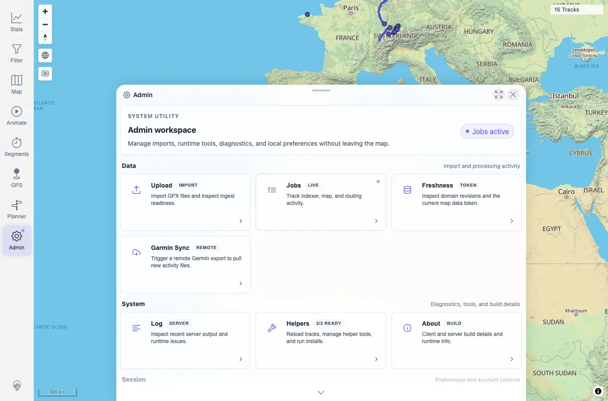

# Packet: SYN_07

## Scope

- Coverage source: `documentation/testing/frontend-regression-test-plan.md`
- Coverage ID or run packet: SYN_07
- In scope: Verify indexer-running state surfaces as a badge and does not block map interaction.
- Out of scope: Admin status detail completeness already handled in ADM packets.

## Prerequisites

- Required previous coverage IDs or run packets: SYN_06.
- Required app/data state: Authenticated desktop map.
- Required browser context: Desktop Chrome context against the remote target.

## Allowed Mutations

- Allowed: Upload one larger fully synthetic GPX to keep the GPS indexer pending long enough to capture the running badge.
- Not allowed: Use private data or leave the indexer pending before advancing.

## Actions And Results

| Coverage ID | Action | Expected result | Actual result | Status | Evidence |
|---|---|---|---|---|---|
| SYN_07 | Uploaded `syn-indexer-active-20260619233341.gpx`, waited until `/api/indexer/status` reported one GPS file pending, dragged/zoomed the map, opened Admin, and captured the status badge. | Indexer-running state appears as a badge and map interaction remains usable. | While API status showed `pending=1`, map drag and wheel zoom completed. Admin displayed `Jobs active` in the hero chip and the Jobs tile showed `LIVE`. The indexer settled afterward with `pending=0`, `completed=17`, and jobs at 100%. | PASS | [assets/SYN_07-indexer-active-badge.webp](../assets/SYN_07-indexer-active-badge.webp); [assets/SYN_07-active-badge-results.txt](../assets/SYN_07-active-badge-results.txt) |

## Issues

| ID | Severity | Summary | Reproduction | Expected | Actual | Evidence | Release impact |
|---|---|---|---|---|---|---|---|

## Evidence Files

| File | Purpose |
|---|---|
| [assets/SYN_07-indexer-active-badge.webp](../assets/SYN_07-indexer-active-badge.webp) | Admin `Jobs active` and `LIVE` badge while the GPS indexer was pending. |
| [assets/SYN_07-active-badge-results.txt](../assets/SYN_07-active-badge-results.txt) | Upload, pending indexer, map interaction, and settle summary. |

## Screenshot Evidence

## Timings

| Step | Timing |
|---|---:|
| Synthetic upload, pending capture, map interaction, and settle | ~1 min |

## Handoff Notes

- Completed: SYN_07 passed.
- Remaining unfinished coverage: APP_01 onward.
- Blocked or not applicable: None.
- State left for the next packet: Server settled with 17 tracks, GPS indexer pending 0/completed 17, and background jobs 17/17 done.
