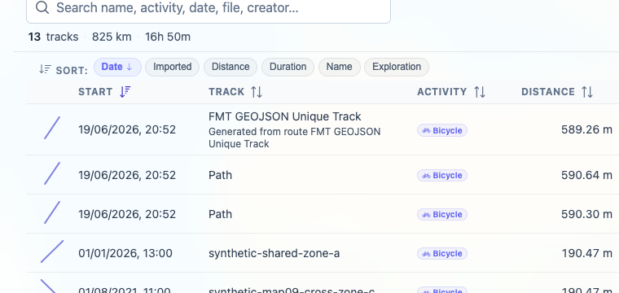

# Packet: TBS_01

## Scope

- Coverage source: `documentation/testing/frontend-regression-test-plan.md`
- Coverage ID or run packet: TBS_01
- In scope: Track browser list contents and displayed columns/fields.
- Out of scope: Search, sorting, quick views, row navigation, and detailed statistics totals; covered by later TBS packets.

## Prerequisites

- Required previous coverage IDs or run packets: FLT_08.
- Required app/data state: Filtering Off and all 13 tracks visible.
- Required browser context: clean isolated Chrome context.

## Allowed Mutations

- Allowed: Open Track Browser surfaces and switch stats tabs.
- Not allowed: Change filter state or edit track data.

## Actions And Results

| Coverage ID | Action | Expected result | Actual result | Status | Evidence |
|---|---|---|---|---|---|
| TBS_01 | Opened Stats, switched to the `Tracks` tab, and inspected the summary, view chips, sort controls, search placeholder, columns, and representative rows. | Track browser lists all or filtered tracks with name, date, distance, duration, activity, and related fields. | Tracks tab showed all 13 visible tracks with `13 tracks · 825 km · 16h 50m`, view chips, sort controls, search input, and columns for start, track, activity, distance, duration, average speed, energy, exploration, and imported timestamp. Representative rows included GPX/FIT/synthetic/import-format tracks with names, dates, distances, durations, activities, energy, and import times. | PASS | [assets/TBS_01-track-browser-fields.txt](../assets/TBS_01-track-browser-fields.txt); [assets/TBS_01-track-browser-list.png](../assets/TBS_01-track-browser-list.png) |

## Issues

| ID | Severity | Summary | Reproduction | Expected | Actual | Evidence | Release impact |
|---|---|---|---|---|---|---|---|

## Evidence Files

| File | Purpose |
|---|---|
| [assets/TBS_01-track-browser-fields.txt](../assets/TBS_01-track-browser-fields.txt) | Track browser summary, controls, columns, and representative row field observations. |
| [assets/TBS_01-track-browser-list.png](../assets/TBS_01-track-browser-list.png) | Tracks tab list crop. |

## Screenshot Evidence

## Timings

| Step | Timing |
|---|---:|
| Open Stats Tracks tab and inspect list fields | ~6 min |

## Handoff Notes

- Completed: TBS_01.
- Remaining unfinished coverage: TBS_02 onward.
- Blocked or not applicable: none.
- State left for the next packet: Browser on `/mtl/stats`, `Tracks` tab active, filtering Off and all 13 tracks listed.
