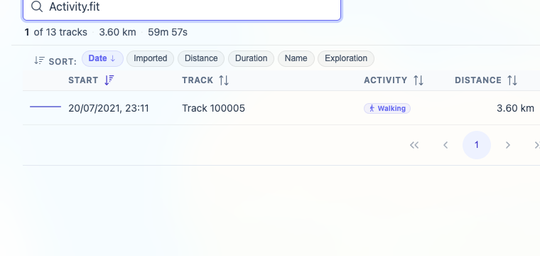

# Packet: TBS_02

## Scope

- Coverage source: `documentation/testing/frontend-regression-test-plan.md`
- Coverage ID or run packet: TBS_02
- In scope: Track browser search matching names, descriptions, dates, distances, durations, activity, and file paths.
- Out of scope: Sorting and quick-view behavior; covered by TBS_03 and TBS_04.

## Prerequisites

- Required previous coverage IDs or run packets: TBS_01.
- Required app/data state: Browser on Stats > Tracks, filtering Off, all 13 tracks available.
- Required browser context: clean isolated Chrome context.

## Allowed Mutations

- Allowed: Temporarily enter and clear track browser search terms.
- Not allowed: Change track data or leave the search box filtered.

## Actions And Results

| Coverage ID | Action | Expected result | Actual result | Status | Evidence |
|---|---|---|---|---|---|
| TBS_02 | Searched `Jura`, `Generated`, `2010`, `518`, `59m`, `Walking`, `Activity.fit`, and `.fit`, recording the visible result summary and matching rows after each query. | Search matches names, descriptions, dates, distances, durations, activity, and file paths. | All target categories matched. `Jura` matched name, `Generated` matched description, `2010` matched two dates, `518` matched Mosel distance, `59m` matched FIT duration, `Walking` matched activity, and `Activity.fit` / `.fit` matched the FIT row through hidden file/source search text. Clearing search restored `13 tracks · 825 km`. | PASS | [assets/TBS_02-search-matrix.txt](../assets/TBS_02-search-matrix.txt); [assets/TBS_02-file-search-hidden-match.png](../assets/TBS_02-file-search-hidden-match.png) |

## Issues

| ID | Severity | Summary | Reproduction | Expected | Actual | Evidence | Release impact |
|---|---|---|---|---|---|---|---|

## Evidence Files

| File | Purpose |
|---|---|
| [assets/TBS_02-search-matrix.txt](../assets/TBS_02-search-matrix.txt) | Search query matrix and cleanup state. |
| [assets/TBS_02-file-search-hidden-match.png](../assets/TBS_02-file-search-hidden-match.png) | File/source query `Activity.fit` returning the FIT track row. |

## Screenshot Evidence

## Timings

| Step | Timing |
|---|---:|
| Search matrix and reset | ~9 min |

## Handoff Notes

- Completed: TBS_02.
- Remaining unfinished coverage: TBS_03 onward.
- Blocked or not applicable: none.
- State left for the next packet: Browser on `/mtl/stats`, `Tracks` tab active, search input cleared, filtering Off.
