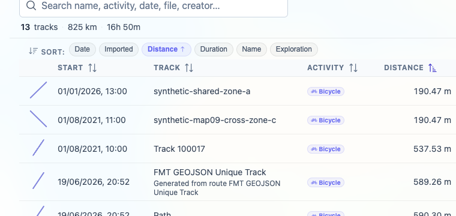
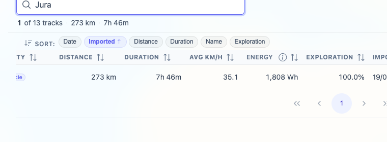
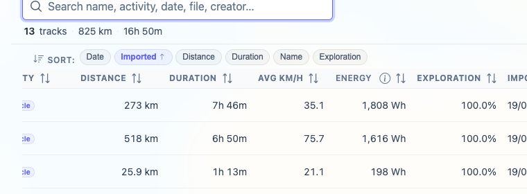

# Packet: TBS_03

## Scope

- Coverage source: `documentation/testing/frontend-regression-test-plan.md`
- Coverage ID or run packet: TBS_03
- In scope: Track browser sorting by every visible table column and summary updates for the currently visible subset.
- Out of scope: Quick-view subset presets; covered by TBS_04.

## Prerequisites

- Required previous coverage IDs or run packets: TBS_01, TBS_02.
- Required app/data state: Browser on Stats > Tracks, filtering Off, all 13 tracks available.
- Required browser context: clean isolated Chrome context.

## Allowed Mutations

- Allowed: Temporarily change table sort order and search text.
- Not allowed: Change track data or leave search filtered.

## Actions And Results

| Coverage ID | Action | Expected result | Actual result | Status | Evidence |
|---|---|---|---|---|---|
| TBS_03 | Sorted the Tracks table by Start/Date, Track, Activity, Distance, Duration, Avg km/h, Energy, Exploration, and Imported; then narrowed the table with `Jura` and cleared the search. | Each column sort changes the visible order consistently, and the summary row reflects the currently visible rows. | All visible columns sorted without errors and showed expected leading rows or active sort state. The visible summary changed from `13 tracks · 825 km · 16h 50m` to `1 of 13 tracks · 273 km` for the `Jura` subset, then restored to `13 tracks · 825 km` after clearing search. | PASS | [assets/TBS_03-sort-summary-results.txt](../assets/TBS_03-sort-summary-results.txt); [assets/TBS_03-distance-sort.png](../assets/TBS_03-distance-sort.png); [assets/TBS_03-filtered-summary.png](../assets/TBS_03-filtered-summary.png); [assets/TBS_03-summary-cleared.png](../assets/TBS_03-summary-cleared.png) |

## Issues

| ID | Severity | Summary | Reproduction | Expected | Actual | Evidence | Release impact |
|---|---|---|---|---|---|---|---|

## Evidence Files

| File | Purpose |
|---|---|
| [assets/TBS_03-sort-summary-results.txt](../assets/TBS_03-sort-summary-results.txt) | Sort-by-column observations and visible-summary state. |
| [assets/TBS_03-distance-sort.png](../assets/TBS_03-distance-sort.png) | Distance ascending order with the shortest synthetic tracks first. |
| [assets/TBS_03-filtered-summary.png](../assets/TBS_03-filtered-summary.png) | `Jura` subset with summary reduced to one visible track. |
| [assets/TBS_03-summary-cleared.png](../assets/TBS_03-summary-cleared.png) | Cleared search restoring all 13 tracks. |

## Screenshot Evidence

## Timings

| Step | Timing |
|---|---:|
| Sort matrix and summary reset | ~11 min |

## Handoff Notes

- Completed: TBS_03.
- Remaining unfinished coverage: TBS_04 onward.
- Blocked or not applicable: none.
- State left for the next packet: Browser on `/mtl/stats`, `Tracks` tab active, search input cleared, filtering Off, Date sort chip active.
