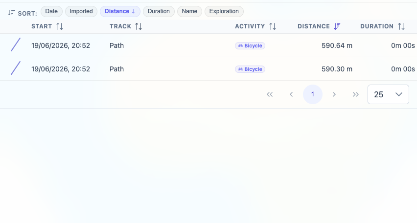
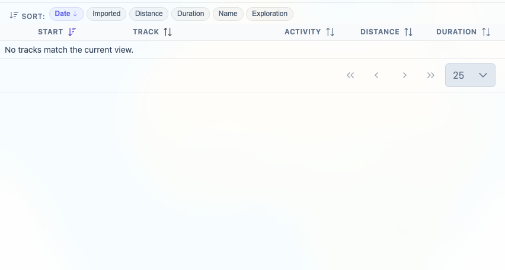
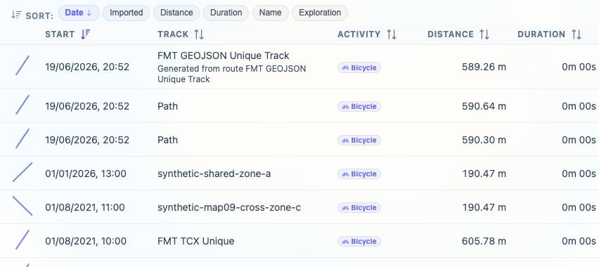

# Packet: TBS_04

## Scope

- Coverage source: `documentation/testing/frontend-regression-test-plan.md`
- Coverage ID or run packet: TBS_04
- In scope: Track browser quick-view/preset buttons and preservation of usable sorting/search behavior.
- Out of scope: Row navigation to details; covered by TBS_05.

## Prerequisites

- Required previous coverage IDs or run packets: TBS_01 through TBS_03.
- Required app/data state: Browser on Stats > Tracks, filtering Off, all 13 tracks available.
- Required browser context: clean isolated Chrome context.

## Allowed Mutations

- Allowed: Temporarily switch browser preset buttons, sort rows, and enter/clear track search text.
- Not allowed: Change track data or leave the browser filtered.

## Actions And Results

| Coverage ID | Action | Expected result | Actual result | Status | Evidence |
|---|---|---|---|---|---|
| TBS_04 | Switched `All`, `Excluded`, `Stats excluded`, and `No activity`; then set `All` + Distance sort + search `Path`, switched to `Excluded`, and switched back to `All`. | Presets switch subsets correctly and preserve usable sorting/search behavior. | Presets switched subsets: `All` showed 13 tracks, the other presets showed the expected empty state for this dataset, and returning to `All` restored 13 tracks. However, switching to `Excluded` cleared the `Path` search and reset Distance sort to Date; returning to `All` kept the reset state. | FIXED | [assets/TBS_04-quick-view-results.txt](../assets/TBS_04-quick-view-results.txt); [assets/TBS_04-all-path-distance.png](../assets/TBS_04-all-path-distance.png); [assets/TBS_04-excluded-preserves-search-sort.png](../assets/TBS_04-excluded-preserves-search-sort.png); [assets/TBS_04-all-restored-reset-state.jpg](../assets/TBS_04-all-restored-reset-state.jpg); [assets/FIXED-issues-local-verification.txt](../assets/FIXED-issues-local-verification.txt) |

## Issues

| ID | Severity | Summary | Reproduction | Expected | Actual | Evidence | Release impact |
|---|---|---|---|---|---|---|---|
| TBS-04-P2 | P2 | Track browser presets clear active search and sort. | In Stats > Tracks, select `All`, select Distance sort, search `Path`, click `Excluded`, then click `All`. | Search text and selected sort remain usable while switching presets. | The search input is cleared and Distance sort resets to Date when `Excluded` is selected; returning to `All` does not restore them. | [assets/TBS_04-quick-view-results.txt](../assets/TBS_04-quick-view-results.txt); [assets/TBS_04-excluded-preserves-search-sort.png](../assets/TBS_04-excluded-preserves-search-sort.png) | Users lose their current browser refinement when checking another preset subset. |

## Evidence Files

| File | Purpose |
|---|---|
| [assets/FIXED-issues-local-verification.txt](../assets/FIXED-issues-local-verification.txt) | Local implementation and verification evidence for FIXED status. |
| [assets/TBS_04-quick-view-results.txt](../assets/TBS_04-quick-view-results.txt) | Preset subset matrix and preservation failure details. |
| [assets/TBS_04-all-path-distance.png](../assets/TBS_04-all-path-distance.png) | `All` with `Path` search and Distance sort before switching presets. |
| [assets/TBS_04-excluded-preserves-search-sort.png](../assets/TBS_04-excluded-preserves-search-sort.png) | `Excluded` after switch, showing empty state and reset controls. |
| [assets/TBS_04-all-restored-reset-state.jpg](../assets/TBS_04-all-restored-reset-state.jpg) | Return to `All` with the search/sort reset still in effect. |

## Screenshot Evidence

## Timings

| Step | Timing |
|---|---:|
| Preset matrix and preservation retest | ~12 min |

## Handoff Notes

- Fix status: FIXED locally: quick-view preset changes preserve active search and sort. Evidence: [assets/FIXED-issues-local-verification.txt](../assets/FIXED-issues-local-verification.txt).

- Completed: TBS_04.
- Remaining unfinished coverage: TBS_05 onward.
- Blocked or not applicable: none.
- State left for the next packet: Browser on `/mtl/stats`, `Tracks` tab active, `All` selected, search input cleared, filtering Off, Date sort active.
