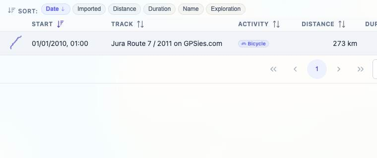
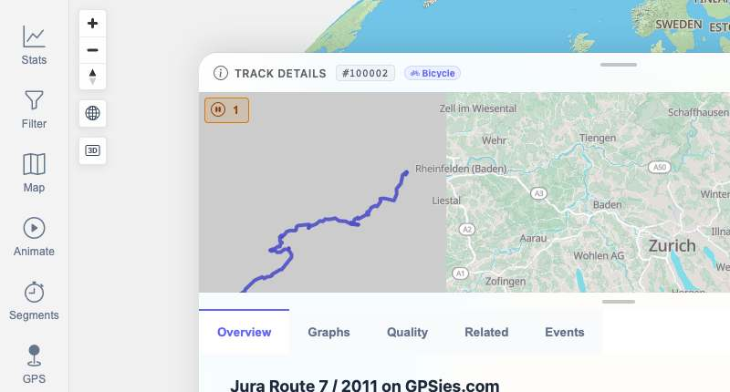

# Packet: TBS_05

## Scope

- Coverage source: `documentation/testing/frontend-regression-test-plan.md`
- Coverage ID or run packet: TBS_05
- In scope: Clicking a track-browser row opens that track's details.
- Out of scope: Detail-tab content depth; covered by TRD packets and related TBS checks.

## Prerequisites

- Required previous coverage IDs or run packets: TBS_01 through TBS_04.
- Required app/data state: Browser on Stats > Tracks, filtering Off, all 13 tracks available.
- Required browser context: clean isolated Chrome context.

## Allowed Mutations

- Allowed: Temporarily search for a row and navigate to/from track detail.
- Not allowed: Change track data or leave search filtered.

## Actions And Results

| Coverage ID | Action | Expected result | Actual result | Status | Evidence |
|---|---|---|---|---|---|
| TBS_05 | Searched `Jura`, clicked the single visible Jura row in the Tracks table, verified the resulting detail view, then returned to Stats > Tracks and cleared search. | Clicking a browser row opens the selected track's details. | The row opened `/mtl/track/100002`; the detail view contained `Jura Route 7 / 2011 on GPSies.com` and visible Overview, Graphs, Quality, Related, and Events tabs. Cleanup returned to `/mtl/stats` with 13 rows and empty search. | PASS | [assets/TBS_05-row-detail-results.txt](../assets/TBS_05-row-detail-results.txt); [assets/TBS_05-row-before-click.jpg](../assets/TBS_05-row-before-click.jpg); [assets/TBS_05-track-detail-opened.jpg](../assets/TBS_05-track-detail-opened.jpg) |

## Issues

| ID | Severity | Summary | Reproduction | Expected | Actual | Evidence | Release impact |
|---|---|---|---|---|---|---|---|

## Evidence Files

| File | Purpose |
|---|---|
| [assets/TBS_05-row-detail-results.txt](../assets/TBS_05-row-detail-results.txt) | Row-click navigation state and cleanup state. |
| [assets/TBS_05-row-before-click.jpg](../assets/TBS_05-row-before-click.jpg) | Search-isolated Jura row before clicking. |
| [assets/TBS_05-track-detail-opened.jpg](../assets/TBS_05-track-detail-opened.jpg) | Track detail view opened from the row. |

## Screenshot Evidence

## Timings

| Step | Timing |
|---|---:|
| Row click, detail verification, cleanup | ~7 min |

## Handoff Notes

- Completed: TBS_05.
- Remaining unfinished coverage: TBS_06 onward.
- Blocked or not applicable: none.
- State left for the next packet: Browser on `/mtl/stats`, `Tracks` tab active, `All` selected, search input cleared, filtering Off, Date sort active.
