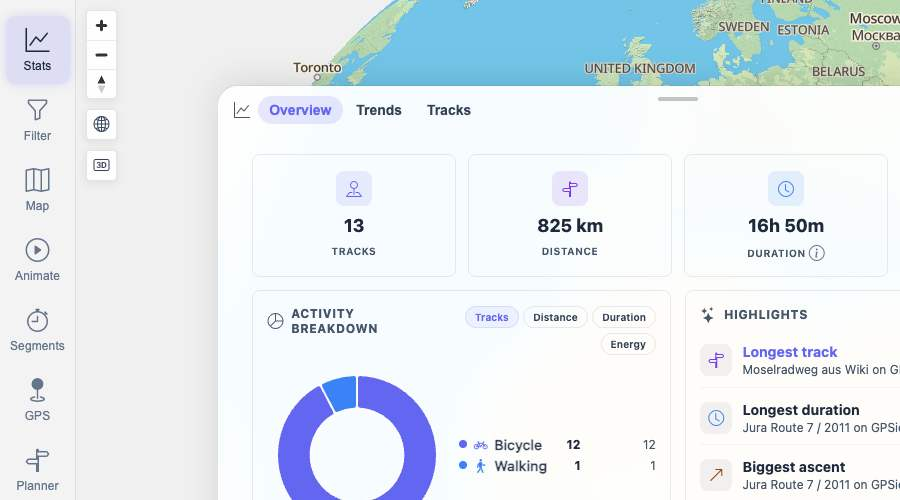
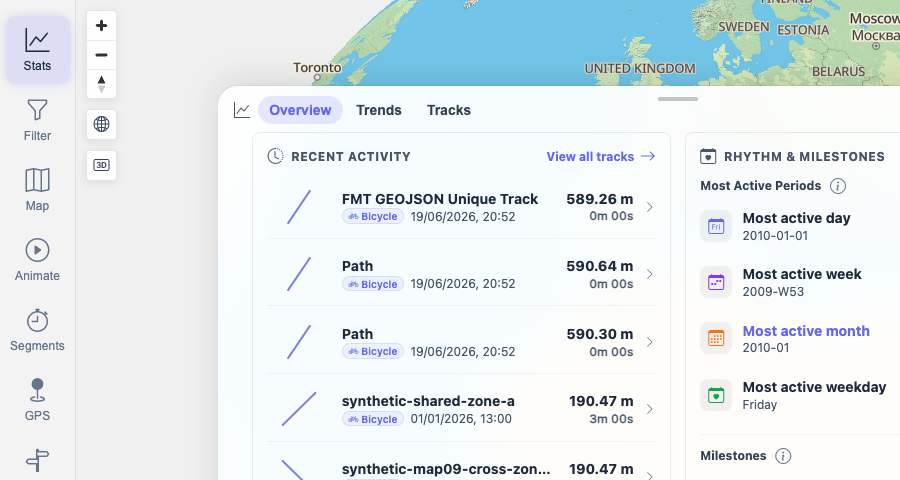
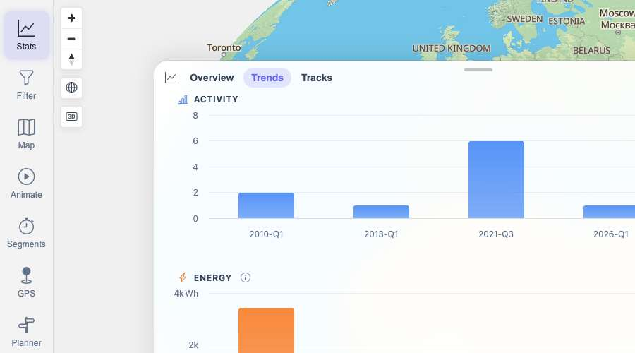

# Packet: TBS_06

## Scope

- Coverage source: `documentation/testing/frontend-regression-test-plan.md`
- Coverage ID or run packet: TBS_06
- In scope: Statistics overview totals, elevation/stat surfaces, activity breakdown, rankings, milestones, and period-chart presence.
- Out of scope: Detailed chart switching behavior; covered by TBS_09.

## Prerequisites

- Required previous coverage IDs or run packets: TBS_01 through TBS_05.
- Required app/data state: Browser on `/mtl/stats`, filtering Off, all 13 tracks available.
- Required browser context: clean isolated Chrome context.

## Allowed Mutations

- Allowed: Switch between Stats Overview and Trends tabs.
- Not allowed: Change track data or filters.

## Actions And Results

| Coverage ID | Action | Expected result | Actual result | Status | Evidence |
|---|---|---|---|---|---|
| TBS_06 | Opened Stats Overview and Trends, checked visible totals, activity breakdown, highlight rankings, rhythm/milestone rows, period-chart summary, and searched visible UI text for a total elevation/ascent/gain statistic. | Statistics overview shows total distance, time, elevation, activity breakdown, rankings, milestones, and period charts. | Distance/time/energy totals were present (`13 Tracks`, `825 km`, `16h 50m`, `4,023 Wh`), plus activity breakdown, rankings, milestones, and period charts. No visible total elevation/ascent/gain statistic was found; only ascent rankings/milestones were visible. | FIXED | [assets/TBS_06-overview-results.txt](../assets/TBS_06-overview-results.txt); [assets/TBS_06-overview-top.jpg](../assets/TBS_06-overview-top.jpg); [assets/TBS_06-rhythm-milestones.jpg](../assets/TBS_06-rhythm-milestones.jpg); [assets/TBS_06-period-charts.jpg](../assets/TBS_06-period-charts.jpg); [assets/FIXED-issues-local-verification.txt](../assets/FIXED-issues-local-verification.txt) |

## Issues

| ID | Severity | Summary | Reproduction | Expected | Actual | Evidence | Release impact |
|---|---|---|---|---|---|---|---|
| TBS-06-P2 | P2 | Stats overview does not expose a total elevation/ascent value. | Open Stats Overview with the 13-track dataset and inspect the totals/stat surfaces. | Overview includes a visible total elevation/ascent/gain statistic alongside total distance and time. | Overview shows total tracks, distance, duration, and energy; ascent appears only in rankings/milestones such as `Biggest ascent`, not as a total. | [assets/TBS_06-overview-results.txt](../assets/TBS_06-overview-results.txt); [assets/TBS_06-overview-top.jpg](../assets/TBS_06-overview-top.jpg) | Users cannot see aggregate elevation from the statistics overview. |

## Evidence Files

| File | Purpose |
|---|---|
| [assets/FIXED-issues-local-verification.txt](../assets/FIXED-issues-local-verification.txt) | Local implementation and verification evidence for FIXED status. |
| [assets/TBS_06-overview-results.txt](../assets/TBS_06-overview-results.txt) | Presence matrix and missing total-elevation finding. |
| [assets/TBS_06-overview-top.jpg](../assets/TBS_06-overview-top.jpg) | Overview top totals, activity breakdown, and highlight rankings. |
| [assets/TBS_06-rhythm-milestones.jpg](../assets/TBS_06-rhythm-milestones.jpg) | Rhythm and milestone rows. |
| [assets/TBS_06-period-charts.jpg](../assets/TBS_06-period-charts.jpg) | Trends period summary and charts. |

## Screenshot Evidence

## Timings

| Step | Timing |
|---|---:|
| Overview and Trends inspection | ~10 min |

## Handoff Notes

- Fix status: FIXED locally: server overview summary exposes ascentM and UI renders Ascent total. Evidence: [assets/FIXED-issues-local-verification.txt](../assets/FIXED-issues-local-verification.txt).

- Completed: TBS_06.
- Remaining unfinished coverage: TBS_07 onward.
- Blocked or not applicable: none.
- State left for the next packet: Browser on `/mtl/stats`, Overview tab active, filtering Off.
