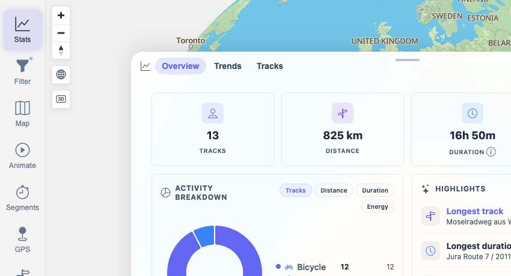
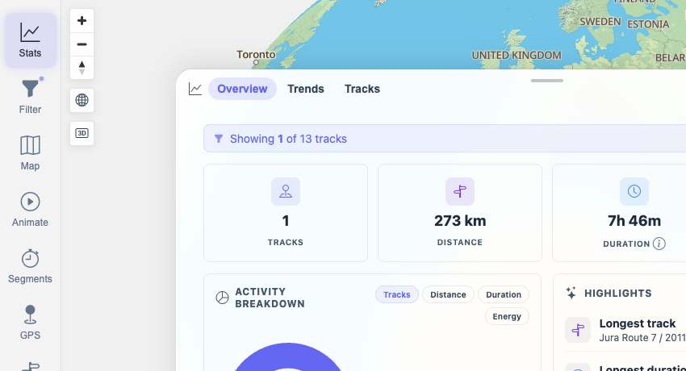
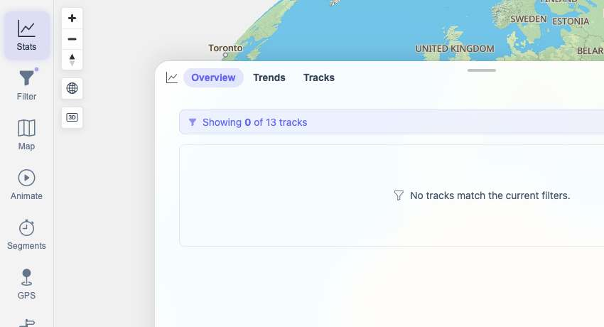

# Packet: TBS_07

## Scope

- Coverage source: `documentation/testing/frontend-regression-test-plan.md`
- Coverage ID or run packet: TBS_07
- In scope: Statistics correctness for many-track, single-track, and empty track sets.
- Out of scope: Import/delete transition timing; covered by TBS_08.

## Prerequisites

- Required previous coverage IDs or run packets: TBS_01 through TBS_06.
- Required app/data state: 13 imported, statistics-eligible tracks available.
- Required browser context: clean isolated Chrome context.

## Allowed Mutations

- Allowed: Temporarily set SmartBaseFilter `TRACK_IDS` in the browser filter state and hard-reload to force filter-store hydration.
- Not allowed: Change track data or leave the filter modified.

## Actions And Results

| Coverage ID | Action | Expected result | Actual result | Status | Evidence |
|---|---|---|---|---|---|
| TBS_07 | Tested stats with explicit `TRACK_IDS` for all 13 tracks, `100002` only, and non-existent `999999999`, comparing the visible Overview cards to `/api/tracks/get-track-overview` and `/api/tracks/get-track-statistics`. | Stats are correct for many tracks, a single track, and an empty track set. | Many-track UI matched API totals (`13`, `825 km`, `16h 50m`, `4,023 Wh`, Bicycle 12 / Walking 1). Single-track UI matched API totals (`1`, `273 km`, `7h 46m`, `1,808 Wh`, Bicycle 1). Empty state showed `Showing 0 of 13 tracks`, zero distance/time markers, and empty API totals. Filter state was restored afterward. | PASS | [assets/TBS_07-stats-cases.txt](../assets/TBS_07-stats-cases.txt); [assets/TBS_07-many-stats.jpg](../assets/TBS_07-many-stats.jpg); [assets/TBS_07-single-stats.jpg](../assets/TBS_07-single-stats.jpg); [assets/TBS_07-empty-stats.jpg](../assets/TBS_07-empty-stats.jpg) |

## Issues

| ID | Severity | Summary | Reproduction | Expected | Actual | Evidence | Release impact |
|---|---|---|---|---|---|---|---|

## Evidence Files

| File | Purpose |
|---|---|
| [assets/TBS_07-stats-cases.txt](../assets/TBS_07-stats-cases.txt) | API/UI comparison for many, single, and empty stats cases. |
| [assets/TBS_07-many-stats.jpg](../assets/TBS_07-many-stats.jpg) | Many-track Overview totals and breakdown. |
| [assets/TBS_07-single-stats.jpg](../assets/TBS_07-single-stats.jpg) | Single-track Overview totals and breakdown. |
| [assets/TBS_07-empty-stats.jpg](../assets/TBS_07-empty-stats.jpg) | Empty-filter Overview state. |

## Screenshot Evidence

## Timings

| Step | Timing |
|---|---:|
| Filtered stats matrix and cleanup | ~16 min |

## Handoff Notes

- Completed: TBS_07.
- Remaining unfinished coverage: TBS_08 onward.
- Blocked or not applicable: none.
- State left for the next packet: Browser on `/mtl/stats`, Overview tab active, original unfiltered SmartBaseFilter state restored.
