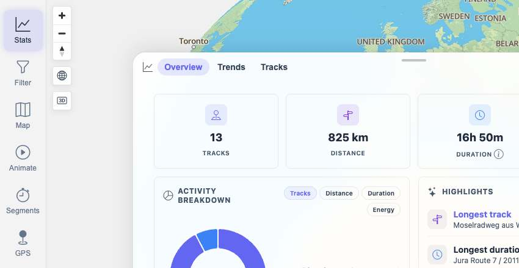
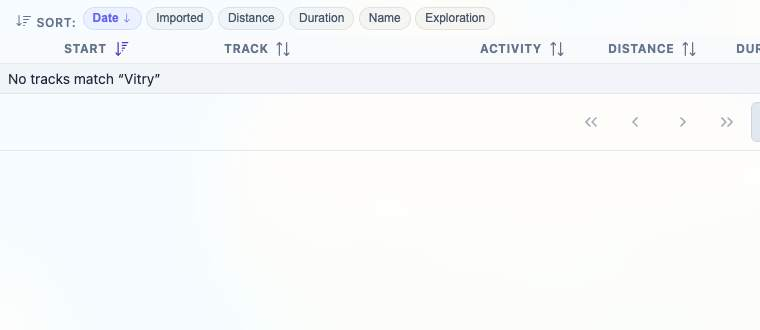

# Packet: TBS_08

## Scope

- Coverage source: `documentation/testing/frontend-regression-test-plan.md`
- Coverage ID or run packet: TBS_08
- In scope: Statistics after the required five-GPX import, after deleting two imported tracks, and current no-stale-deleted-track verification.
- Out of scope: Detailed period-chart switching; covered by TBS_09.

## Prerequisites

- Required previous coverage IDs or run packets: IMP_09, DEL_03, DEL_04, TBS_07.
- Required app/data state: Full run import/delete sequence completed; later FIT/FMT/synthetic imports may also be present.
- Required browser context: clean isolated Chrome context.

## Allowed Mutations

- Allowed: Navigate Stats and search the track browser for deleted names.
- Not allowed: Add/delete files or change track data.

## Actions And Results

| Coverage ID | Action | Expected result | Actual result | Status | Evidence |
|---|---|---|---|---|---|
| TBS_08 | Reused run-local IMP_09/DEL_03 transition evidence, then freshly checked current API IDs, current Stats Overview summary, and track-browser searches for the two deleted GPX names. | Stats update after five-GPX import and again after deleting two imported tracks; deleted-track totals do not remain stale. | IMP_09 shows post-import stats at 5 tracks / 1,042,712.01 m / 84,660 s. DEL_03 shows post-delete stats at 3 tracks / 816,961.34 m / 57,035 s with IDs 100000/100001 absent. Fresh current check also has no deleted IDs/names in API or browser searches; current summary reflects the later 13-track dataset without deleted tracks. | PASS | [assets/TBS_08-import-delete-stats-results.txt](../assets/TBS_08-import-delete-stats-results.txt); [assets/IMP_09-post-import-totals.txt](../assets/IMP_09-post-import-totals.txt); [assets/DEL_03-deletion-surfaces.txt](../assets/DEL_03-deletion-surfaces.txt); [assets/TBS_08-current-stats.jpg](../assets/TBS_08-current-stats.jpg); [assets/TBS_08-current-deleted-search.jpg](../assets/TBS_08-current-deleted-search.jpg) |

## Issues

| ID | Severity | Summary | Reproduction | Expected | Actual | Evidence | Release impact |
|---|---|---|---|---|---|---|---|

## Evidence Files

| File | Purpose |
|---|---|
| [assets/TBS_08-import-delete-stats-results.txt](../assets/TBS_08-import-delete-stats-results.txt) | Consolidated import/delete/current no-stale summary. |
| [assets/IMP_09-post-import-totals.txt](../assets/IMP_09-post-import-totals.txt) | Five-GPX post-import stats totals from this run. |
| [assets/DEL_03-deletion-surfaces.txt](../assets/DEL_03-deletion-surfaces.txt) | Post-delete stats and deleted-ID absence from this run. |
| [assets/TBS_08-current-stats.jpg](../assets/TBS_08-current-stats.jpg) | Current Stats Overview after later imports, without deleted tracks. |
| [assets/TBS_08-current-deleted-search.jpg](../assets/TBS_08-current-deleted-search.jpg) | Current track-browser search showing deleted track name absent. |

## Screenshot Evidence

## Timings

| Step | Timing |
|---|---:|
| Import/delete evidence review and fresh no-stale check | ~9 min |

## Handoff Notes

- Completed: TBS_08.
- Remaining unfinished coverage: TBS_09 onward.
- Blocked or not applicable: none.
- State left for the next packet: Browser on `/mtl/stats`, Overview tab active, track browser search cleared, filtering Off.
