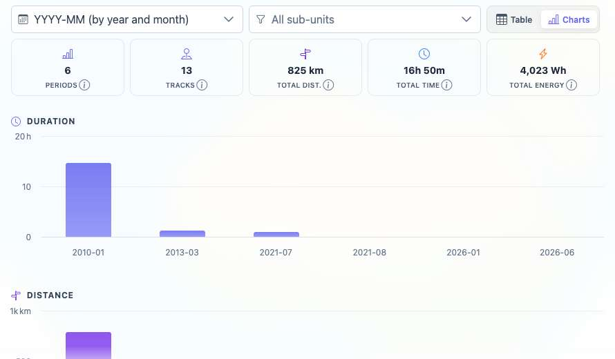
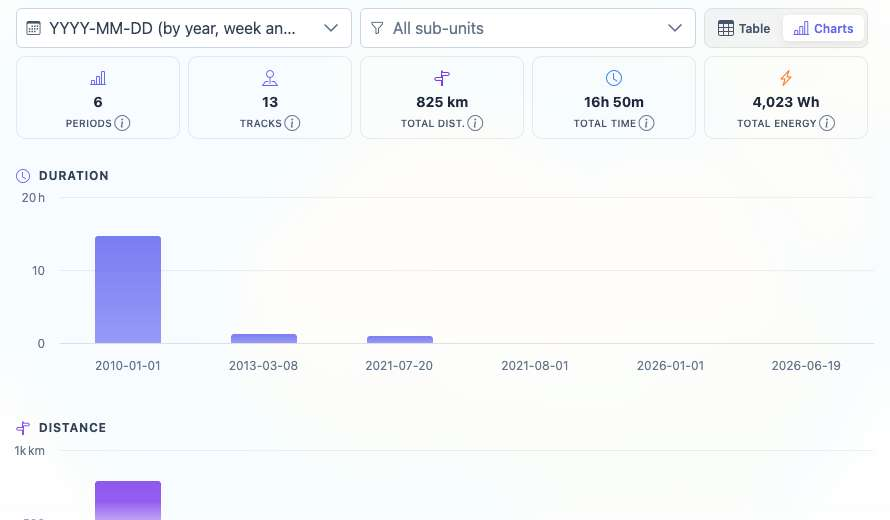

# Packet: TBS_09

## Scope

- Coverage source: `documentation/testing/frontend-regression-test-plan.md`
- Coverage ID or run packet: TBS_09
- In scope: Time-period chart rendering and switching for monthly, weekly, and daily groupings.
- Out of scope: Clicking stats entries for navigation/filter/highlight behavior; covered by TBS_10 and TBS_11.

## Prerequisites

- Required previous coverage IDs or run packets: TBS_06 through TBS_08.
- Required app/data state: 13-track dataset available, filtering Off.
- Required browser context: clean isolated Chrome context.

## Allowed Mutations

- Allowed: Switch Stats Trends period grouping and restore the default grouping.
- Not allowed: Change track data or filters.

## Actions And Results

| Coverage ID | Action | Expected result | Actual result | Status | Evidence |
|---|---|---|---|---|---|
| TBS_09 | Opened Stats > Trends, switched the period selector to `YYYY-MM`, `YYYY-WW`, and `YYYY-MM-DD`, and checked chart summaries/Highcharts text for each. | Time-period charts render and switch correctly for daily, weekly, and monthly views. | Monthly, weekly, and daily selections all rendered period summaries (`6 Periods`, `13 Tracks`, `825 km`, `16h 50m`, `4,023 Wh`) and visible Highcharts-backed Duration, Distance, Activity, and Energy charts with matching x-axis labels. The period selector was restored to `YYYY-Q`. | PASS | [assets/TBS_09-period-chart-results.txt](../assets/TBS_09-period-chart-results.txt); [assets/TBS_09-monthly-charts.jpg](../assets/TBS_09-monthly-charts.jpg); [assets/TBS_09-weekly-charts.jpg](../assets/TBS_09-weekly-charts.jpg); [assets/TBS_09-daily-charts.jpg](../assets/TBS_09-daily-charts.jpg) |

## Issues

| ID | Severity | Summary | Reproduction | Expected | Actual | Evidence | Release impact |
|---|---|---|---|---|---|---|---|

## Evidence Files

| File | Purpose |
|---|---|
| [assets/TBS_09-period-chart-results.txt](../assets/TBS_09-period-chart-results.txt) | Period switch matrix and chart DOM summaries. |
| [assets/TBS_09-monthly-charts.jpg](../assets/TBS_09-monthly-charts.jpg) | Monthly chart rendering. |
| [assets/TBS_09-weekly-charts.jpg](../assets/TBS_09-weekly-charts.jpg) | Weekly chart rendering. |
| [assets/TBS_09-daily-charts.jpg](../assets/TBS_09-daily-charts.jpg) | Daily chart rendering. |

## Screenshot Evidence

## Timings

| Step | Timing |
|---|---:|
| Period selector chart switch matrix | ~8 min |

## Handoff Notes

- Completed: TBS_09.
- Remaining unfinished coverage: TBS_10 onward.
- Blocked or not applicable: none.
- State left for the next packet: Browser on `/mtl/stats`, Trends tab active, period grouping restored to `YYYY-Q`, charts mode active.
