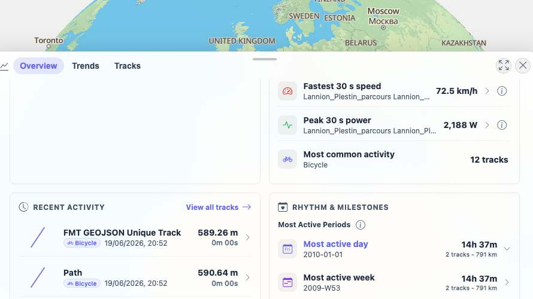
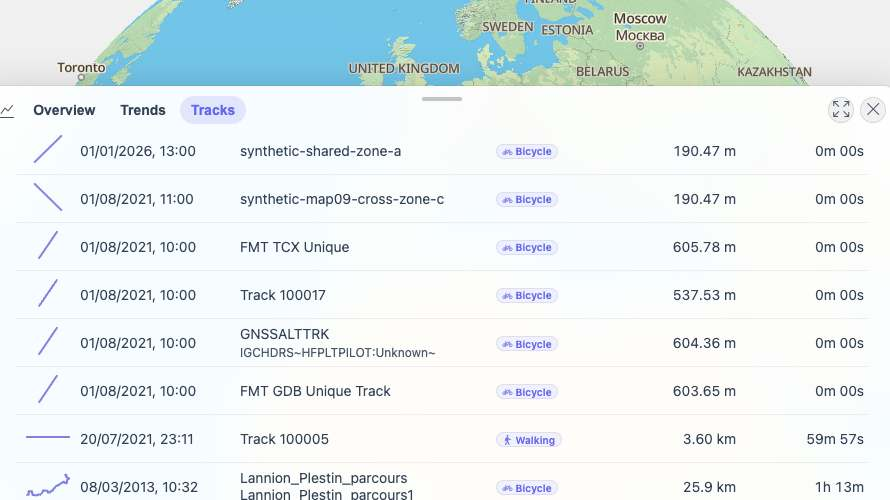
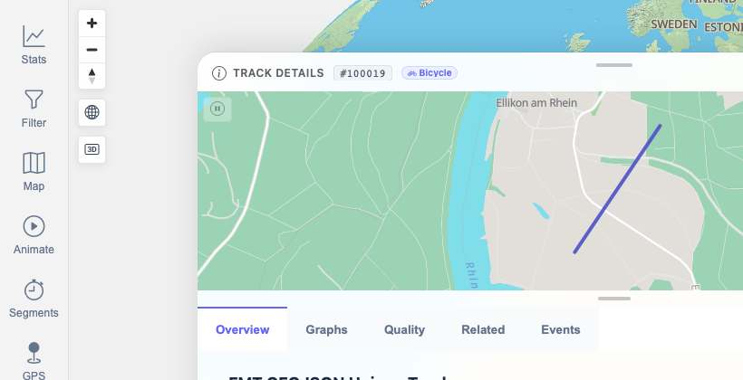

# Packet: TBS_10

## Scope

- Coverage source: `documentation/testing/frontend-regression-test-plan.md`
- Coverage ID or run packet: TBS_10
- In scope: Click behavior for Stats Overview entries that navigate, switch lists, or open drilldown/highlight panels.
- Out of scope: Full highlight drilldown/exclusion-count coverage; covered by TBS_11.

## Prerequisites

- Required previous coverage IDs or run packets: TBS_06 through TBS_09.
- Required app/data state: 13-track dataset available, filtering Off.
- Required browser context: clean isolated Chrome context.

## Allowed Mutations

- Allowed: Click stats entries and navigate back to Stats Overview.
- Not allowed: Exclude tracks, change filters, or modify track data.

## Actions And Results

| Coverage ID | Action | Expected result | Actual result | Status | Evidence |
|---|---|---|---|---|---|
| TBS_10 | Clicked `Most active day`, `View all tracks`, and the first Recent Activity row. | Clicking a stats entry navigates, switches the list, or highlights/drills down as appropriate. | `Most active day` opened a period drilldown and highlighted the active row; `View all tracks` switched to the Tracks tab with the 13-row table; clicking `FMT GEOJSON Unique Track` in Recent Activity opened `/mtl/track/100019` with Track Details. Cleanup returned to Stats Overview. | PASS | [assets/TBS_10-stats-entry-clicks.txt](../assets/TBS_10-stats-entry-clicks.txt); [assets/TBS_10-period-drilldown.jpg](../assets/TBS_10-period-drilldown.jpg); [assets/TBS_10-view-all-tracks.jpg](../assets/TBS_10-view-all-tracks.jpg); [assets/TBS_10-recent-row-detail.jpg](../assets/TBS_10-recent-row-detail.jpg) |

## Issues

| ID | Severity | Summary | Reproduction | Expected | Actual | Evidence | Release impact |
|---|---|---|---|---|---|---|---|

## Evidence Files

| File | Purpose |
|---|---|
| [assets/TBS_10-stats-entry-clicks.txt](../assets/TBS_10-stats-entry-clicks.txt) | Click sequence and resulting states. |
| [assets/TBS_10-period-drilldown.jpg](../assets/TBS_10-period-drilldown.jpg) | Most active day drilldown and active row. |
| [assets/TBS_10-view-all-tracks.jpg](../assets/TBS_10-view-all-tracks.jpg) | View all tracks switching to the Tracks tab. |
| [assets/TBS_10-recent-row-detail.jpg](../assets/TBS_10-recent-row-detail.jpg) | Recent Activity row opening Track Details. |

## Screenshot Evidence

## Timings

| Step | Timing |
|---|---:|
| Stats-entry click matrix and cleanup | ~9 min |

## Handoff Notes

- Completed: TBS_10.
- Remaining unfinished coverage: TBS_11 onward.
- Blocked or not applicable: none.
- State left for the next packet: Browser on `/mtl/stats`, Overview tab active, filtering Off.
