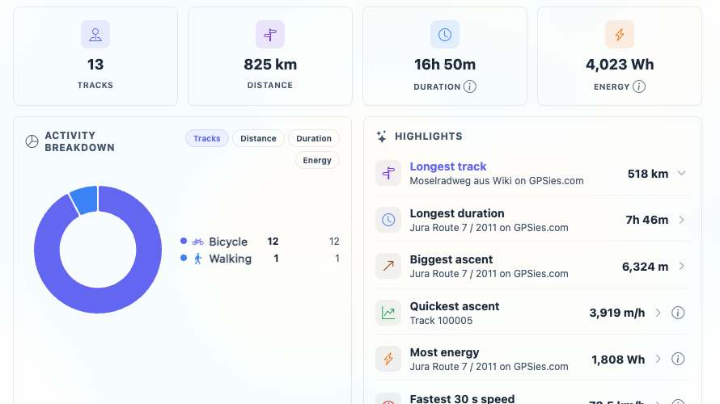
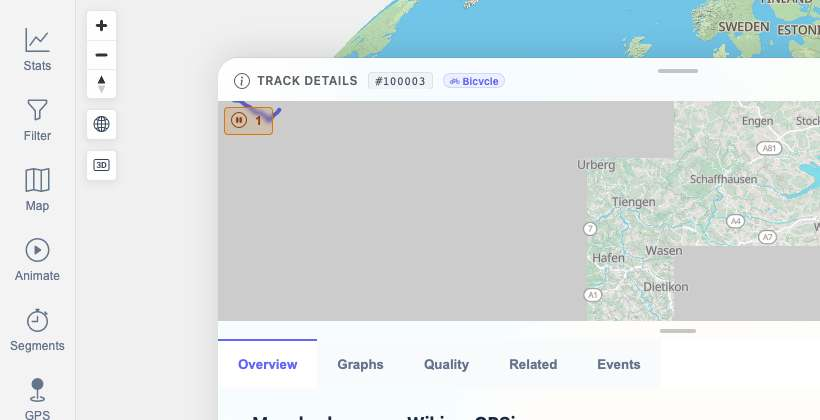

# Packet: TBS_11

## Scope

- Coverage source: `documentation/testing/frontend-regression-test-plan.md`
- Coverage ID or run packet: TBS_11
- In scope: Highlight drilldown list, opening a selected highlighted track, and excluded-highlight count visibility where applicable.
- Out of scope: Changing highlight exclusion state; no data mutation requested.

## Prerequisites

- Required previous coverage IDs or run packets: TBS_10.
- Required app/data state: 13-track dataset available, filtering Off.
- Required browser context: clean isolated Chrome context.

## Allowed Mutations

- Allowed: Open/close highlight drilldowns and navigate to/from track detail.
- Not allowed: Exclude tracks from highlights or change track data.

## Actions And Results

| Coverage ID | Action | Expected result | Actual result | Status | Evidence |
|---|---|---|---|---|---|
| TBS_11 | Opened the `Longest track` highlight drilldown, inspected the ranked rows, opened rank 1, and checked highlight-exclusion count state. | Highlight drilldowns open the expected track list, selected tracks open, and excluded-highlight counts are exposed when applicable. | The drilldown listed ranked tracks with Mosel rank 1 and Jura rank 2; opening rank 1 navigated to `/mtl/track/100003` with Mosel Track Details. The overview API reported `highlightExcludedTrackCount: 0`, so no excluded-highlight count note was shown. | PASS | [assets/TBS_11-highlight-drilldown-results.txt](../assets/TBS_11-highlight-drilldown-results.txt); [assets/TBS_11-highlight-drilldown.jpg](../assets/TBS_11-highlight-drilldown.jpg); [assets/TBS_11-highlight-detail.jpg](../assets/TBS_11-highlight-detail.jpg) |

## Issues

| ID | Severity | Summary | Reproduction | Expected | Actual | Evidence | Release impact |
|---|---|---|---|---|---|---|---|

## Evidence Files

| File | Purpose |
|---|---|
| [assets/TBS_11-highlight-drilldown-results.txt](../assets/TBS_11-highlight-drilldown-results.txt) | Drilldown rows, opened detail URL, and exclusion count state. |
| [assets/TBS_11-highlight-drilldown.jpg](../assets/TBS_11-highlight-drilldown.jpg) | Longest track highlight drilldown. |
| [assets/TBS_11-highlight-detail.jpg](../assets/TBS_11-highlight-detail.jpg) | Mosel detail opened from highlight rank 1. |

## Screenshot Evidence

## Timings

| Step | Timing |
|---|---:|
| Highlight drilldown and detail navigation | ~7 min |

## Handoff Notes

- Completed: TBS_11.
- Remaining unfinished coverage: TBS_12 onward.
- Blocked or not applicable: none.
- State left for the next packet: Browser on `/mtl/stats`, Overview tab active, filtering Off.
