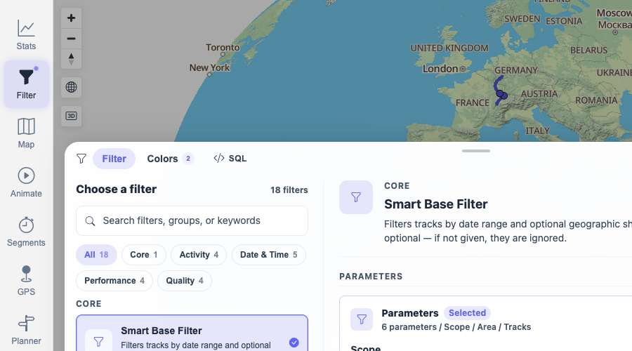
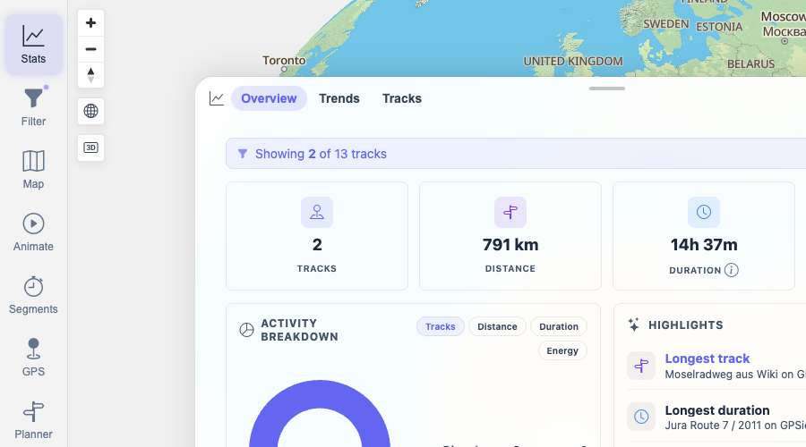
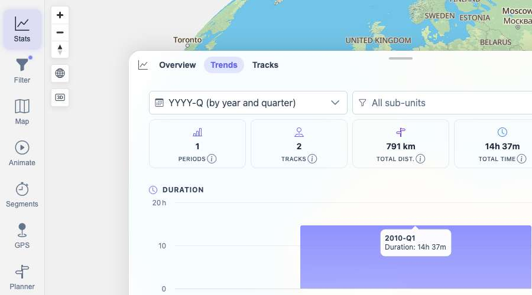
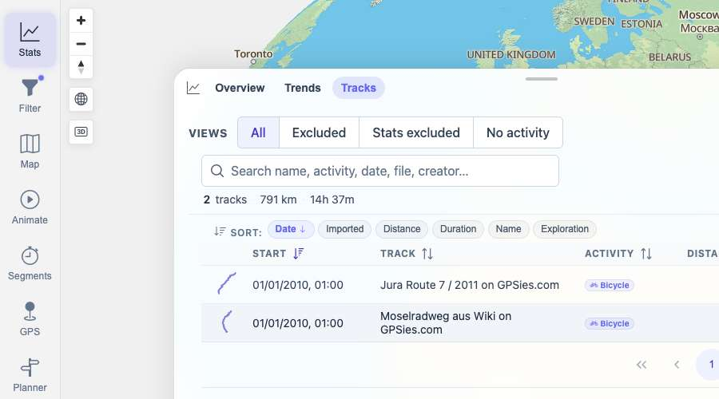

# Packet: TBS_12

## Scope

- Coverage source: `documentation/testing/frontend-regression-test-plan.md`
- Coverage ID or run packet: TBS_12
- In scope: Active geo-filter resolved track set consistency across map/filter count, Stats Overview, Trends, and Stats Tracks before and after reload.
- Out of scope: Geo drawing control mechanics; covered by FLT_05.

## Prerequisites

- Required previous coverage IDs or run packets: FLT_05, TBS_06 through TBS_11.
- Required app/data state: 13-track dataset available, original filter state restorable.
- Required browser context: clean isolated Chrome context.

## Allowed Mutations

- Allowed: Temporarily apply a SmartBaseFilter geo rectangle and reload.
- Not allowed: Change track data or leave the filter modified.

## Actions And Results

| Coverage ID | Action | Expected result | Actual result | Status | Evidence |
|---|---|---|---|---|---|
| TBS_12 | Applied a geo rectangle (`minLat=46`, `maxLat=48`, `minLng=5`, `maxLng=8`) resolving to Jura and Mosel, checked Filter/map count, Stats Overview, Trends, and Tracks, then reloaded and repeated Overview. | The active filter's resolved track set is used consistently across map count, Overview totals, Trends totals, and Stats Tracks, including after reload. | The filter endpoint resolved IDs `100002,100003` and the UI showed `2 / 13 Tracks`. Overview showed `Showing 2 of 13 tracks`, `791 km`, `14h 37m`, `3,423 Wh`, Bicycle 2. Trends showed `1 Periods`, `2 Tracks`, `791 km`, `14h 37m`. Tracks showed exactly Jura and Mosel with `2 tracks · 791 km · 14h 37m`. After reload, Overview still matched. Original filter state was restored. | PASS | [assets/TBS_12-geo-filter-stats-results.txt](../assets/TBS_12-geo-filter-stats-results.txt); [assets/TBS_12-filter-map-count.jpg](../assets/TBS_12-filter-map-count.jpg); [assets/TBS_12-stats-overview-filtered.jpg](../assets/TBS_12-stats-overview-filtered.jpg); [assets/TBS_12-trends-filtered.jpg](../assets/TBS_12-trends-filtered.jpg); [assets/TBS_12-tracks-filtered.jpg](../assets/TBS_12-tracks-filtered.jpg); [assets/TBS_12-after-reload-overview.jpg](../assets/TBS_12-after-reload-overview.jpg) |

## Issues

| ID | Severity | Summary | Reproduction | Expected | Actual | Evidence | Release impact |
|---|---|---|---|---|---|---|---|

## Evidence Files

| File | Purpose |
|---|---|
| [assets/TBS_12-geo-filter-stats-results.txt](../assets/TBS_12-geo-filter-stats-results.txt) | Resolved IDs and cross-surface marker summary. |
| [assets/TBS_12-filter-map-count.jpg](../assets/TBS_12-filter-map-count.jpg) | Filter/map count showing `2 / 13 Tracks`. |
| [assets/TBS_12-stats-overview-filtered.jpg](../assets/TBS_12-stats-overview-filtered.jpg) | Filtered Stats Overview. |
| [assets/TBS_12-trends-filtered.jpg](../assets/TBS_12-trends-filtered.jpg) | Filtered Trends totals/charts. |
| [assets/TBS_12-tracks-filtered.jpg](../assets/TBS_12-tracks-filtered.jpg) | Filtered Stats Tracks table. |
| [assets/TBS_12-after-reload-overview.jpg](../assets/TBS_12-after-reload-overview.jpg) | Reloaded filtered Overview. |

## Screenshot Evidence

## Timings

| Step | Timing |
|---|---:|
| Geo-filter cross-surface and reload check | ~14 min |

## Handoff Notes

- Completed: TBS_12.
- Remaining unfinished coverage: PLN_01 onward.
- Blocked or not applicable: none.
- State left for the next packet: Browser on `/mtl/stats`, Overview tab active, original unfiltered SmartBaseFilter state restored.
