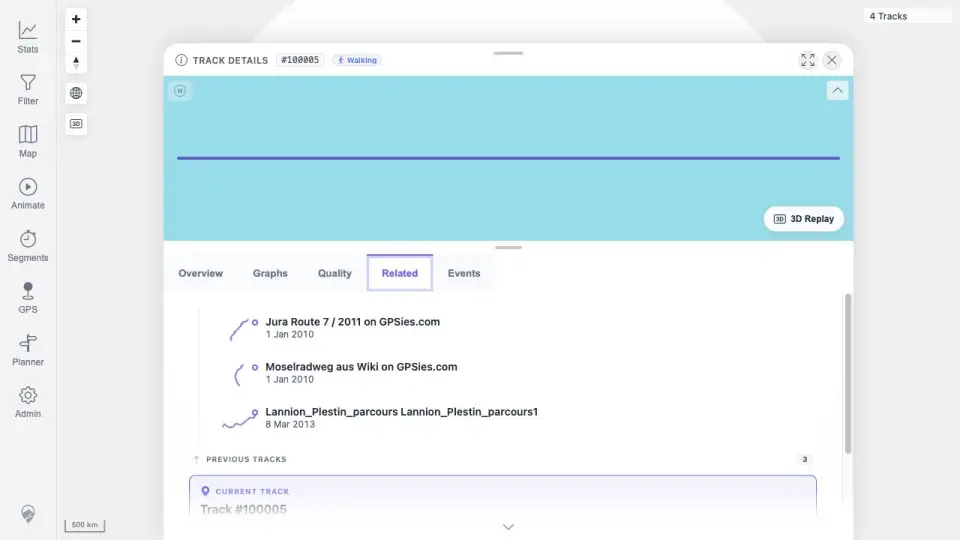
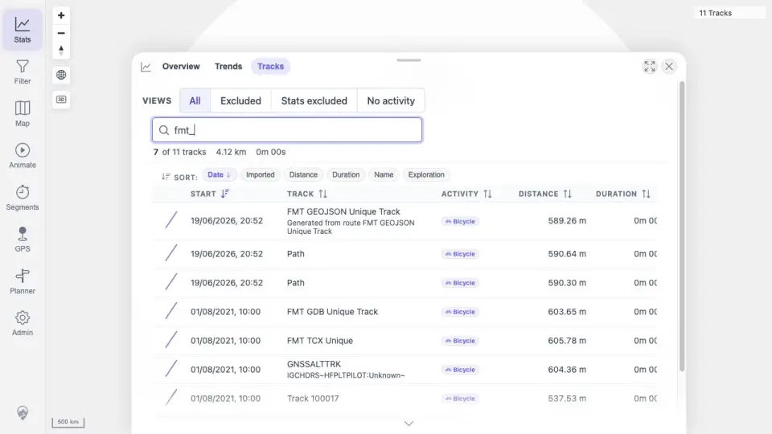
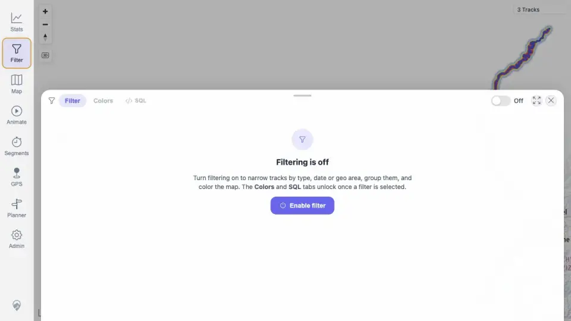

# Packet: TRD_07

## Scope

- Coverage source: `documentation/testing/frontend-regression-test-plan.md`
- Coverage ID or run packet: TRD_07
- In scope: Verify small track shape previews in browser, filters, stats, related tracks, and selection lists.
- Out of scope: Opening the overlap selection list itself, covered by MAP_09.

## Prerequisites

- Required previous coverage IDs or run packets: TRD_06, MAP_09, FIT_03, IMP_05, DEL_03.
- Required app/data state: Track browser/filter/stats/related surfaces available; overlap selection list openable.
- Required browser context: authenticated desktop browser.

## Allowed Mutations

- Allowed: Reuse completed surface screenshots/evidence.
- Not allowed: Change data or server state.

## Actions And Results

| Coverage ID | Action | Expected result | Actual result | Status | Evidence |
|---|---|---|---|---|---|
| TRD_07 | Reviewed completed browser/filter/stats/related evidence and MAP_09 selection-list attempt. | Track shape previews are visible in browser, filters, stats, related tracks, and selection lists. | Browser/filter/stats/related surfaces have screenshot evidence, but the selection-list surface could not be opened because MAP_09 was blocked by canvas hit-targeting. | BLOCKED | [assets/TRD_07-shape-preview-blocked.txt](../assets/TRD_07-shape-preview-blocked.txt); [assets/FIT_03-related.webp](../assets/FIT_03-related.webp); [assets/FMT_02-track-browser-formats.webp](../assets/FMT_02-track-browser-formats.webp); [assets/DEL_03-filter-after-delete.webp](../assets/DEL_03-filter-after-delete.webp); [assets/MAP_09-overlap-selection-blocked.txt](../assets/MAP_09-overlap-selection-blocked.txt) |

## Issues

| ID | Severity | Summary | Reproduction | Expected | Actual | Evidence | Release impact |
|---|---|---|---|---|---|---|---|

## Evidence Files

| File | Purpose |
|---|---|
| [assets/TRD_07-shape-preview-blocked.txt](../assets/TRD_07-shape-preview-blocked.txt) | Covered surfaces and selection-list blocking gap. |
| [assets/FIT_03-related.webp](../assets/FIT_03-related.webp) | Related tracks surface. |
| [assets/FMT_02-track-browser-formats.webp](../assets/FMT_02-track-browser-formats.webp) | Track browser format rows. |
| [assets/DEL_03-filter-after-delete.webp](../assets/DEL_03-filter-after-delete.webp) | Filter surface. |
| [assets/MAP_09-overlap-selection-blocked.txt](../assets/MAP_09-overlap-selection-blocked.txt) | Selection-list blocking evidence. |

## Screenshot Evidence

## Timings

| Step | Timing |
|---|---:|
| Shape-preview evidence review | <1 min |

## Handoff Notes

- Completed: TRD_07 as terminal BLOCKED.
- Remaining unfinished coverage: TRD_08 onward.
- Blocked or not applicable: Selection-list preview requires MAP_09 selection list to open.
- State left for the next packet: unchanged.
