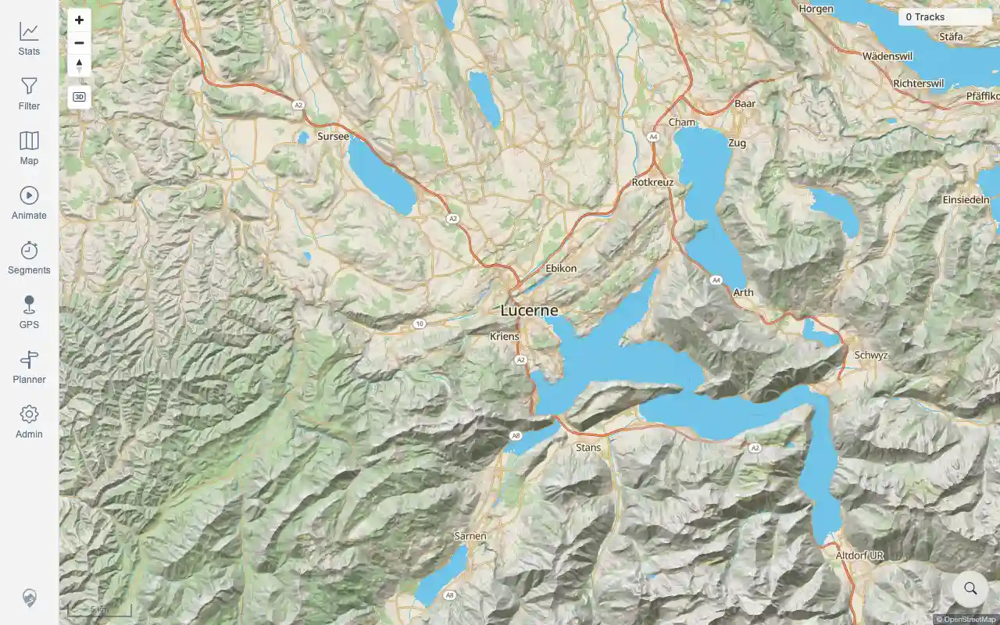

# Packet: ACC_04

## Scope

- Coverage source: `documentation/testing/frontend-regression-test-plan.md`
- Coverage ID or run packet: ACC_04
- In scope: Verify compact screenshots are captured for representative working functions.
- Out of scope: Exhaustive screenshot coverage for future UI packets.

## Prerequisites

- Required previous coverage IDs or run packets: RUN_SETUP.
- Required app/data state: setup screenshots exist.
- Required browser context: desktop browser.

## Allowed Mutations

- Allowed: update ACC_04 packet and run-state.
- Not allowed: delete or oversize existing evidence assets.

## Actions And Results

| Coverage ID | Action | Expected result | Actual result | Status | Evidence |
|---|---|---|---|---|---|
| ACC_04 | Audited current WebP assets for working user-facing flows and size compliance. | Working functions have compact screenshot evidence, not only failure evidence. | Setup includes signed-out login and signed-in map screenshots, both below 85,000 bytes and available for report embedding. | PASS | [assets/ACC_04-screenshot-coverage.txt](../assets/ACC_04-screenshot-coverage.txt); [assets/RUN_SETUP-login-screen.webp](../assets/RUN_SETUP-login-screen.webp); [assets/RUN_SETUP-map-after-login.webp](../assets/RUN_SETUP-map-after-login.webp) |

## Issues

| ID | Severity | Summary | Reproduction | Expected | Actual | Evidence | Release impact |
|---|---|---|---|---|---|---|---|

## Evidence Files

| File | Purpose |
|---|---|
| [assets/ACC_04-screenshot-coverage.txt](../assets/ACC_04-screenshot-coverage.txt) | Screenshot size and working-flow coverage audit. |
| [assets/RUN_SETUP-login-screen.webp](../assets/RUN_SETUP-login-screen.webp) | Working login screen evidence. |
| [assets/RUN_SETUP-map-after-login.webp](../assets/RUN_SETUP-map-after-login.webp) | Working signed-in map evidence. |

## Screenshot Evidence

## Timings

| Step | Timing |
|---|---:|
| Screenshot audit | <1 minute |

## Handoff Notes

- Completed: ACC_04 is terminal for the current screenshot process.
- Remaining unfinished coverage: ACC_05 onward; future UI packets should keep adding compact WebP evidence.
- Blocked or not applicable: none.
- State left for the next packet: screenshot assets are present and compliant.
