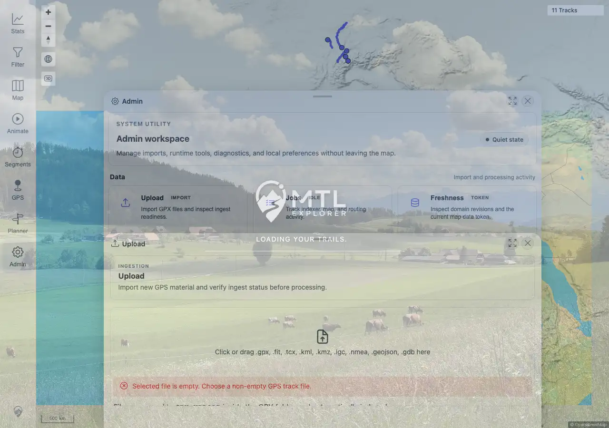
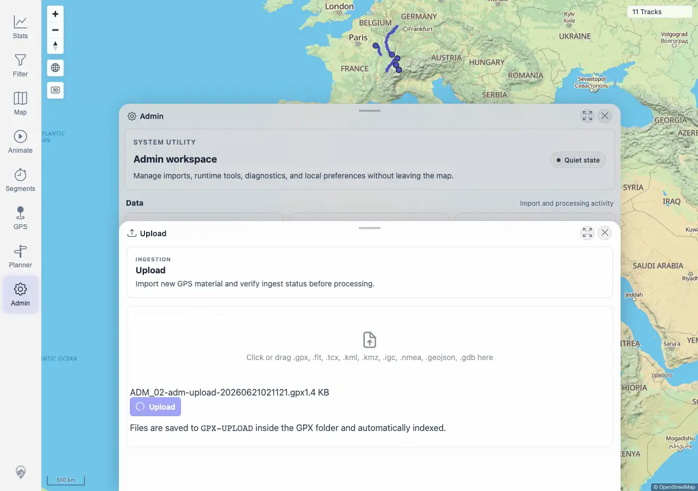
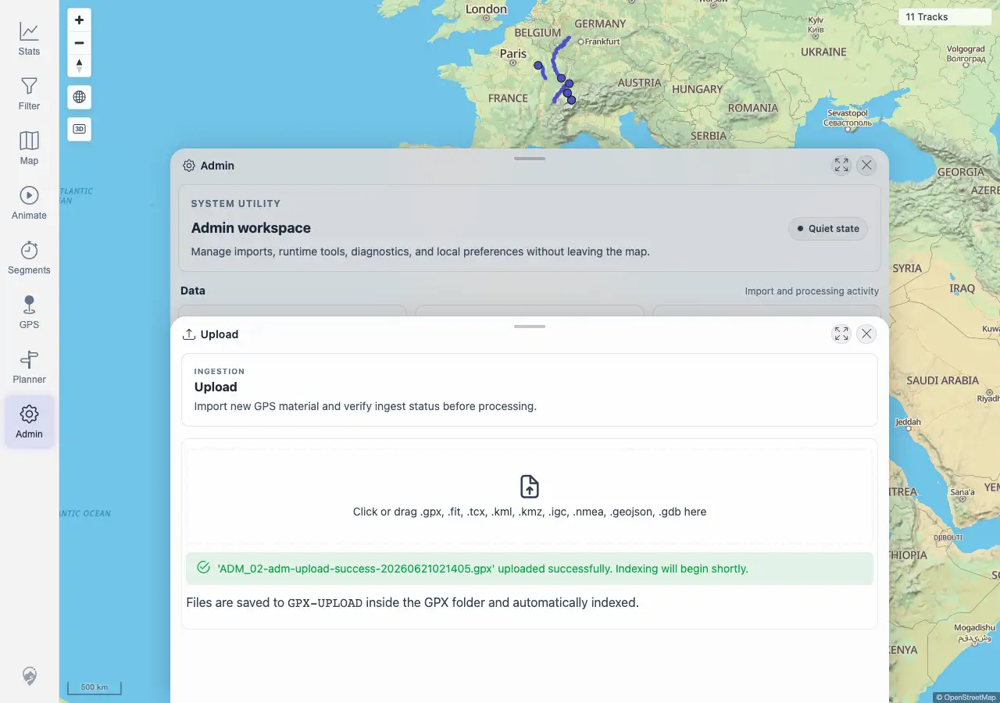

# Packet: ADM_02

## Scope

- Coverage source: `documentation/testing/frontend-regression-test-plan.md`
- Coverage ID or run packet: ADM_02
- In scope: Admin track-file upload availability, accepted-format picker behavior, progress/loading state, success notice, unsupported-format error, and empty-file error.
- Out of scope: Broader indexer dashboard behavior; covered by ADM_03.

## Prerequisites

- Required previous coverage IDs or run packets: ADM_01 terminal.
- Required app/data state: Authenticated Admin workspace with upload directory available.
- Required browser context: Desktop Chromium against the remote quick-install target.

## Allowed Mutations

- Allowed: Upload fully synthetic, non-private GPX files through the Admin upload UI.
- Not allowed: Upload private/local GPX tracks or alter existing imported source files.

## Actions And Results

| Coverage ID | Action | Expected result | Actual result | Status | Evidence |
|---|---|---|---|---|---|
| ADM_02 | Opened Admin > Upload, selected an unsupported `.txt`, selected an empty `.gpx`, selected valid synthetic `.gpx` files, captured loading state, clicked Upload, waited for success notice, then confirmed the uploaded tracks reached completed indexer state. | Upload availability is clear; supported formats are shown; upload progress, success, unsupported-format errors, and empty-file errors are clear. | PASS. Upload status returned available; the picker showed accepted formats. Unsupported `.txt` produced `Unsupported file format`; empty `.gpx` produced `Selected file is empty`. Valid upload showed a loading button state, then a visible success notice. Synthetic uploads indexed as track `100019` with 5 points and track `100020` with 12 points; GPS indexer settled at pending `0`, failed `0`. | PASS | [assets/ADM-admin-results.txt](../assets/ADM-admin-results.txt); [assets/ADM_02-upload-validation.webp](../assets/ADM_02-upload-validation.webp); [assets/ADM_02-upload-progress.webp](../assets/ADM_02-upload-progress.webp); [assets/ADM_02-upload-results.webp](../assets/ADM_02-upload-results.webp) |

## Issues

| ID | Severity | Summary | Reproduction | Expected | Actual | Evidence | Release impact |
|---|---|---|---|---|---|---|---|
|  |  |  |  |  |  |  |  |

## Evidence Files

| File | Purpose |
|---|---|
| [assets/ADM-admin-results.txt](../assets/ADM-admin-results.txt) | Compact Admin evidence for upload availability, validation messages, success notice, indexed track IDs, and assertions. |
| [assets/ADM_02-upload-validation.webp](../assets/ADM_02-upload-validation.webp) | Upload panel after validation error checks. |
| [assets/ADM_02-upload-progress.webp](../assets/ADM_02-upload-progress.webp) | Valid file staged with upload loading state visible. |
| [assets/ADM_02-upload-results.webp](../assets/ADM_02-upload-results.webp) | Upload success notice after the non-intercepted valid upload. |

## Screenshot Evidence

## Timings

| Step | Timing |
|---|---:|
| Validation and valid upload checks | ~3 min |

## Handoff Notes

- Completed: ADM_02 is terminal PASS.
- Remaining unfinished coverage: ADM_03 onward.
- Blocked or not applicable: none.
- State left for the next packet: Synthetic Admin upload tracks `100019` (`ADM_02-adm-upload-20260621020618.gpx`) and `100020` (`ADM_02-adm-upload-success-20260621021405.gpx`) are indexed; a normal UI freshness reload may be needed before every open map view shows both.
