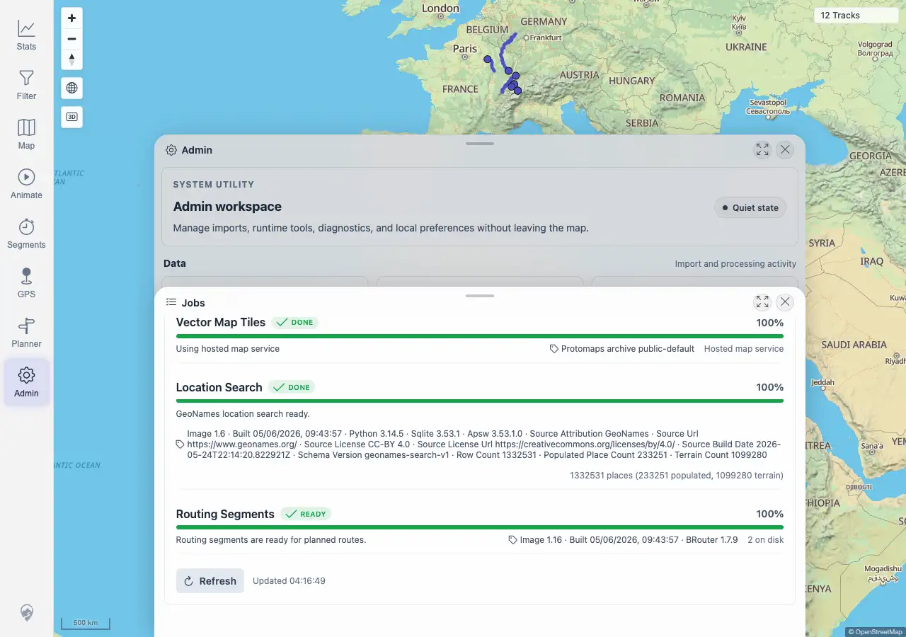

# Packet: ADM_03

## Scope

- Coverage source: `documentation/testing/frontend-regression-test-plan.md`
- Coverage ID or run packet: ADM_03
- In scope: Admin Jobs indexer status for GPS and MEDIA, including refresh behavior and current pending/completed/failed/removed counts.
- Out of scope: Starting manual rescans; covered by ADM_04.

## Prerequisites

- Required previous coverage IDs or run packets: ADM_02 terminal.
- Required app/data state: Admin upload mutations indexed and background processing settled.
- Required browser context: Desktop Chromium against the remote target.

## Allowed Mutations

- Allowed: Open Jobs and click Refresh.
- Not allowed: Queue manual rescans or upload/delete files.

## Actions And Results

| Coverage ID | Action | Expected result | Actual result | Status | Evidence |
|---|---|---|---|---|---|
| ADM_03 | Opened Admin > Jobs, recorded the visible File Indexers section, queried `/mtl/api/indexer/status`, clicked Refresh, and compared the panel update marker before/after. | Indexer status shows GPS and media pending/running/completed/failed/removed state; refresh updates over time. | PASS. The panel showed File Indexers for GPS and MEDIA. GPS showed DONE, 88%, `16`, `2 removed`, `18 total`; MEDIA showed DONE, 100%, `0`, `0 total`. The API exposed GPS/MEDIA pending/completed/failed/removed fields with pending `0` and failed `0`; clicking Refresh changed the marker from `Updated 04:16:47` to `Updated 04:16:49`. | PASS | [assets/ADM_03-indexer-status.txt](../assets/ADM_03-indexer-status.txt); [assets/ADM_03-indexer-status.webp](../assets/ADM_03-indexer-status.webp) |

## Issues

| ID | Severity | Summary | Reproduction | Expected | Actual | Evidence | Release impact |
|---|---|---|---|---|---|---|---|
|  |  |  |  |  |  |  |  |

## Evidence Files

| File | Purpose |
|---|---|
| [assets/ADM_03-indexer-status.txt](../assets/ADM_03-indexer-status.txt) | Compact API/UI evidence for GPS/MEDIA indexer rows and refresh timestamp change. |
| [assets/ADM_03-indexer-status.webp](../assets/ADM_03-indexer-status.webp) | Jobs panel after refresh with File Indexers visible. |

## Screenshot Evidence

## Timings

| Step | Timing |
|---|---:|
| Jobs indexer status and refresh check | <1 min |

## Handoff Notes

- Completed: ADM_03 is terminal PASS.
- Remaining unfinished coverage: ADM_04 onward.
- Blocked or not applicable: none.
- State left for the next packet: Jobs panel was refreshed only; no manual rescan was triggered.
