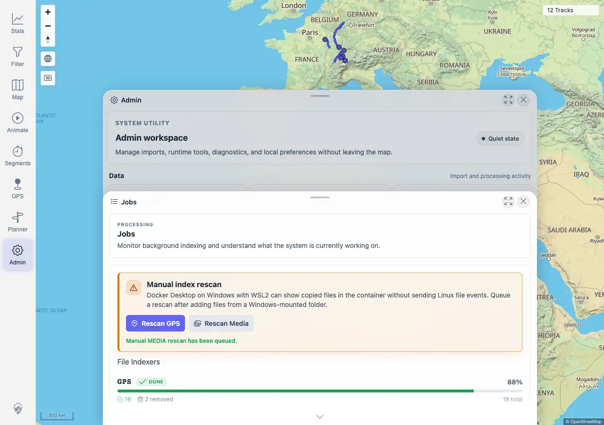
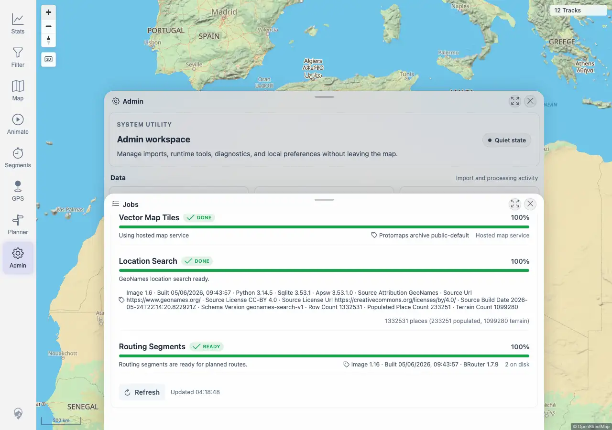

# Packet: ADM_04

## Scope

- Coverage source: `documentation/testing/frontend-regression-test-plan.md`
- Coverage ID or run packet: ADM_04
- In scope: Manual GPS and Media rescan controls, queued state, post-rescan settlement, and map usability afterward.
- Out of scope: Background job-specific progress; covered by ADM_05.

## Prerequisites

- Required previous coverage IDs or run packets: ADM_03 terminal.
- Required app/data state: Admin Jobs panel reachable; indexers initially settled.
- Required browser context: Desktop Chromium against the remote target.

## Allowed Mutations

- Allowed: Queue manual GPS and Media rescans from Admin.
- Not allowed: Add/delete source files or change deployment configuration.

## Actions And Results

| Coverage ID | Action | Expected result | Actual result | Status | Evidence |
|---|---|---|---|---|---|
| ADM_04 | Opened Admin > Jobs, clicked `Rescan GPS`, clicked `Rescan Media`, recorded responses and panel state, waited for pending counts to settle, then clicked map zoom. | Rescan GPS and Rescan Media show queued/already-running/not-ready states without breaking map interaction. | PASS. GPS returned `STARTED` with `Manual GPS rescan has been queued.` and MEDIA returned `STARTED` with `Manual MEDIA rescan has been queued.` The panel displayed the queued Media message and indexers settled back to GPS pending `0`, MEDIA pending `0`, failed `0`. After rescans, map zoom remained usable with two canvases and `12 Tracks`. No already-running or not-ready state occurred in this ready environment. | PASS | [assets/ADM_04-manual-rescan.txt](../assets/ADM_04-manual-rescan.txt); [assets/ADM_04-rescan-started.webp](../assets/ADM_04-rescan-started.webp); [assets/ADM_04-map-after-rescan.webp](../assets/ADM_04-map-after-rescan.webp) |

## Issues

| ID | Severity | Summary | Reproduction | Expected | Actual | Evidence | Release impact |
|---|---|---|---|---|---|---|---|
|  |  |  |  |  |  |  |  |

## Evidence Files

| File | Purpose |
|---|---|
| [assets/ADM_04-manual-rescan.txt](../assets/ADM_04-manual-rescan.txt) | Rescan API responses, visible Jobs section, settled indexer state, and map usability assertions. |
| [assets/ADM_04-rescan-started.webp](../assets/ADM_04-rescan-started.webp) | Jobs panel immediately after manual rescan actions. |
| [assets/ADM_04-map-after-rescan.webp](../assets/ADM_04-map-after-rescan.webp) | Map/Admin view after rescan and zoom interaction. |

## Screenshot Evidence

## Timings

| Step | Timing |
|---|---:|
| Manual rescans and settlement check | <1 min |

## Handoff Notes

- Completed: ADM_04 is terminal PASS.
- Remaining unfinished coverage: ADM_05 onward.
- Blocked or not applicable: none.
- State left for the next packet: Manual GPS and Media rescans were queued and settled; current visible map count is `12 Tracks`.
