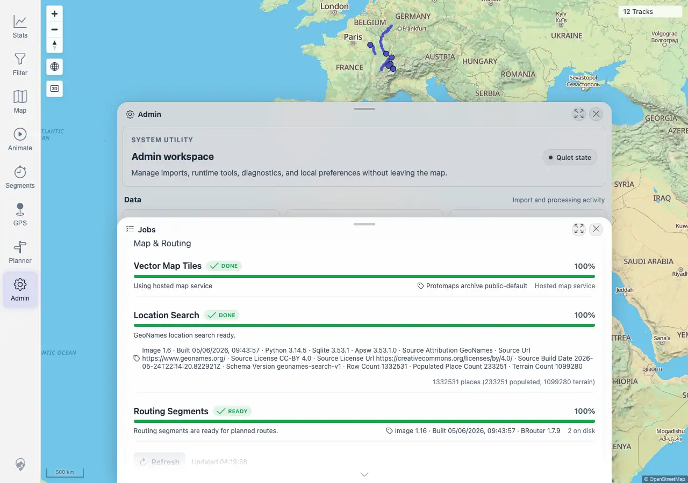

# Packet: ADM_05

## Scope

- Coverage source: `documentation/testing/frontend-regression-test-plan.md`
- Coverage ID or run packet: ADM_05
- In scope: Background job progress visibility and settled state after imports/uploads.
- Out of scope: File indexer status and manual rescans; covered by ADM_03 and ADM_04.

## Prerequisites

- Required previous coverage IDs or run packets: ADM_04 terminal.
- Required app/data state: Current synthetic Admin uploads and prior imports have completed indexing.
- Required browser context: Desktop Chromium against the remote target.

## Allowed Mutations

- Allowed: Refresh the Admin Jobs panel.
- Not allowed: Queue new work or change data.

## Actions And Results

| Coverage ID | Action | Expected result | Actual result | Status | Evidence |
|---|---|---|---|---|---|
| ADM_05 | Opened Admin > Jobs, clicked Refresh, inspected Track Processing Jobs, and queried `/mtl/api/jobs/status`. | Duplicate Finder and Exploration Score progress is visible and settles after imports. | PASS. Track Processing Jobs showed Duplicate Finder, Activity Classifier, and Exploration Score as DONE at 100%, each `16` of `16 total`. The jobs API matched the UI with pending `0`, done `16`, total `16` for all three jobs. | PASS | [assets/ADM_05-background-jobs.txt](../assets/ADM_05-background-jobs.txt); [assets/ADM_05-background-jobs.webp](../assets/ADM_05-background-jobs.webp) |

## Issues

| ID | Severity | Summary | Reproduction | Expected | Actual | Evidence | Release impact |
|---|---|---|---|---|---|---|---|
|  |  |  |  |  |  |  |  |

## Evidence Files

| File | Purpose |
|---|---|
| [assets/ADM_05-background-jobs.txt](../assets/ADM_05-background-jobs.txt) | Jobs API response, visible job section, and assertions. |
| [assets/ADM_05-background-jobs.webp](../assets/ADM_05-background-jobs.webp) | Jobs panel with Track Processing Jobs visible. |

## Screenshot Evidence

## Timings

| Step | Timing |
|---|---:|
| Background job progress check | <1 min |

## Handoff Notes

- Completed: ADM_05 is terminal PASS.
- Remaining unfinished coverage: ADM_06 onward.
- Blocked or not applicable: none.
- State left for the next packet: Jobs panel was refreshed only; no new background work was queued.
