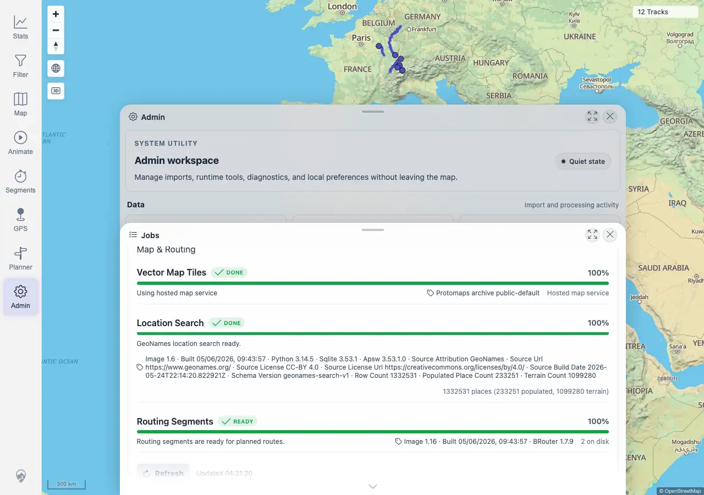

# Packet: ADM_06

## Scope

- Coverage source: `documentation/testing/frontend-regression-test-plan.md`
- Coverage ID or run packet: ADM_06
- In scope: Operational task status for vector map tiles, location search, and routing segments.
- Out of scope: File indexers and processing jobs; covered by ADM_03 through ADM_05.

## Prerequisites

- Required previous coverage IDs or run packets: ADM_05 terminal.
- Required app/data state: Admin Jobs panel reachable.
- Required browser context: Desktop Chromium against the remote target.

## Allowed Mutations

- Allowed: Refresh the Jobs panel and read status APIs.
- Not allowed: Change map provider mode, planner state, or data files.

## Actions And Results

| Coverage ID | Action | Expected result | Actual result | Status | Evidence |
|---|---|---|---|---|---|
| ADM_06 | Opened Admin > Jobs, refreshed, inspected Map & Routing cards, and queried map, location-search, and planner status APIs. | Vector map tiles, location search, and routing segment status show ready/downloading/unavailable/disabled states with useful detail. | PASS. Current environment showed ready/done states: Vector Map Tiles DONE with hosted public map service details, Location Search DONE with GeoNames row counts and version/source detail, and Routing Segments READY with BRouter version and `2 on disk`. Backing APIs returned ready statuses for all three. No downloading/unavailable/disabled state applied in this configured run. | PASS | [assets/ADM_06-operational-tasks.txt](../assets/ADM_06-operational-tasks.txt); [assets/ADM_06-operational-tasks.webp](../assets/ADM_06-operational-tasks.webp) |

## Issues

| ID | Severity | Summary | Reproduction | Expected | Actual | Evidence | Release impact |
|---|---|---|---|---|---|---|---|
|  |  |  |  |  |  |  |  |

## Evidence Files

| File | Purpose |
|---|---|
| [assets/ADM_06-operational-tasks.txt](../assets/ADM_06-operational-tasks.txt) | Compact API and visible-card evidence for map/search/routing tasks. |
| [assets/ADM_06-operational-tasks.webp](../assets/ADM_06-operational-tasks.webp) | Jobs panel with Map & Routing cards visible. |

## Screenshot Evidence

## Timings

| Step | Timing |
|---|---:|
| Operational task check | <1 min |

## Handoff Notes

- Completed: ADM_06 is terminal PASS.
- Remaining unfinished coverage: ADM_07 onward.
- Blocked or not applicable: none.
- State left for the next packet: Jobs panel was refreshed only; no operational state changed.
