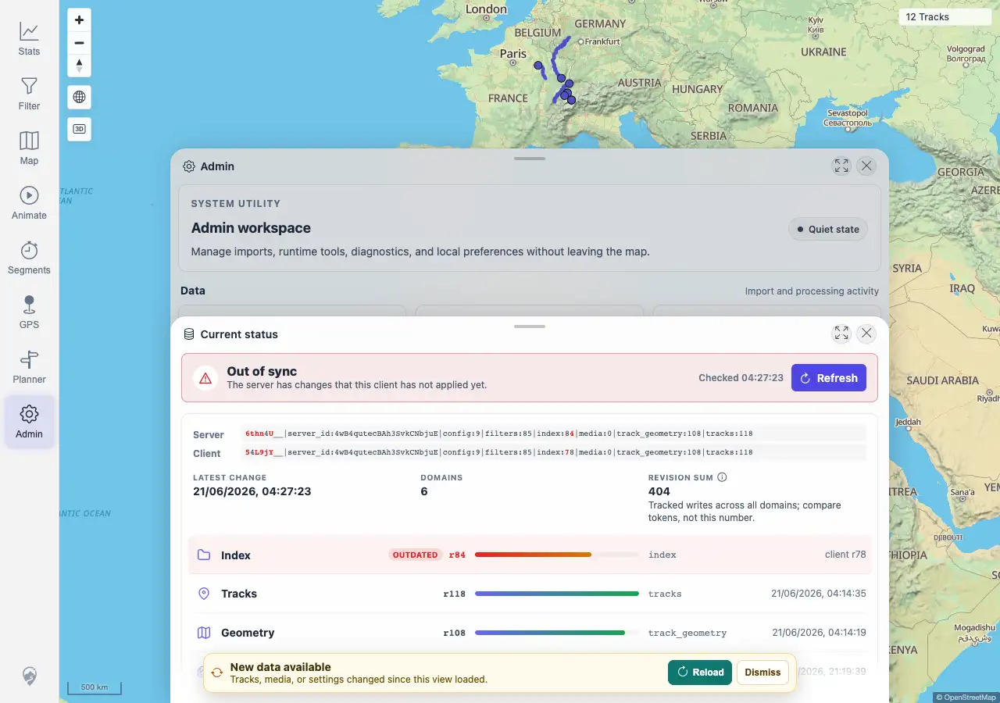
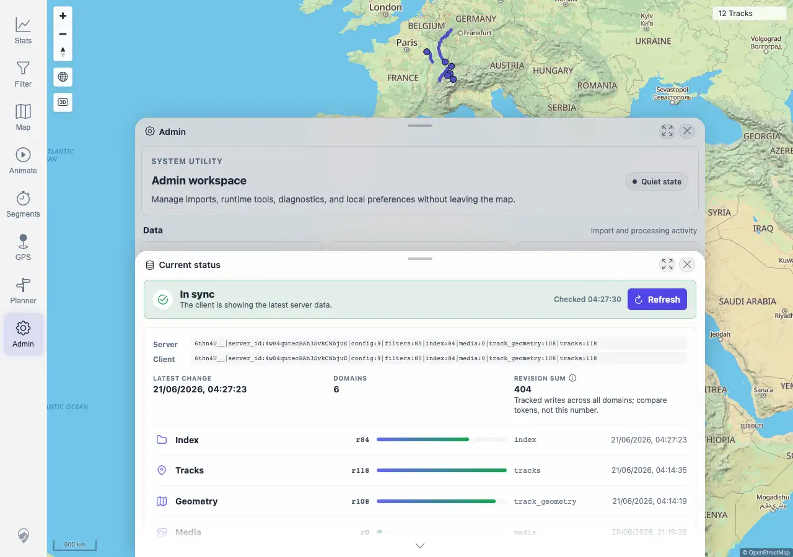

# Packet: ADM_07

## Scope

- Coverage source: `documentation/testing/frontend-regression-test-plan.md`
- Coverage ID or run packet: ADM_07
- In scope: Data freshness timestamp, token comparison, reload offer, and return to in-sync state.
- Out of scope: Manual rescan controls as a feature; covered by ADM_04.

## Prerequisites

- Required previous coverage IDs or run packets: ADM_06 terminal.
- Required app/data state: Freshness panel reachable with client/server token comparison.
- Required browser context: Desktop Chromium against the remote target.

## Allowed Mutations

- Allowed: Trigger a GPS rescan to create a server-side freshness-token change, then click the UI Reload action.
- Not allowed: Add/delete source files.

## Actions And Results

| Coverage ID | Action | Expected result | Actual result | Status | Evidence |
|---|---|---|---|---|---|
| ADM_07 | Opened Admin > Freshness, recorded the synced token/timestamp state, triggered a GPS rescan to make the server token newer, refreshed the panel, captured the reload offer, clicked Reload, then confirmed tokens matched again. | Data freshness shows last-update timestamp and offers reload. | PASS. Freshness showed server/client tokens, `LATEST CHANGE` timestamp, domains, revision sum, and per-domain dates. After the rescan, status changed to `Out of sync`, Index was marked `OUTDATED`, server/client tokens differed, and a `New data available` banner offered `Reload`. Clicking Reload returned the panel to `In sync` with matching tokens. | PASS | [assets/ADM_07-freshness.txt](../assets/ADM_07-freshness.txt); [assets/ADM_07-freshness-reload-offer.webp](../assets/ADM_07-freshness-reload-offer.webp); [assets/ADM_07-freshness-after-reload.webp](../assets/ADM_07-freshness-after-reload.webp) |

## Issues

| ID | Severity | Summary | Reproduction | Expected | Actual | Evidence | Release impact |
|---|---|---|---|---|---|---|---|
|  |  |  |  |  |  |  |  |

## Evidence Files

| File | Purpose |
|---|---|
| [assets/ADM_07-freshness.txt](../assets/ADM_07-freshness.txt) | Token, timestamp, out-of-sync, reload, and synced-state evidence. |
| [assets/ADM_07-freshness-reload-offer.webp](../assets/ADM_07-freshness-reload-offer.webp) | Freshness panel showing server/client mismatch and Reload offer. |
| [assets/ADM_07-freshness-after-reload.webp](../assets/ADM_07-freshness-after-reload.webp) | Freshness panel after Reload with matching tokens. |

## Screenshot Evidence

## Timings

| Step | Timing |
|---|---:|
| Freshness stale/reload check | ~2 min |

## Handoff Notes

- Completed: ADM_07 is terminal PASS.
- Remaining unfinished coverage: ADM_08 onward.
- Blocked or not applicable: none.
- State left for the next packet: Freshness is in sync at index revision `84`; GPS indexer remains settled.
