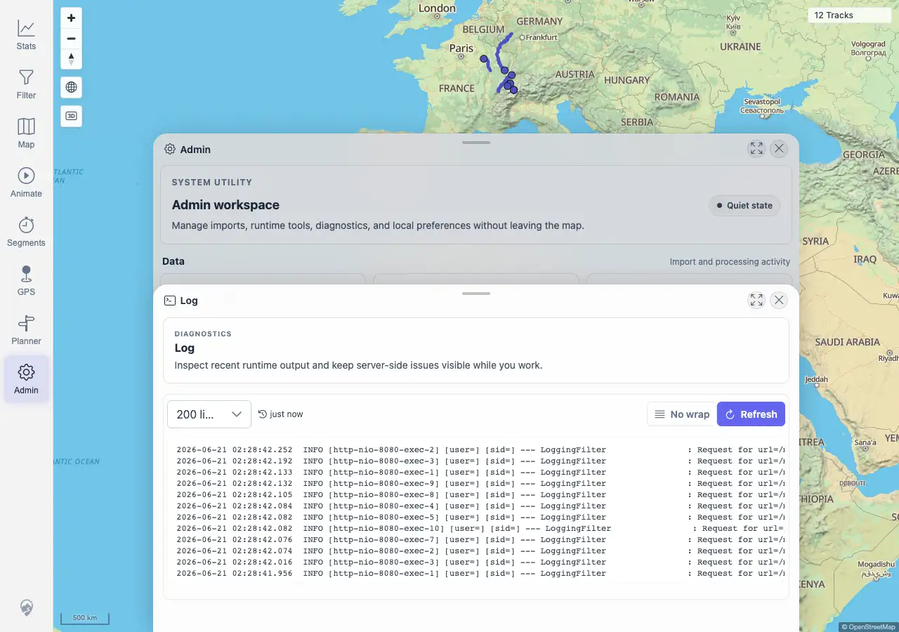
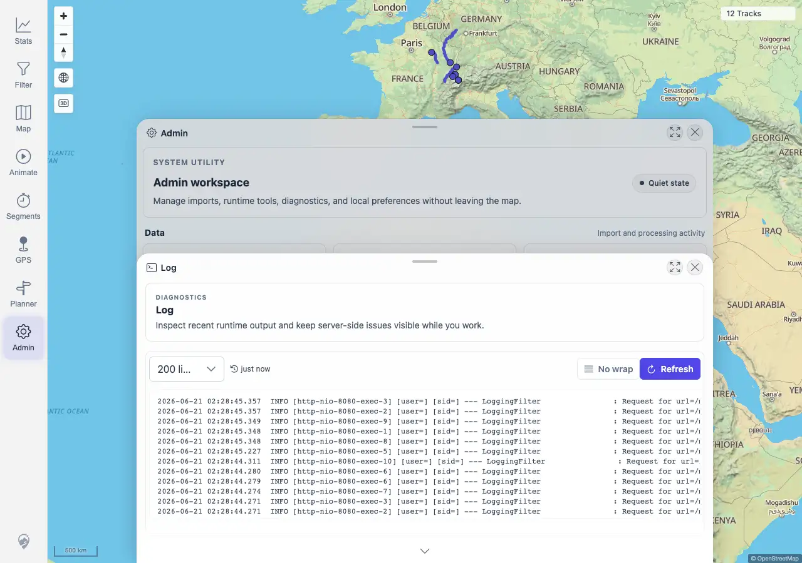

# Packet: ADM_08

## Scope

- Coverage source: `documentation/testing/frontend-regression-test-plan.md`
- Coverage ID or run packet: ADM_08
- In scope: Admin server log loading and refresh behavior.
- Out of scope: Interpreting every log line or treating known non-blocking map tile warnings as new issues.

## Prerequisites

- Required previous coverage IDs or run packets: ADM_07 terminal.
- Required app/data state: Admin Log panel reachable.
- Required browser context: Desktop Chromium against the remote target.

## Allowed Mutations

- Allowed: Refresh the server log panel.
- Not allowed: Change server configuration or data.

## Actions And Results

| Coverage ID | Action | Expected result | Actual result | Status | Evidence |
|---|---|---|---|---|---|
| ADM_08 | Opened Admin > Log, confirmed server log lines were visible, called the server-log API, clicked Refresh, and confirmed log lines still loaded. | Server log lines load and refresh. | PASS. The panel showed log controls (`200 lines`, `just now`, `No wrap`, `Refresh`) and recent server log lines. `/mtl/api/admin/server-log?lines=80` returned 200 with 79 lines before and after Refresh. The compact evidence redacts session IDs. | PASS | [assets/ADM_08-server-log.txt](../assets/ADM_08-server-log.txt); [assets/ADM_08-server-log-loaded.webp](../assets/ADM_08-server-log-loaded.webp); [assets/ADM_08-server-log-refreshed.webp](../assets/ADM_08-server-log-refreshed.webp) |

## Issues

| ID | Severity | Summary | Reproduction | Expected | Actual | Evidence | Release impact |
|---|---|---|---|---|---|---|---|
|  |  |  |  |  |  |  |  |

## Evidence Files

| File | Purpose |
|---|---|
| [assets/ADM_08-server-log.txt](../assets/ADM_08-server-log.txt) | Compact server-log loading/refresh evidence with redacted sample lines. |
| [assets/ADM_08-server-log-loaded.webp](../assets/ADM_08-server-log-loaded.webp) | Log panel after initial load. |
| [assets/ADM_08-server-log-refreshed.webp](../assets/ADM_08-server-log-refreshed.webp) | Log panel after Refresh. |

## Screenshot Evidence

## Timings

| Step | Timing |
|---|---:|
| Server log load and refresh check | <1 min |

## Handoff Notes

- Completed: ADM_08 is terminal PASS.
- Remaining unfinished coverage: ADM_09 onward.
- Blocked or not applicable: none.
- State left for the next packet: No server state changed.
