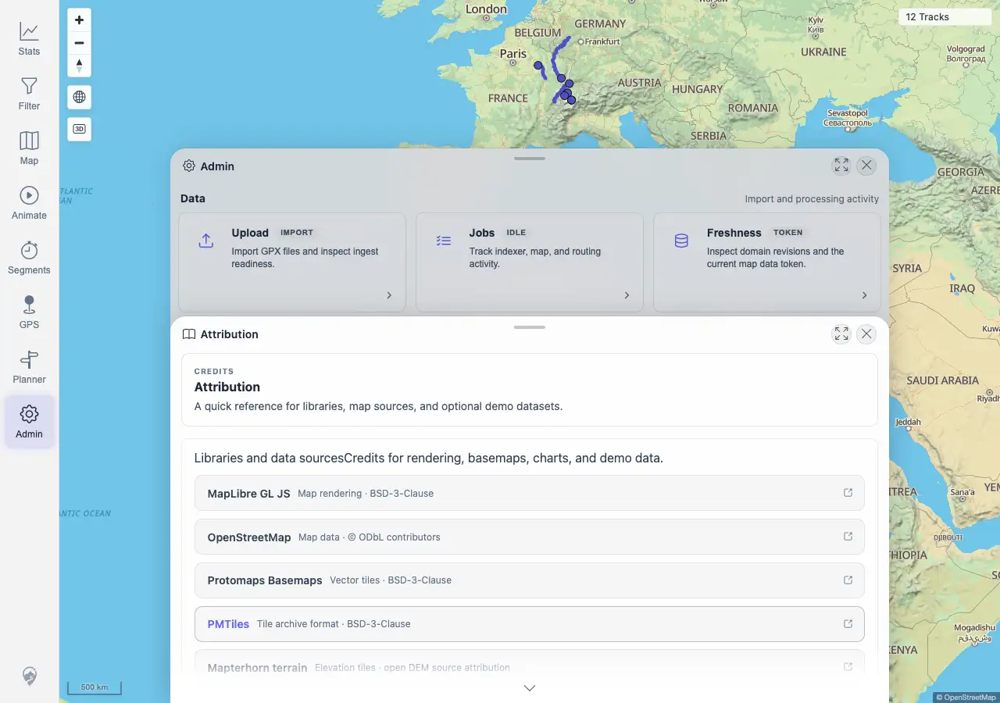

# Packet: ADM_09

## Scope

- Coverage source: `documentation/testing/frontend-regression-test-plan.md`
- Coverage ID or run packet: ADM_09
- In scope: Admin Attribution panel and expected map/data/library sources.
- Out of scope: Legal review of every license term.

## Prerequisites

- Required previous coverage IDs or run packets: ADM_08 terminal.
- Required app/data state: Admin Attribution panel reachable.
- Required browser context: Desktop Chromium against the remote target.

## Allowed Mutations

- Allowed: Open Attribution.
- Not allowed: Change app data or settings.

## Actions And Results

| Coverage ID | Action | Expected result | Actual result | Status | Evidence |
|---|---|---|---|---|---|
| ADM_09 | Opened Admin > Attribution and inspected the listed credits/sources. | Attribution shows expected map/data sources. | PASS. Attribution showed source/library credits including MapLibre GL JS, OpenStreetMap, Protomaps Basemaps, PMTiles, Mapterhorn terrain, swisstopo, SchweizMobil, Waymarked Trails, Highcharts, GeoNames, GPSBabel, and BRouter with source/license context. | PASS | [assets/ADM_09-attribution.txt](../assets/ADM_09-attribution.txt); [assets/ADM_09-attribution.webp](../assets/ADM_09-attribution.webp) |

## Issues

| ID | Severity | Summary | Reproduction | Expected | Actual | Evidence | Release impact |
|---|---|---|---|---|---|---|---|
|  |  |  |  |  |  |  |  |

## Evidence Files

| File | Purpose |
|---|---|
| [assets/ADM_09-attribution.txt](../assets/ADM_09-attribution.txt) | Visible source list and expected source assertions. |
| [assets/ADM_09-attribution.webp](../assets/ADM_09-attribution.webp) | Attribution panel screenshot. |

## Screenshot Evidence

## Timings

| Step | Timing |
|---|---:|
| Attribution panel check | <1 min |

## Handoff Notes

- Completed: ADM_09 is terminal PASS.
- Remaining unfinished coverage: ADM_10 onward.
- Blocked or not applicable: none.
- State left for the next packet: No data or settings changed.
