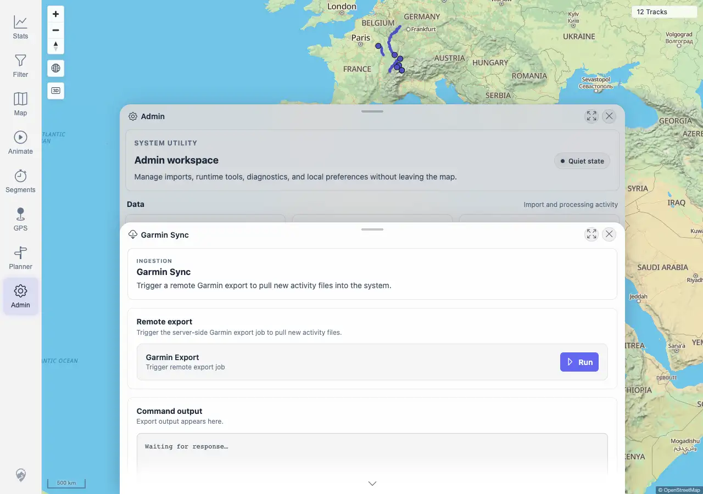
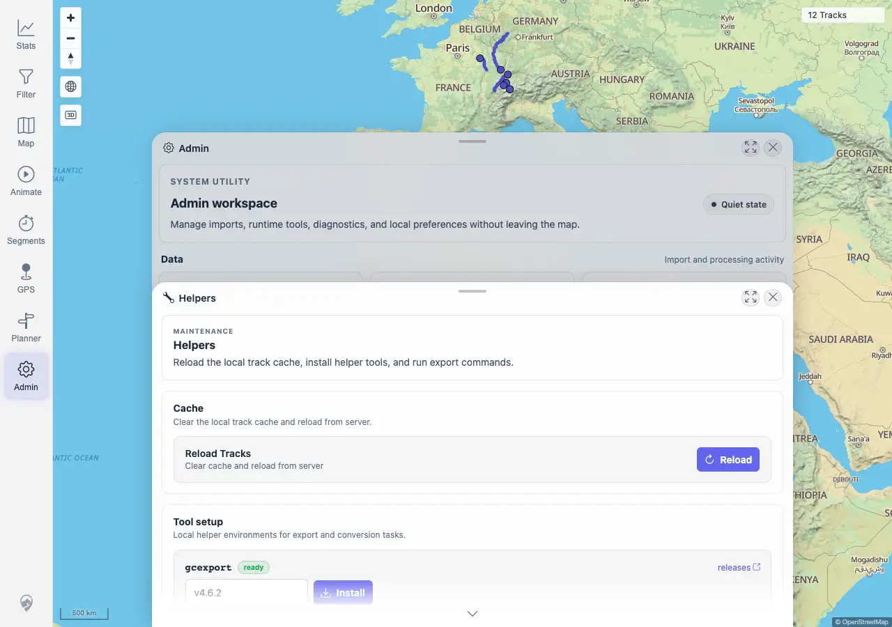
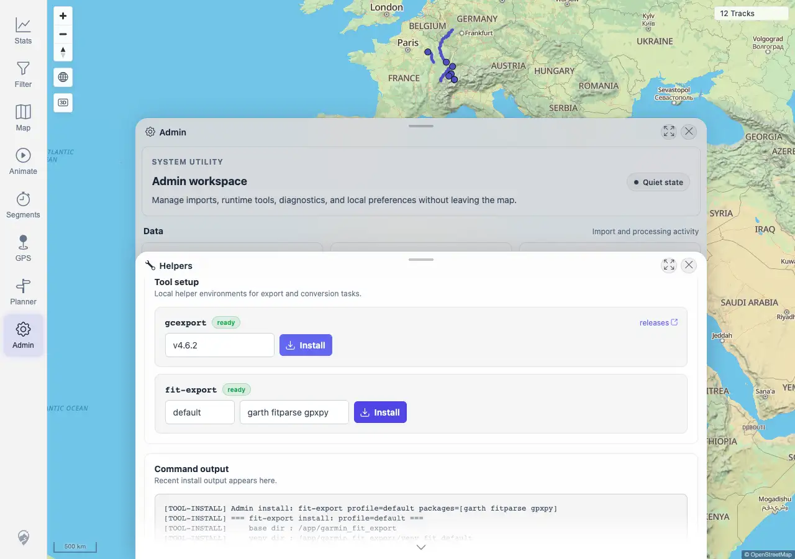

# Packet: ADM_10

## Scope

- Coverage source: `documentation/testing/frontend-regression-test-plan.md`
- Coverage ID or run packet: ADM_10
- In scope: Garmin Sync entry point, Garmin helper tool status, and install/update action feedback.
- Out of scope: Running an actual Garmin account export against external credentials.

## Prerequisites

- Required previous coverage IDs or run packets: ADM_09 terminal.
- Required app/data state: Admin Garmin Sync and Helpers panels reachable.
- Required browser context: Desktop Chromium against the remote target.

## Allowed Mutations

- Allowed: Run Garmin helper install/update actions with the currently configured values.
- Not allowed: Trigger a real remote Garmin export.

## Actions And Results

| Coverage ID | Action | Expected result | Actual result | Status | Evidence |
|---|---|---|---|---|---|
| ADM_10 | Opened Admin > Garmin Sync, verified the remote export entry point/output area, then opened Helpers > Tool setup, queried `/mtl/api/garmin-export/tool-status`, clicked `Install` for `gcexport` and `fit-export` with current configured values, and checked resulting output/status. | Garmin export tools, if present, show installed-exporter status; install/update actions report success or error. | PASS. Tool status reported `gcexport` version `v4.6.2` ready and `fit-export` profile `default` ready with packages `garth fitparse gpxpy`. Both install/update actions returned HTTP 200 with clear output: existing venvs were already present, active version/profile/packages were updated, and final tool status still loaded as ready. The real Garmin export `Run` action was not triggered. | PASS | [assets/ADM_10-garmin-tools.txt](../assets/ADM_10-garmin-tools.txt); [assets/ADM_10-garmin-sync.webp](../assets/ADM_10-garmin-sync.webp); [assets/ADM_10-tool-status-before.webp](../assets/ADM_10-tool-status-before.webp); [assets/ADM_10-gcexport-install-result.webp](../assets/ADM_10-gcexport-install-result.webp); [assets/ADM_10-fit-export-install-result.webp](../assets/ADM_10-fit-export-install-result.webp) |

## Issues

| ID | Severity | Summary | Reproduction | Expected | Actual | Evidence | Release impact |
|---|---|---|---|---|---|---|---|
|  |  |  |  |  |  |  |  |

## Evidence Files

| File | Purpose |
|---|---|
| [assets/ADM_10-garmin-tools.txt](../assets/ADM_10-garmin-tools.txt) | Tool-status API, install/update outputs, and assertions. |
| [assets/ADM_10-garmin-sync.webp](../assets/ADM_10-garmin-sync.webp) | Garmin Sync remote export panel. |
| [assets/ADM_10-tool-status-before.webp](../assets/ADM_10-tool-status-before.webp) | Helper tool setup before install actions. |
| [assets/ADM_10-gcexport-install-result.webp](../assets/ADM_10-gcexport-install-result.webp) | `gcexport` install/update result output. |
| [assets/ADM_10-fit-export-install-result.webp](../assets/ADM_10-fit-export-install-result.webp) | `fit-export` install/update result output. |

## Screenshot Evidence

## Timings

| Step | Timing |
|---|---:|
| Garmin tool status and install/update checks | <1 min |

## Handoff Notes

- Completed: ADM_10 is terminal PASS.
- Remaining unfinished coverage: ADM_11 onward.
- Blocked or not applicable: none.
- State left for the next packet: Garmin helper tools remain ready; remote Garmin export was not run.
