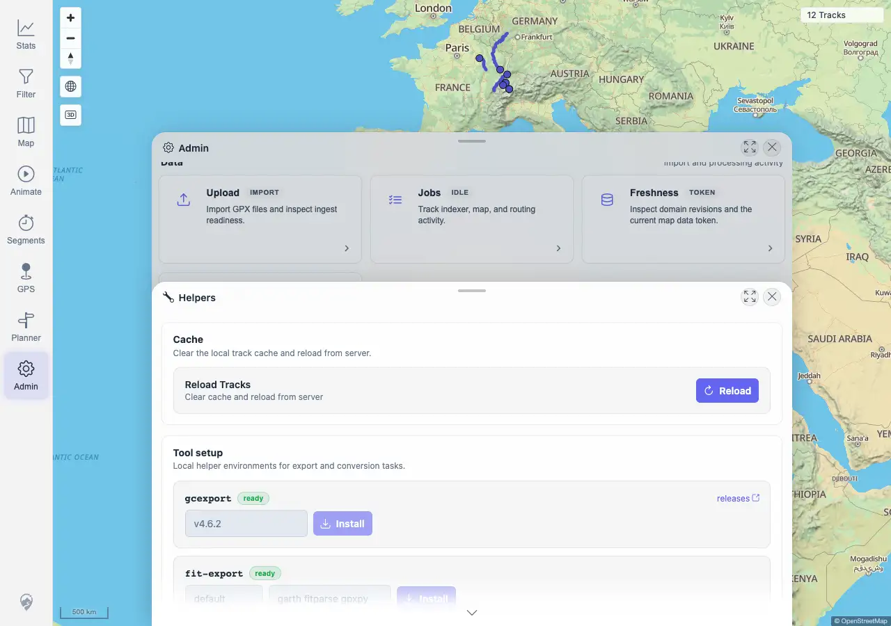
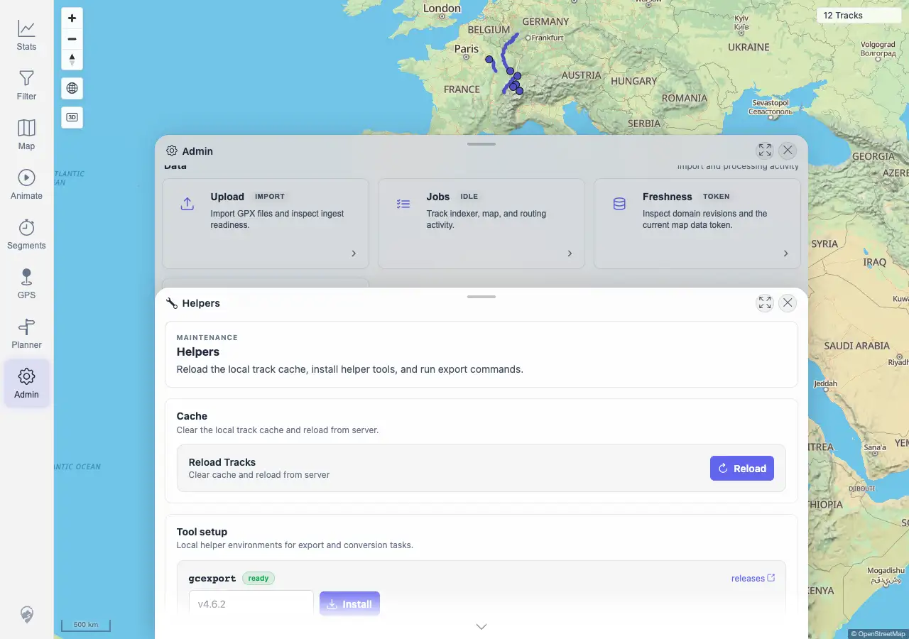

# Packet: ADM_11

## Scope

- Coverage source: `documentation/testing/frontend-regression-test-plan.md`
- Coverage ID or run packet: ADM_11
- In scope: Closing and reopening an Admin child sheet while an action is pending, then verifying state/output is retained.
- Out of scope: Main Admin route history behavior; covered earlier by SGN_09 and ADM_01.

## Prerequisites

- Required previous coverage IDs or run packets: ADM_10 terminal.
- Required app/data state: Helpers panel reachable; Garmin helper tools ready.
- Required browser context: Desktop Chromium against the remote target.

## Allowed Mutations

- Allowed: Run the `fit-export` helper install/update action with current configured values.
- Not allowed: Trigger real Garmin export or alter source track files.

## Actions And Results

| Coverage ID | Action | Expected result | Actual result | Status | Evidence |
|---|---|---|---|---|---|
| ADM_11 | Opened Admin > Helpers, delayed the `fit-export` install response in the browser to hold a pending state, captured `Waiting for response…`, closed the active Helpers sheet, waited for the response, reopened Helpers, and inspected output/status. | Closing/reopening the dialog does not lose state mid-action. | PASS. The active Helpers sheet closed while the action was pending. Reopening Helpers showed the completed fit-export install output (`venv_fit_default already present`, active profile/packages updated), and both `gcexport` and `fit-export` remained `ready`. | PASS | [assets/ADM_11-close-reopen-mid-action.txt](../assets/ADM_11-close-reopen-mid-action.txt); [assets/ADM_11-mid-action-before-close.webp](../assets/ADM_11-mid-action-before-close.webp); [assets/ADM_11-reopened-state.webp](../assets/ADM_11-reopened-state.webp) |

## Issues

| ID | Severity | Summary | Reproduction | Expected | Actual | Evidence | Release impact |
|---|---|---|---|---|---|---|---|
|  |  |  |  |  |  |  |  |

## Evidence Files

| File | Purpose |
|---|---|
| [assets/ADM_11-close-reopen-mid-action.txt](../assets/ADM_11-close-reopen-mid-action.txt) | Close/reopen action log, delayed response status, reopened output, and assertions. |
| [assets/ADM_11-mid-action-before-close.webp](../assets/ADM_11-mid-action-before-close.webp) | Helpers panel while the install action was waiting for response. |
| [assets/ADM_11-reopened-state.webp](../assets/ADM_11-reopened-state.webp) | Helpers panel after reopening with completed output visible. |

## Screenshot Evidence

## Timings

| Step | Timing |
|---|---:|
| Close/reopen mid-action check | <1 min |

## Handoff Notes

- Completed: ADM_11 is terminal PASS.
- Remaining unfinished coverage: SYN_01 onward.
- Blocked or not applicable: none.
- State left for the next packet: Admin Helpers install output persists; no track data changed.
