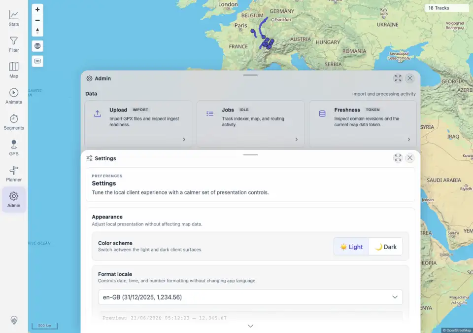
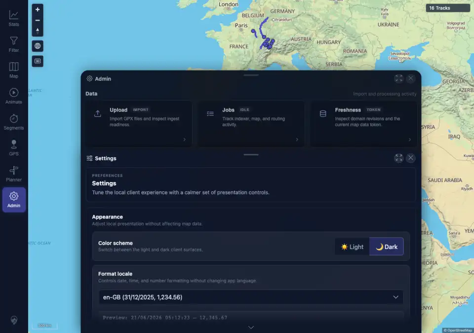
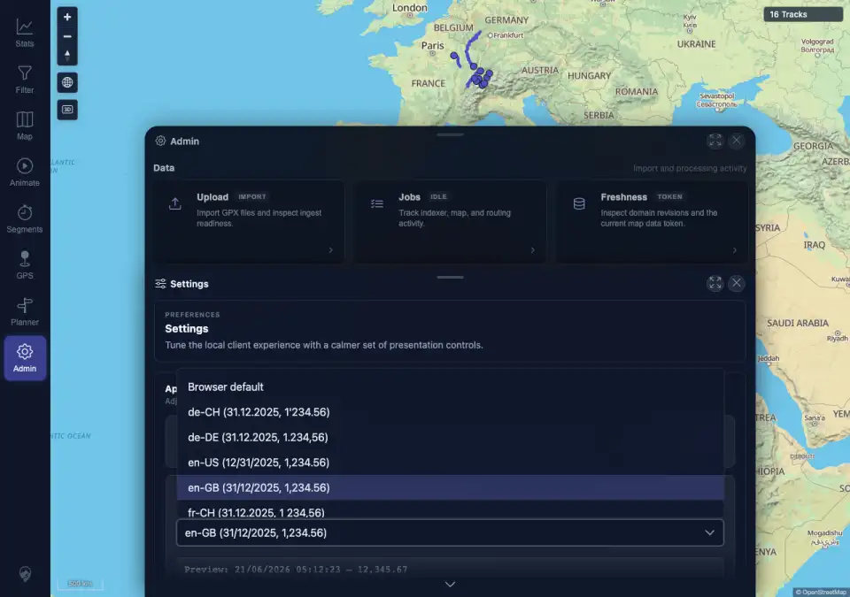

# Packet: APP_01

## Scope

- Coverage source: `documentation/testing/frontend-regression-test-plan.md`
- Coverage ID or run packet: APP_01
- In scope: UI color-scheme switching through Admin > Settings and immediate re-theme of core app surfaces.
- Out of scope: Detailed contrast audit and chart-specific re-coloring; covered by APP_02 and APP_03.

## Prerequisites

- Required previous coverage IDs or run packets: SYN_07 terminal.
- Required app/data state: Synced authenticated map at 16 tracks.
- Required browser context: Desktop Chromium against the remote target.

## Allowed Mutations

- Allowed: Change local color-scheme preference.
- Not allowed: Change track data or server configuration.

## Actions And Results

| Coverage ID | Action | Expected result | Actual result | Status | Evidence |
|---|---|---|---|---|---|
| APP_01 | Opened Admin > Settings, switched Color scheme to Light, sampled computed styles and captured the Settings sheet, then switched to Dark, sampled styles again, and opened the locale dropdown in dark mode. | Switching between light and dark mode re-themes the whole UI immediately across text, panels, sheets, dropdowns, and map controls. | PASS. `data-theme` changed from `light` to `dark` without reload. Eight sampled surfaces changed color/background/border values: body, navigation panel, Admin sheet, panel section, toggle buttons, Settings select, preview code, and map scale control. The locale dropdown opened and rendered in dark mode with no page/console errors. | PASS | [assets/APP_01-theme-switch.txt](../assets/APP_01-theme-switch.txt); [assets/APP_01-settings-light.webp](../assets/APP_01-settings-light.webp); [assets/APP_01-settings-dark.webp](../assets/APP_01-settings-dark.webp); [assets/APP_01-dark-dropdown.webp](../assets/APP_01-dark-dropdown.webp) |

## Issues

| ID | Severity | Summary | Reproduction | Expected | Actual | Evidence | Release impact |
|---|---|---|---|---|---|---|---|
|  |  |  |  |  |  |  |  |

## Evidence Files

| File | Purpose |
|---|---|
| [assets/APP_01-theme-switch.txt](../assets/APP_01-theme-switch.txt) | Theme attributes, sampled computed styles, dropdown assertion, and console/page error check. |
| [assets/APP_01-settings-light.webp](../assets/APP_01-settings-light.webp) | Settings sheet in light mode. |
| [assets/APP_01-settings-dark.webp](../assets/APP_01-settings-dark.webp) | Settings sheet immediately after switching to dark mode. |
| [assets/APP_01-dark-dropdown.webp](../assets/APP_01-dark-dropdown.webp) | Settings locale dropdown rendered in dark mode. |

## Screenshot Evidence

## Timings

| Step | Timing |
|---|---:|
| Light/dark switching and dropdown check | <1 min |

## Handoff Notes

- Completed: APP_01 is terminal PASS.
- Remaining unfinished coverage: APP_02 onward.
- Blocked or not applicable: none.
- State left for the next packet: Authenticated desktop browser remains in dark UI mode.
