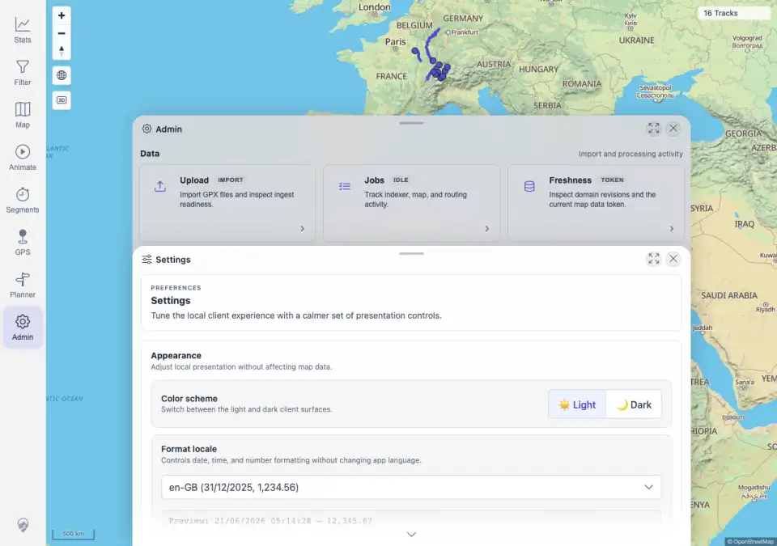
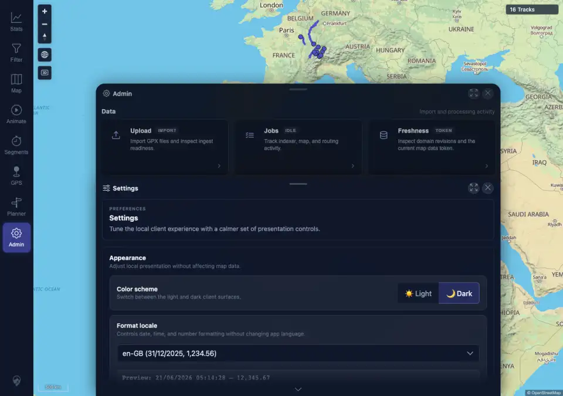

# Packet: APP_02

## Scope

- Coverage source: `documentation/testing/frontend-regression-test-plan.md`
- Coverage ID or run packet: APP_02
- In scope: Visible text readability in light and dark themes across map navigation and Admin Settings surfaces.
- Out of scope: Chart recolor behavior; covered by APP_03.

## Prerequisites

- Required previous coverage IDs or run packets: APP_01 terminal.
- Required app/data state: Authenticated desktop browser with Admin Settings reachable.
- Required browser context: Desktop Chromium against the remote target.

## Allowed Mutations

- Allowed: Change local color-scheme preference.
- Not allowed: Change track data or server configuration.

## Actions And Results

| Coverage ID | Action | Expected result | Actual result | Status | Evidence |
|---|---|---|---|---|---|
| APP_02 | Switched Admin Settings to Light, scanned visible direct text nodes for text/background contrast, captured a screenshot, switched to Dark, repeated the scan, and captured a dark screenshot. | No text is unreadable through white-on-white or black-on-black combinations in either theme. | PASS. The scanner checked 28 visible text nodes per theme across map attribution/scale, navigation labels, Admin Settings text, controls, and captions. Both light and dark scans had `lowCount: 0`; the lowest sampled ratios were 2.43 for map attribution in light mode and 3.23 for muted Settings helper text in dark mode. No page/console errors occurred. | PASS | [assets/APP_02-contrast-audit.txt](../assets/APP_02-contrast-audit.txt); [assets/APP_02-light-contrast.webp](../assets/APP_02-light-contrast.webp); [assets/APP_02-dark-contrast.webp](../assets/APP_02-dark-contrast.webp) |

## Issues

| ID | Severity | Summary | Reproduction | Expected | Actual | Evidence | Release impact |
|---|---|---|---|---|---|---|---|
|  |  |  |  |  |  |  |  |

## Evidence Files

| File | Purpose |
|---|---|
| [assets/APP_02-contrast-audit.txt](../assets/APP_02-contrast-audit.txt) | Light/dark visible text scan details and lowest contrast samples. |
| [assets/APP_02-light-contrast.webp](../assets/APP_02-light-contrast.webp) | Light-mode Settings and map/navigation surfaces. |
| [assets/APP_02-dark-contrast.webp](../assets/APP_02-dark-contrast.webp) | Dark-mode Settings and map/navigation surfaces. |

## Screenshot Evidence

## Timings

| Step | Timing |
|---|---:|
| Light/dark readability scan | <1 min |

## Handoff Notes

- Completed: APP_02 is terminal PASS.
- Remaining unfinished coverage: APP_03 onward.
- Blocked or not applicable: none.
- State left for the next packet: Authenticated desktop browser remains in dark UI mode.
