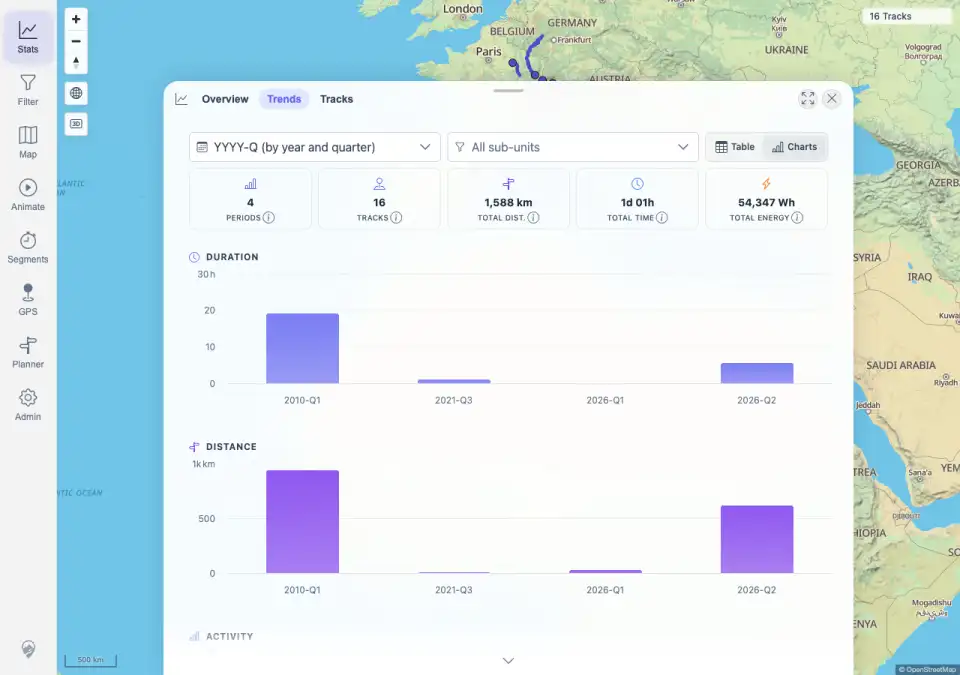
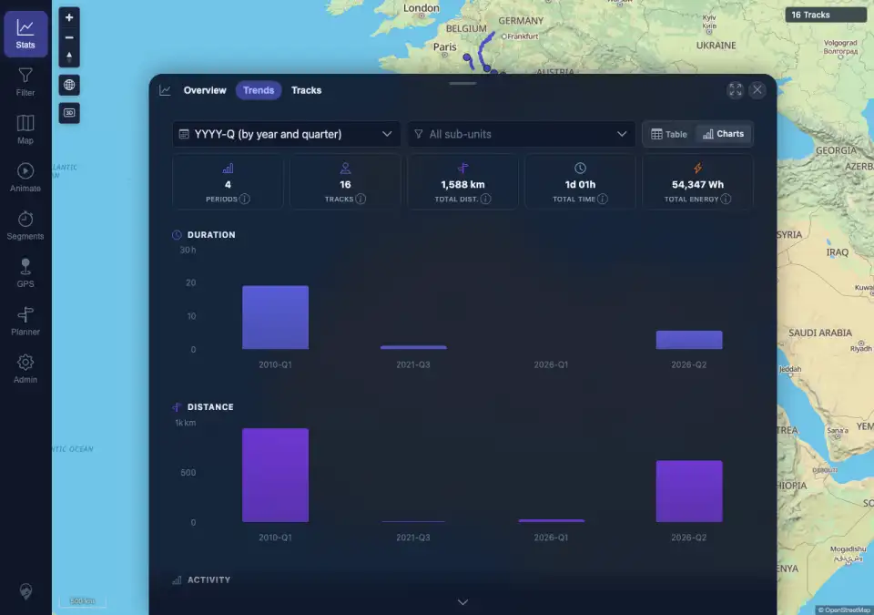

# Packet: APP_03

## Scope

- Coverage source: `documentation/testing/frontend-regression-test-plan.md`
- Coverage ID or run packet: APP_03
- In scope: Statistics Trends chart colors after switching UI theme without a page reload.
- Out of scope: General theme switching and contrast coverage; covered by APP_01 and APP_02.

## Prerequisites

- Required previous coverage IDs or run packets: APP_02 terminal.
- Required app/data state: Authenticated desktop browser with statistics available.
- Required browser context: Desktop Chromium against the remote target.

## Allowed Mutations

- Allowed: Change local color-scheme preference.
- Not allowed: Reload the page during the theme switch being tested; change track data.

## Actions And Results

| Coverage ID | Action | Expected result | Actual result | Status | Evidence |
|---|---|---|---|---|---|
| APP_03 | Started from a light-theme page load, opened Stats > Trends > Charts, sampled Highcharts SVG/card colors, switched to Dark through Admin > Settings without reloading, reopened the same Trends chart surface, and sampled colors again. | Charts re-color on theme switch without needing a reload. | PASS. Both states rendered 8 Highcharts SVGs. After the UI-driven dark switch, the document theme was `dark`, chart grid strokes changed from light `rgba(0, 0, 0, .06)` to dark `rgba(255, 255, 255, .06)` on the sampled visible charts, chart card text/border colors changed, and no page/console errors occurred. | PASS | [assets/APP_03-chart-recolor.txt](../assets/APP_03-chart-recolor.txt); [assets/APP_03-light-charts.webp](../assets/APP_03-light-charts.webp); [assets/APP_03-dark-charts.webp](../assets/APP_03-dark-charts.webp) |

## Issues

| ID | Severity | Summary | Reproduction | Expected | Actual | Evidence | Release impact |
|---|---|---|---|---|---|---|---|
|  |  |  |  |  |  |  |  |

## Evidence Files

| File | Purpose |
|---|---|
| [assets/APP_03-chart-recolor.txt](../assets/APP_03-chart-recolor.txt) | Light/dark chart color samples and no-reload switch assertions. |
| [assets/APP_03-light-charts.webp](../assets/APP_03-light-charts.webp) | Trends charts before theme switch in light mode. |
| [assets/APP_03-dark-charts.webp](../assets/APP_03-dark-charts.webp) | Trends charts after UI switch to dark mode without page reload. |

## Screenshot Evidence

## Timings

| Step | Timing |
|---|---:|
| Chart open, theme switch, reopen, and sampling | <1 min |

## Handoff Notes

- Completed: APP_03 is terminal PASS.
- Remaining unfinished coverage: APP_04 onward.
- Blocked or not applicable: none.
- State left for the next packet: Authenticated desktop browser remains in dark UI mode.
