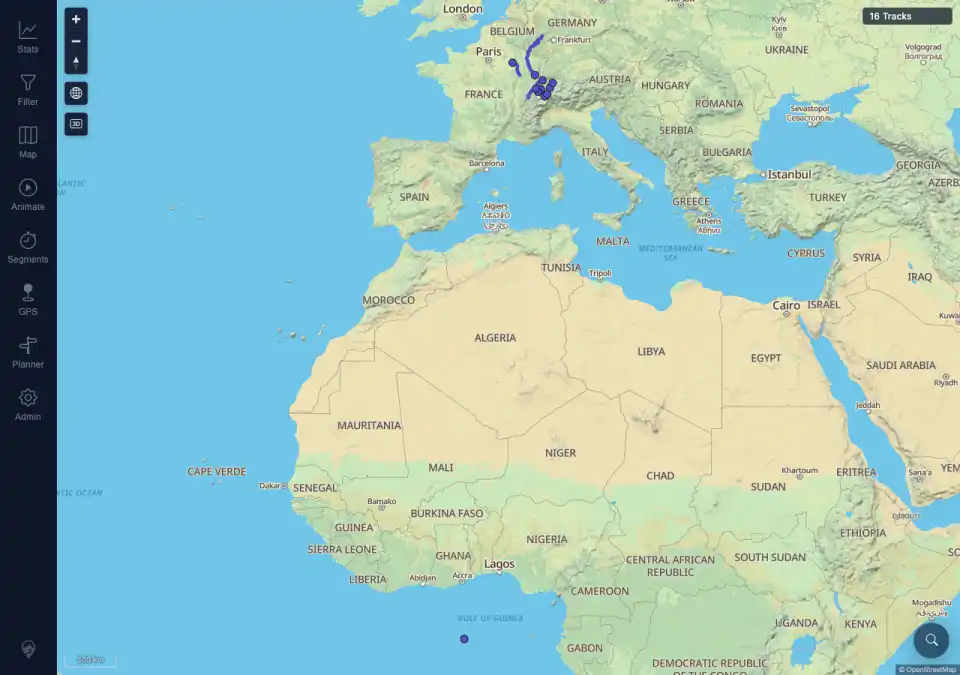
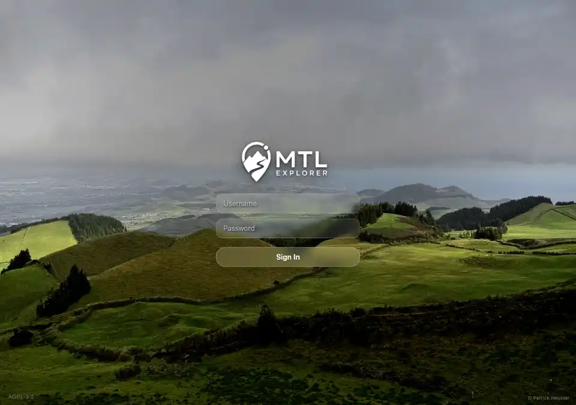
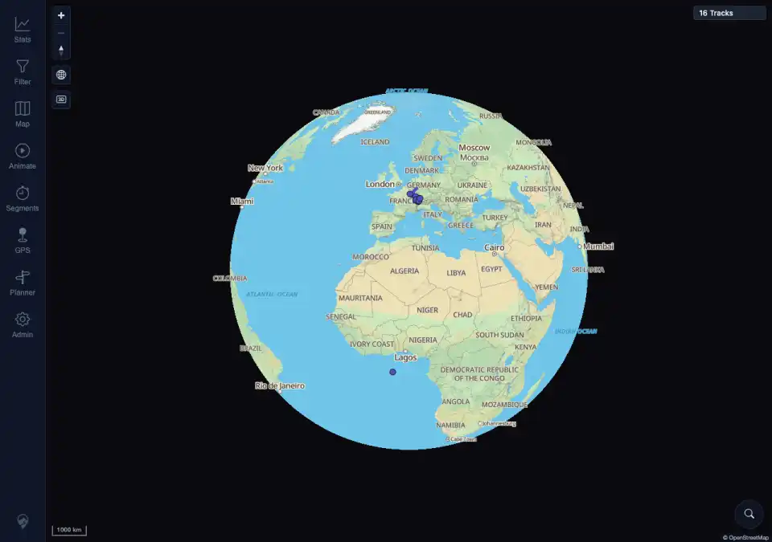

# Packet: APP_04

## Scope

- Coverage source: `documentation/testing/frontend-regression-test-plan.md`
- Coverage ID or run packet: APP_04
- In scope: Color-scheme preference persistence across reload and credentials-only logout/login.
- Out of scope: Full destructive logout preference clearing.

## Prerequisites

- Required previous coverage IDs or run packets: APP_03 terminal.
- Required app/data state: Authenticated desktop browser with map reachable.
- Required browser context: Desktop Chromium against the remote target.

## Allowed Mutations

- Allowed: Change local color-scheme preference; perform credentials-only logout/login.
- Not allowed: Full local wipe logout; track data changes.

## Actions And Results

| Coverage ID | Action | Expected result | Actual result | Status | Evidence |
|---|---|---|---|---|---|
| APP_04 | Set color scheme to Dark in Admin > Settings, closed sheets, reloaded the page, then used Admin > Session > Credentials only Logout and logged back in. | Selected theme persists across reload and login. | PASS. Before reload, after reload, on the login screen, and after re-login, `data-theme` and `mtl.color-scheme` were both `dark`. The login form remained visible after logout, and the re-login returned to the dark 16-track map without page/console errors. | PASS | [assets/APP_04-theme-persistence.txt](../assets/APP_04-theme-persistence.txt); [assets/APP_04-before-reload-dark.webp](../assets/APP_04-before-reload-dark.webp); [assets/APP_04-dark-after-reload.webp](../assets/APP_04-dark-after-reload.webp); [assets/APP_04-dark-login.webp](../assets/APP_04-dark-login.webp); [assets/APP_04-dark-after-relogin.webp](../assets/APP_04-dark-after-relogin.webp) |

## Issues

| ID | Severity | Summary | Reproduction | Expected | Actual | Evidence | Release impact |
|---|---|---|---|---|---|---|---|
|  |  |  |  |  |  |  |  |

## Evidence Files

| File | Purpose |
|---|---|
| [assets/APP_04-theme-persistence.txt](../assets/APP_04-theme-persistence.txt) | Theme/storage checks before reload, after reload, after logout, and after re-login. |
| [assets/APP_04-before-reload-dark.webp](../assets/APP_04-before-reload-dark.webp) | Dark map before reload. |
| [assets/APP_04-dark-after-reload.webp](../assets/APP_04-dark-after-reload.webp) | Dark map after reload. |
| [assets/APP_04-dark-login.webp](../assets/APP_04-dark-login.webp) | Dark login screen after credentials-only logout. |
| [assets/APP_04-dark-after-relogin.webp](../assets/APP_04-dark-after-relogin.webp) | Dark map after re-login. |

## Screenshot Evidence

## Timings

| Step | Timing |
|---|---:|
| Dark persistence reload and logout/login | ~2 min |

## Handoff Notes

- Completed: APP_04 is terminal PASS.
- Remaining unfinished coverage: APP_05 onward.
- Blocked or not applicable: none.
- State left for the next packet: Authenticated desktop browser remains in dark UI mode.
