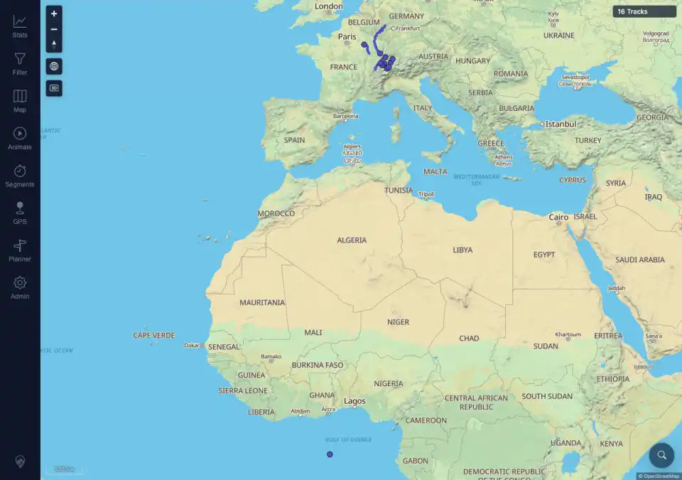

# Packet: APP_05

## Scope

- Coverage source: `documentation/testing/frontend-regression-test-plan.md`
- Coverage ID or run packet: APP_05
- In scope: Hard refresh behavior when dark mode is selected.
- Out of scope: Long-term theme persistence; covered by APP_04.

## Prerequisites

- Required previous coverage IDs or run packets: APP_04 terminal.
- Required app/data state: `mtl.color-scheme` stored as `dark`.
- Required browser context: Desktop Chromium against the remote target.

## Allowed Mutations

- Allowed: Reload the browser page and sample early render frames.
- Not allowed: Change track data or server configuration.

## Actions And Results

| Coverage ID | Action | Expected result | Actual result | Status | Evidence |
|---|---|---|---|---|---|
| APP_05 | Forced the stored color scheme to dark before navigation, attached an init-script sampler for theme/frame state, hard-loaded `/mtl/`, waited for the map, and reviewed all rendered app samples. | Hard refresh in dark mode does not flash the light theme first. | PASS. The sampler recorded 237 frames and 233 rendered app samples. Pre-render samples had no visible app and a dark body background; the first rendered samples already had `theme=dark` with the dark navigation background. Light rendered samples: `0`; non-dark rendered samples: `0`; final map was dark with `16 Tracks`. | PASS | [assets/APP_05-hard-refresh-dark.txt](../assets/APP_05-hard-refresh-dark.txt); [assets/APP_05-dark-hard-refresh.webp](../assets/APP_05-dark-hard-refresh.webp) |

## Issues

| ID | Severity | Summary | Reproduction | Expected | Actual | Evidence | Release impact |
|---|---|---|---|---|---|---|---|
|  |  |  |  |  |  |  |  |

## Evidence Files

| File | Purpose |
|---|---|
| [assets/APP_05-hard-refresh-dark.txt](../assets/APP_05-hard-refresh-dark.txt) | Frame-sampler summary proving no rendered light-theme samples. |
| [assets/APP_05-dark-hard-refresh.webp](../assets/APP_05-dark-hard-refresh.webp) | Final dark map after hard refresh. |

## Screenshot Evidence

## Timings

| Step | Timing |
|---|---:|
| Hard-refresh sampling window | ~2.5 s |

## Handoff Notes

- Completed: APP_05 is terminal PASS.
- Remaining unfinished coverage: APP_06 onward.
- Blocked or not applicable: none.
- State left for the next packet: Authenticated desktop browser remains in dark UI mode.
